<center>JavaWeb</center>


# 1.基本概念

## 1.1 前沿

web开发：

+ web，网页的意思
+ 静态web
  + html，css
  + 提供给所有人看的数据始终不会发生变化
+ 动态web
  + 淘宝
  + 每个人不同时间不同地点看到的信息各不相同
  + 技术栈：Servlet/ISP ASP PHP

在Java中，动态web资源开发的技术统称为JavaWeb

## 1.2 web应用程序

web应用程序，可以提供浏览器访问的程序

+ a.html  b.html……多个web资源，这些web可以被外界访问，对外界提供服务
+ 能访问到的任意一个页面或者资源，都存在于某个计算机上
+ URL
+ 这个统一的web资源会被放在同一个文件夹下，web应用程序->Tomcat：服务器
+ 一个web应用由多部分组成（静态web，动态web）
  + html css js
  + jsp servlet
  + Java
  + jar包
  + 配置文件(Properties)

web应用程序编写完毕后，若想提供给外界访问，需要一个服务器统一管理

## 1.3 静态web

+ *.htm *.html都是网页的后缀，如果服务器上一直存在这些东西，就可以直接进行读取，通信

  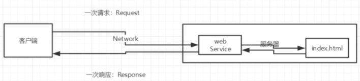

+ 静态web存在的缺点
  + Web页面无法动态更新，所有用户看到的都是同一个页面
    + 轮播图 点击特效：伪动态
    + JavaScript（实际开发最常用）
    + VBScript
  + 无法与数据库交互（数据无法持久化，用户无法交互）

## 1.4 动态web

页面会动态显示，Web的页面显示效果因人而异

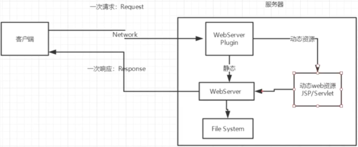

缺点

+ 假如服务器的动态web资源出现了错误，需要重写后台程序，重新发布
  + 停机维护

优点

静态web存在的缺点

+ Web页面可以动态更新，所有用户看到的不是同一个页面
+ 可以与数据库交互

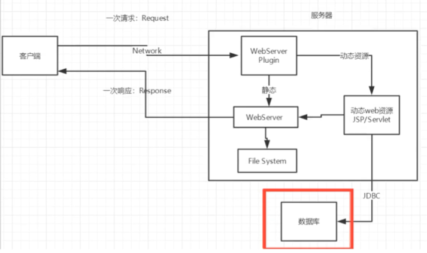

# 2 Web服务器

## 2.1 技术讲解

ASP

+ 微软：国内最早流行的就是ASP
+ 在HTML中嵌入了VB的脚本，ASP+COM；
+ 在ASP开发中，基本上每一个页面都有几千行的业务代码，页面及其混乱
+ 维护成本高

php

+ PHP开发速度很快，功能强大，跨平台，代码简单
+ 无法承载大访问量的情况（局限性）

JSP/Servlet

+ SUN公司主推的B/S架构
+ 基于Java语言
+ 可以承载三高问题带来的影响
+ 语法像ASP

## 2.2 Web服务器

服务器是一种被动的操作，用来处理用户的一些请求，给用户相应信息

IIS：微软，ASP Windows中自带的

Tomcat：Tomcat是Apache 软件基金会（Apache Software Foundation）的Jakarta 项目中的一个核心项目，最新的Servlet 和JSP 规范总是能在Tomcat 中得到体现。因为Tomcat 技术先进、性能稳定，而且免费，因而深受Java 爱好者的喜爱并得到了部分软件开发商的认可，成为目前比较流行的Web 应用服务器。

Tomcat 服务器是一个免费的开放源代码的Web 应用服务器，属于轻量级应用[服务器](https://baike.baidu.com/item/服务器)，在中小型系统和并发访问用户不是很多的场合下被普遍使用，是开发和调试JSP 程序的首选。对于一个初学JavaWeb的人来说，它是最佳选择

Tomcat 实际上运行JSP 页面和Servlet。目前Tomcat最新版本为9.0.37。

下载tomcat：

1. 安装/解压
2. 了解配置文件及目录结构
3. 了解作用 

# 3 Tomcat

## 3.1 安装Tomcat

https://tomcat.apache.org/

## 3.2 启动和配置

文件夹：

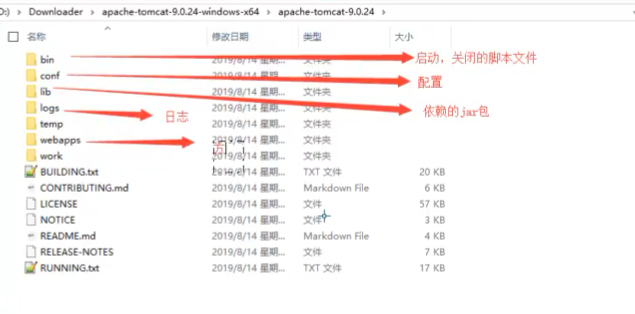

启动，关闭Tomcat

bin>startup.bat  / shutdown.bat

访问测试： http://localhost:8080/

## 3.3 配置

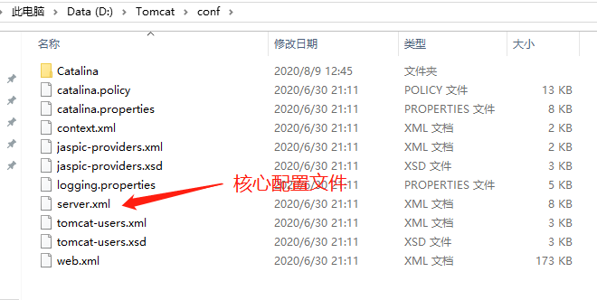

可以配置启动的端口号

+ Tomcat的默认端口号：8080
+ MySQL：3306
+ http：80
+ https：443

```xml
   <Connector port="8080" protocol="HTTP/1.1"
               connectionTimeout="20000"
               redirectPort="8443" />

```

可以配置主机的名称

+ 默认的主机名：localhost ->127.0.0.1
+ 默认的网站应用存放的位置：webapps

```xml
  <Host name="localhost"  appBase="webapps"
        unpackWARs="true" autoDeploy="true">
```
**面试题**

访问网页流程：

1. 输入域名
2. 检查本机的hosts配置文件下有没有这个域名映射
   1. 有，直接放回对应的ip地址，在这个地址中，有需要访问的web程序，可以直接访问
   2. 没有：去DNS解析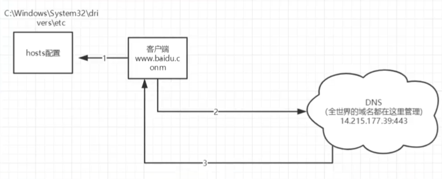

## 3.4 发布web网站

+ 将自己写的网站放到服务器（Tomcat）中指定的web应用文件夹（webapps）下

网站应有的结构

```java
-- webapps :Tomcat服务器的web目录
	-ROOT
	-zz:网站的目录名
		- WEB—INF
			-classes:Java程序
			-lib web应用所依赖的jar包
			-web.xml
		-index.html 默认首页
		- static
			-css
				-style.css
			-js 
			-img
		-...
```

# 4.Http

## 4.1什么是http

http（超文本传输协议）是一个简单的请求-响应协议，它通常运行在TCP之上。

+ 文本：html，字符串，……
+ 超文本：图片，音乐，视频，地图，定位……
+ 端口 80

https：s---安全的

+ 443

## 4.2 两个时代

+ Http1.0

  + HTTP/1.0:客户端可以与web服务器连接后，只能获得一个web资源
+ Http2.0
+ HTTP/1.1：客户端可以与web服务器连接后，可以获得多个web资源

## 4.3  Http请求

+ 客户端--发请求--服务器

百度

```java
Request URL:https://www.baidu.com/   请求地址
Request Method:GET    get方法/post方法
Status Code:200 OK    状态码：200
Remote（远程） Address:14.215.177.39:443
    
Accept:text/html  
Accept-Encoding:gzip, deflate, br
Accept-Language:zh-CN,zh;q=0.9    语言
Cache-Control:max-age=0
Connection:keep-alive
```

1. 请求行

- 请求行中的请求方式：GET
- 请求方式：**Get,Post**,HEAD,DELETE,PUT,TRACT.…
  - get：请求能够携带的参数比较少，大小有限制，会在浏览器的URL地址栏显示数据内容，不安全，但高效
  - post:请求能够携带的参数没有限制，大小没有限制，不会在浏览器的URL地址栏显示数据内容，安全，但不高效。

2. 消息头

```java
Accept：告诉浏览器，它所支持的数据类型
Accept-Encoding：支持哪种编码格式  GBK   UTF-8   GB2312  ISO8859-1
Accept-Language：告诉浏览器，它的语言环境
Cache-Control：缓存控制
Connection：告诉浏览器，请求完成是断开还是保持连接
HOST：主机..../.
```


## 4.4  Http响应

+ 服务器--响应--客户端

百度

```java
Cache-Control:private    缓存控制
Connection:Keep-Alive    连接
Content-Encoding:gzip    编码
Content-Type:text/html   类型  
```

1. 响应体

```java
Accept：告诉浏览器，它所支持的数据类型
Accept-Encoding：支持哪种编码格式  GBK   UTF-8   GB2312  ISO8859-1
Accept-Language：告诉浏览器，它的语言环境
Cache-Control：缓存控制
Connection：告诉浏览器，请求完成是断开还是保持连接
HOST：主机..../.
Refresh:告诉客户端多久刷新一次
Location：让网页重新定位
```

2. 响应状态码

200：请求响应成功200

3xx:请求重定向
+ 重定向：你重新到我给你新位置去；

4xx:找不到资源404

+ 资源不存在；

5xx:服务器代码错误 500  502:网关错误

常见面试题：

当浏览器中地址栏输入地址并回车到页面展示，经历了什么？

# 5 Maven

为什么学习Maven？

1. 在JavaWeb开发中，需要使用大量的的jar包，需要手动导入
2. 如何自动导入和配置jar包？Maven

## 5.1 Maven项目架构管理工具

目的：方便导入jar包

Maven核心思想：**约定大于配置**

+ 有约束，不要去违反

Maven会规定要如何去编写Java代码，必需按规范来。

## 5.2 下载安装Maven

官网：https://maven.apache.org/

## 5.3配置环境变量

- M2_HOME maven目录下的bin目录
- MAVEN_HOME maven的目录
- 在系统的path中配置%MAVEN_HOME%\bin

## 5.4 阿里云镜像

- 镜像：mirrors
- 作用：加速我们的下载
- 国内建议使用阿里云的镜像

```xml
<mirror>
    <id>nexus-aliyun</id>  
    <mirrorOf>*,!jeecg,!jeecg-snapshots</mirrorOf>  
    <name>Nexus aliyun</name>  
    <url>http://maven.aliyun.com/nexus/content/groups/public</url> 
</mirror>
```

## 5.5 本地仓库

在本地的仓库，远程仓库； 建立一个本地仓库：localRepository

```xml
<localRepository>D:\apache-maven-3.6.1\maven-repo</localRepository>
```

## 5.6 在IDEA中使用Maven

1. 启动IDEA
2. 创建Maven项目

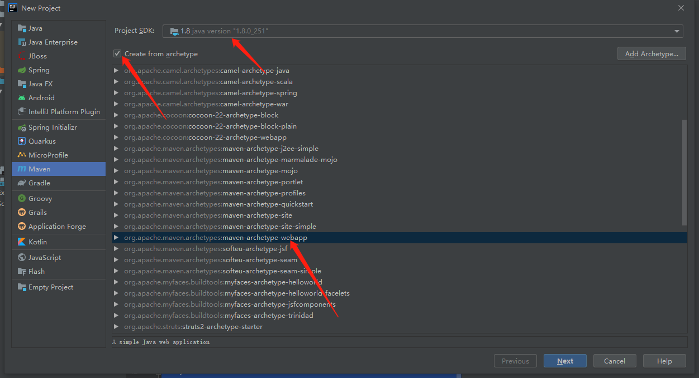

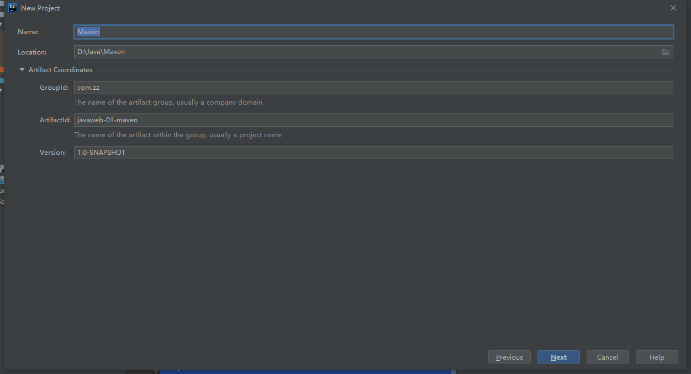

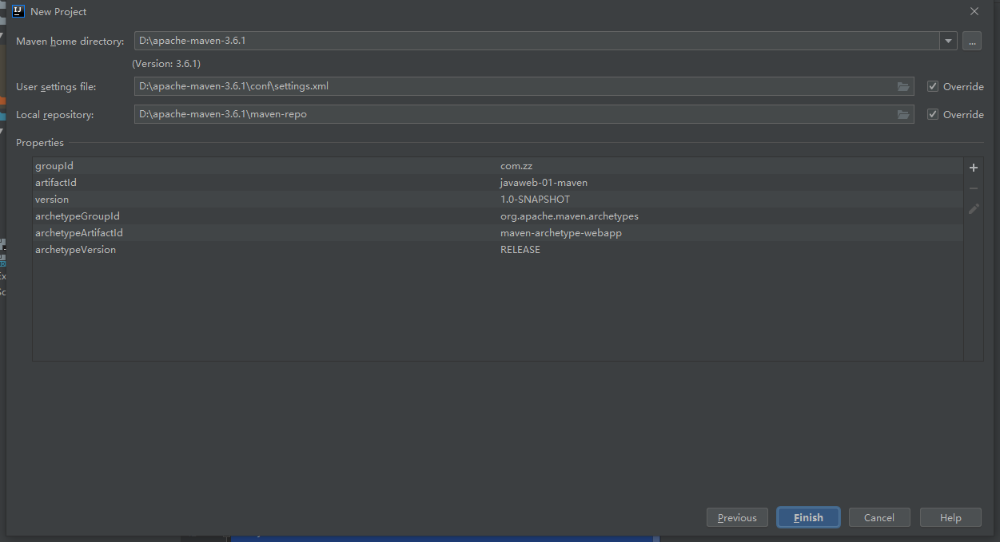

3. 自动导入包

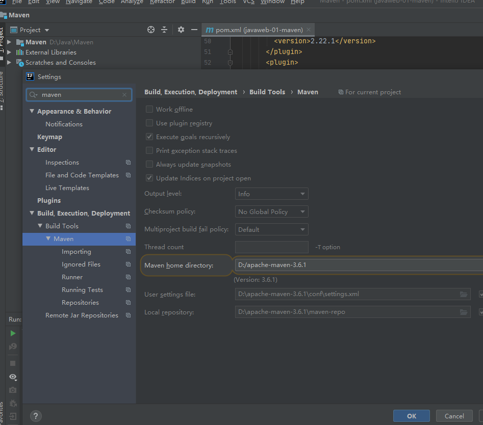

4. 观察Maven仓库多了什么东西？
5. IDEA中的Maven设置

注意：项目创建完成后，IDEA有时候会选择默认的Maven，要切换成本地的

6. 到这里，Maven在IDEA中的配置和使用就OK了。

## 5.7 创建空的Maven项目

## 5.8 标记文件夹功能

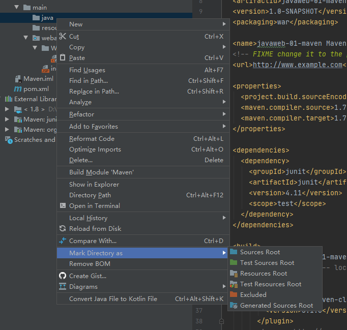

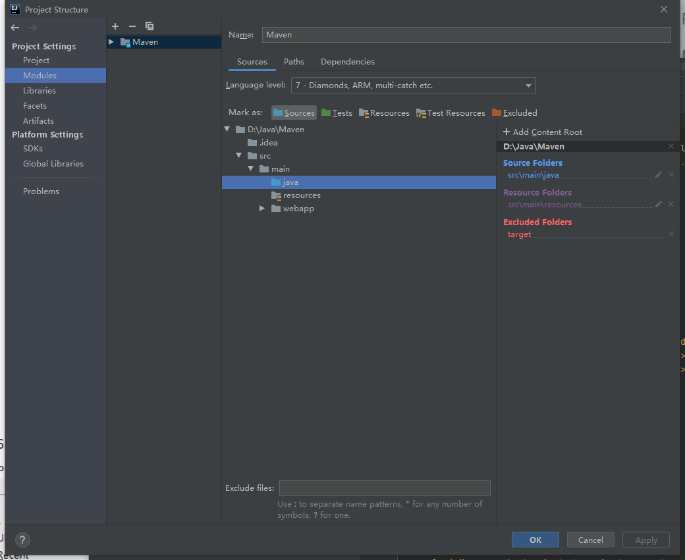

## 5.9 在IDEA中配置Tomcat

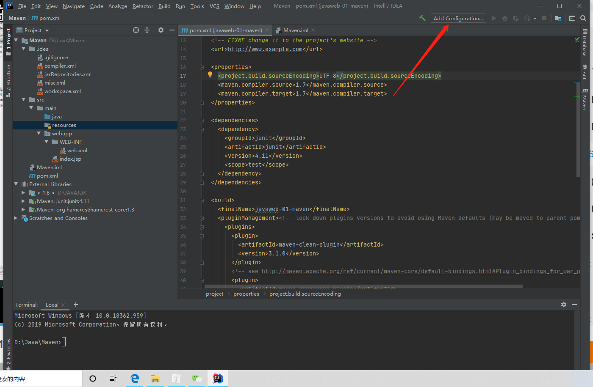

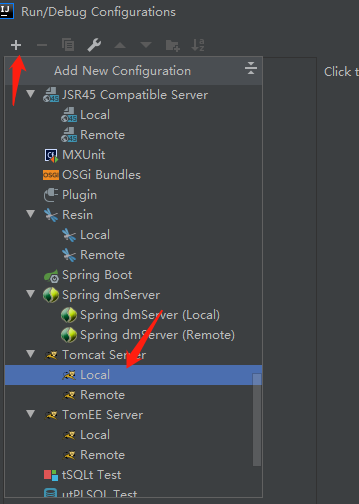


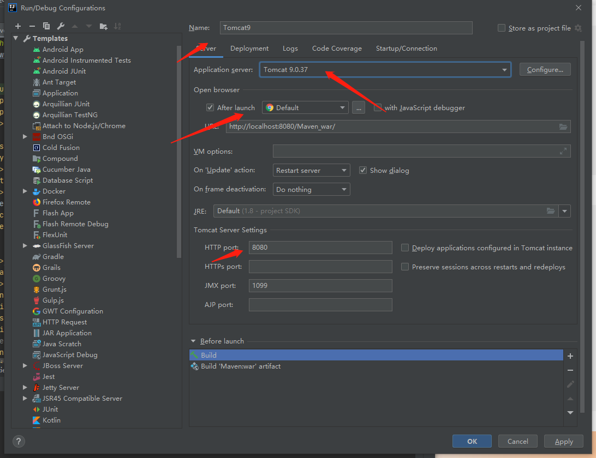

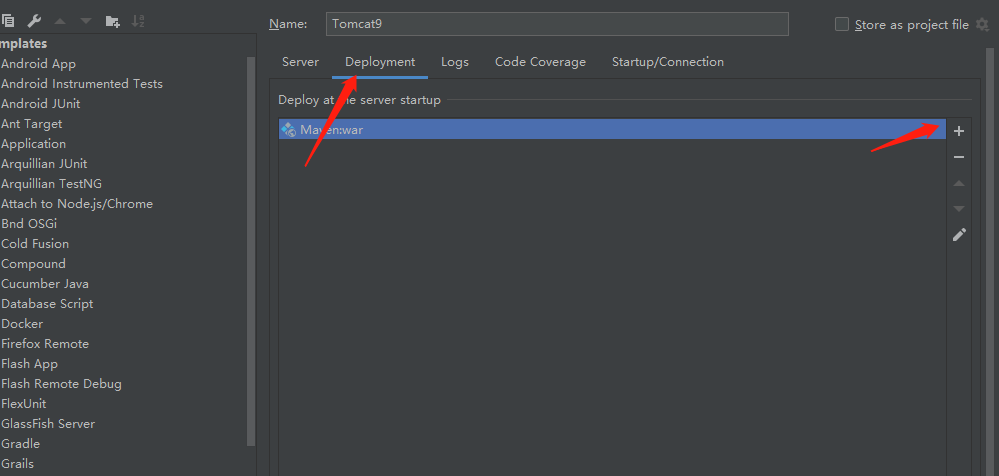

点击启动

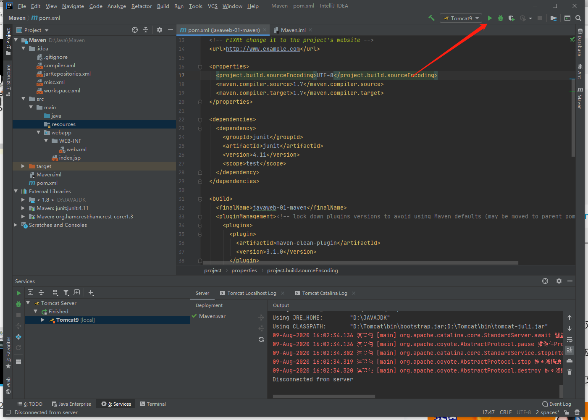


## 5.10 pom文件
pom.xml是Maven的核心配置文件
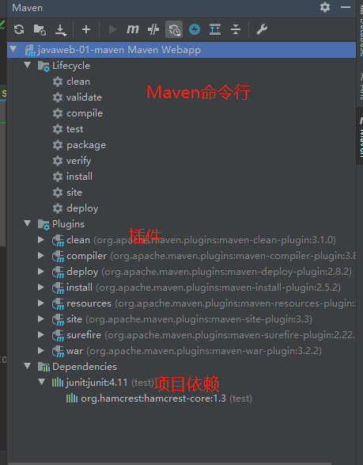


maven由于约定大于配置，之后可能遇到写的配置文件无法被导出或者生效的问题，

```xml
    <build>
        <resources>
            <resource>
                <directory>src/main/resources</directory>
                <excludes>
                    <exclude>**/*.properties</exclude>
                    <exclude>**/*.xml</exclude>
                </excludes>
                <filtering>false</filtering>
            </resource>
            <resource>
                <directory>src/main/java</directory>
                <includes>
                    <include>**/*.properties</include>
                    <include>**/*.xml</include>
                </includes>
                <filtering>false</filtering>
            </resource>
        </resources>
    </build>
```

# 6 Servlet

6.1 Servlet简介

+ Servlet就是sun公司开发动态web的一门技术
+ Sun在这些API中提供了一个接口叫Servlet，如果想开发Servlet，只需要
  + 编写类，实现Servlet接口
  + 把开发好的java类部署到web服务器中

**把实现了Servlet接口的Java程序叫做Servlet**

## 6.2 HelloServlet

Servlet接口有两个默认的实现类，HttpServlet，GenericServlet

1. 创建普通Maven项目，删除src，在里面建立Module

2. 关于Maven父子工程的理解：

   1. 父项目中会有

      ```xml
          <modules>
              <module>servlet-01</module>
          </modules>
      ```

   2. 子项目里会有

      ```xml
          <parent>
              <artifactId>javaweb-02-servlet</artifactId>
              <groupId>com.zz</groupId>
              <version>1.0-SNAPSHOT</version>
          </parent>
      ```

3. Maven环境优化

   1. 修改web.xml为最新的

      ```xml
      <?xml version="1.0" encoding="UTF-8"?>
      <web-app xmlns="http://xmlns.jcp.org/xml/ns/javaee"
               xmlns:xsi="http://www.w3.org/2001/XMLSchema-instance"
               xsi:schemaLocation="http://xmlns.jcp.org/xml/ns/javaee
      http://xmlns.jcp.org/xml/ns/javaee/web-app_4_0.xsd"
               version="4.0"
               metadata-complete="true">
      </web-app>
      ```

      

   2. 将Maven的结构搭建完整

4. 编写一个Servlet程序

   1. 编写一个普通类
   2. 实现Servlet接口，继承HttpServlet


```java
public class HelloServlet extends HttpServlet {

    //由于get和post只是请求实现的不同方式，可以相互调用
    @Override
    protected void doGet(HttpServletRequest req, HttpServletResponse resp) throws ServletException, IOException {


        //ServletOutputStream outputStream = resp.getOutputStream();
        PrintWriter writer = resp.getWriter();//响应流
        writer.println("hello world");

    }

    @Override
    protected void doPost(HttpServletRequest req, HttpServletResponse resp) throws ServletException, IOException {
        doGet(req, resp);
    }
}
```
5. 编写Servlet映射

   为什么需要映射？写的是Java程序，但是要通过浏览器访问，浏览器需要连接web服务器，所以需要在web服务器中注册Servlet，还需给它一个浏览器能够访问的路径

   ```xml
       <!--注册servlet-->
       <servlet>
           <servlet-name>hello</servlet-name>
           <servlet-class>com.zz.servlet.HelloServlet</servlet-class>
       </servlet>
       <!--请求路径-->
       <servlet-mapping>
           <servlet-name>hello</servlet-name>
           <url-pattern>/hello</url-pattern>
       </servlet-mapping>
   ```

6. 配置Tomcat

7. 启动测试

## 6.3 Servlet原理

Servlet是由Web服务器调用，web服务器在收到浏览器请求之后，会：

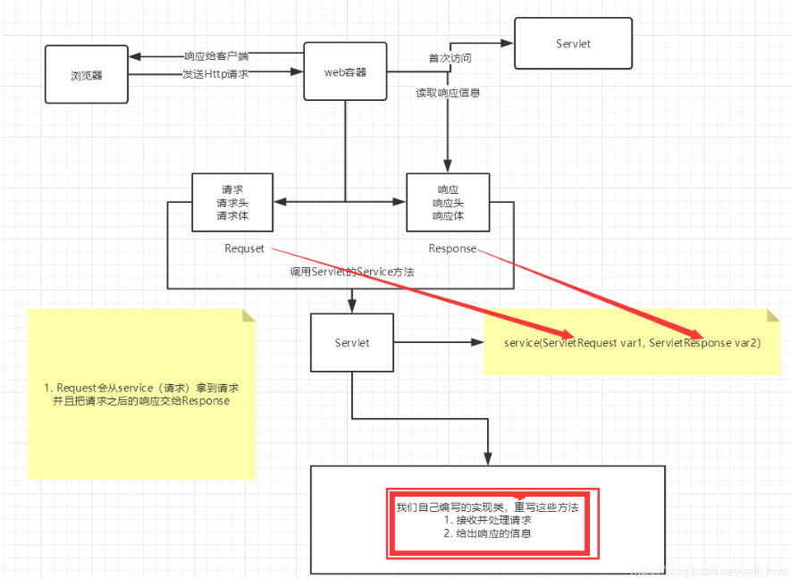

## 6.4 Mapping

1. 一个Servlet可以指定一个映射路径

   ```xml
         <servlet-mapping>
             <servlet-name>hello</servlet-name>
             <url-pattern>/hello</url-pattern>
         </servlet-mapping>
   ```

   

2. 一个Servlet可以指定多个映射路径

   ```xml
         <servlet-mapping>
             <servlet-name>hello</servlet-name>
             <url-pattern>/hello</url-pattern>
         </servlet-mapping>
         <servlet-mapping>
             <servlet-name>hello</servlet-name>
             <url-pattern>/hello2</url-pattern>
         </servlet-mapping>
         <servlet-mapping>
             <servlet-name>hello</servlet-name>
             <url-pattern>/hello3</url-pattern>
         </servlet-mapping>
         <servlet-mapping>
             <servlet-name>hello</servlet-name>
             <url-pattern>/hello4</url-pattern>
         </servlet-mapping>
         <servlet-mapping>
             <servlet-name>hello</servlet-name>
             <url-pattern>/hello5</url-pattern>
         </servlet-mapping>
   ```

3. 一个Servlet可以指定通用映射路径

   ```xml
         <servlet-mapping>
             <servlet-name>hello</servlet-name>
             <url-pattern>/hello/*</url-pattern>
         </servlet-mapping>
   ```

4. 默认请求

   ```xml
          <!--默认请求路径-->
          <servlet-mapping>
              <servlet-name>hello</servlet-name>
              <url-pattern>/*</url-pattern>
          </servlet-mapping>
   ```

   

5. 指定一些后缀或者前缀

   ```xml
     <!--可以自定义后缀实现请求映射
         注意点，*前面不能加项目映射的路径
         hello/sajdlkajda.qinjiang
         -->
     <servlet-mapping>
         <servlet-name>hello</servlet-name>
         <url-pattern>*.qinjiang</url-pattern>
     </servlet-mapping>
   ```

6. 优先级问题：

   指定了固有的映射路径优先级最高，如果找不到就会走默认的处理请求

   ```xml
       <!--注册servlet-->
       <servlet>
           <servlet-name>error</servlet-name>
           <servlet-class>com.zz.servlet.ErrorServlet</servlet-class>
       </servlet>
       <!--请求路径-->
       <servlet-mapping>
           <servlet-name>error</servlet-name>
           <url-pattern>/*</url-pattern>
       </servlet-mapping>
   
   ```

   

## 6.5 ServletContext

web容器在启动的时候，它会为每个web程序都创建一个对应的ServletContext对象，它代表了当前的web应用；

### 1.共享数据

我再这个Servlet中保存的数据，可以在另一个servlet中拿到

放数据：

```java
public class HelloServlet extends HttpServlet {
    @Override
    protected void doGet(HttpServletRequest req, HttpServletResponse resp) throws ServletException, IOException {

        //this.getInitParameter();
        //this.getServletConfig();
        ServletContext servletContext = this.getServletContext();
        String name = "zz";
        servletContext.setAttribute("username",name);//将数据保存在context中，名字为username，值为“zz”
        System.out.println("hello");
    }


}

```

读数据

```java
public class GetServlet extends HttpServlet {
    @Override
    protected void doGet(HttpServletRequest req, HttpServletResponse resp) throws ServletException, IOException {
        ServletContext servletContext = this.getServletContext();
        String username = (String)servletContext.getAttribute("username");
        resp.setContentType("text/html");
        resp.setCharacterEncoding("utf-8");
        PrintWriter writer = resp.getWriter();
        writer.println("姓名："+ username);
    }

    @Override
    protected void doPost(HttpServletRequest req, HttpServletResponse resp) throws ServletException, IOException {
        doGet(req, resp);
    }
}
```

### 2.获取初始化参数

```xml
    <!--配置web初始化参数-->
    <context-param>
        <param-name>url</param-name>
        <param-value>jdbc:mysql://localhost:3306/mybatis</param-value>
    </context-param>
```

```java
public class ServletDemo03 extends HttpServlet {
    protected void doGet(HttpServletRequest req, HttpServletResponse resp) throws ServletException, IOException {
        ServletContext context = this.getServletContext();
        String url = context.getInitParameter("url");
        resp.getWriter().println(url);

    }

    protected void doPost(HttpServletRequest req, HttpServletResponse resp) throws ServletException, IOException {
        this.doGet(req, resp);
    }
}
```

### 3.请求转发

```java
public class ServletDemo04 extends HttpServlet {
    protected void doGet(HttpServletRequest req, HttpServletResponse resp) throws ServletException, IOException {
        ServletContext context = this.getServletContext();
        System.out.println("进入了Demo04");
        RequestDispatcher requestDispatcher = context.getRequestDispatcher("/gp");
        requestDispatcher.forward(req,resp);

    }

    protected void doPost(HttpServletRequest req, HttpServletResponse resp) throws ServletException, IOException {
        this.doGet(req, resp);
    }
}

```

重定向与转发：

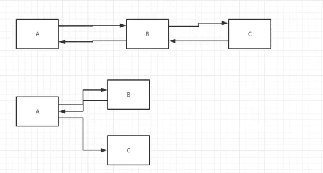

### 4.读取资源文件

Properties

+ 在java目录下新建properties
+ 在resources目录下新建properties

发现都被打包到了同一个路径下：classes，俗称classpath

思路：需要一个文件流

```java
public class ServletDemo05 extends HttpServlet {
    @Override
    protected void doGet(HttpServletRequest req, HttpServletResponse resp) throws ServletException, IOException {
        InputStream is = this.getServletContext().getResourceAsStream("/WEB-INF/classes/db.properties");
        Properties prop = new Properties();
        prop.load(is);
        String username = prop.getProperty("username");
        String password = prop.getProperty("password");

        resp.getWriter().println(username);
        resp.getWriter().println(password);
        is.close();

    }

    @Override
    protected void doPost(HttpServletRequest req, HttpServletResponse resp) throws ServletException, IOException {
        doGet(req, resp);
    }
```

## 6.6 HttpServletResponse

web服务器接收到客户端的http请求，针对这个请求，分别创建一个代表请求的HttpServletRequest对象和一个代表响应的HttpServletResponse对象

+ 如果要获取客户端请求过来的参数 ：找HttpServletRequest
+ 如果要给客户端响应一些信息，找HttpServletResponse

### 1.简单分类

负责向浏览器发送数据的方法

```java
 servletOutputstream getOutputstream() throws IOException;
    Printwriter getwriter() throws IOException;
```

负责向浏览器发送响应头的方法

```java
void setCharacterEncoding(String var1)；
void setContentLength(int var1)；
void setContentLengthLong(long var1);
void setContentType(String var1)；
void setDateHeader(String varl,long var2)
void addDateHeader(String var1,long var2)
void setHeader(String var1,String var2);
void addHeader(String var1,String var2)；
void setIntHeader(String var1,int var2);
void addIntHeader(String varl,int var2);
```

响应的状态码

```java
    int SC_OK = 200;
    int SC_NOT_FOUND = 404;
    int SC_BAD_GATEWAY = 502;
```

### 2.常见应用

1. 向浏览器输出消息

2. 下载文件

   1. 要获取下载文件的路径
   2. 下载的文件名
   3. 下载的文件名设置想办法让浏览器支持下载需要的东西
   4. 获取下载文件的输入流
   5. 创建缓冲区
   6. 获取OutputStream对象
   7. 将FileOutputStream流写入到buffer缓冲区
   8. 使用OutputStream将缓冲区中的数据输出到客户端

3. 验证码

   验证码怎么来的？

   + 前端实现
   + 后端实现，需要用到java的图片类，生成图片

4. **重定向**

   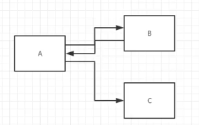

   一个web资源收到客户端请求后，他会通知A客户端去访问另一个web资源C，这个过程叫重定向

   常见场景

   + 用户登录

```java
public class RedirectServlet extends HttpServlet {
    @Override
    protected void doGet(HttpServletRequest req, HttpServletResponse resp) throws ServletException, IOException {
        resp.sendRedirect("/response/image");
    }

    @Override
    protected void doPost(HttpServletRequest req, HttpServletResponse resp) throws ServletException, IOException {
        doGet(req, resp);
    }
}
```

重定向和转发的区别？

相同点：

+ 页面都会发生变化

不同点：

+ 请求转发的时候，url不会发生变化
+ 重定向的时候，url地址会发生变化

index.jsp

```jsp
<html>
<body>
<h2>Hello World!</h2>
<%--这里提交的路径需要寻找到项目的路径--%>
<%--${pageContext. request, contextPath}代表当前的项目--%>
<form action="${pageContext.request.contextPath}/login" method="get">
    用户名:<input type="text" name="username"><br>
    密码：<input type="password" name="password"><br>
    <input type="submit">

</form>
</body>
</html>

```

RequestTest

```java
public class RequestTest extends HttpServlet {
    @Override
    protected void doGet(HttpServletRequest req, HttpServletResponse resp) throws ServletException, IOException {
        //处理请求
        String username = req.getParameter("username");
        String password = req.getParameter("password");

        System.out.println(username+password);
        //重定向的时候一定要注意路径问题，否则404
        resp.sendRedirect("/response/success.jsp");
    }

    @Override
    protected void doPost(HttpServletRequest req, HttpServletResponse resp) throws ServletException, IOException {
        doGet(req, resp);
    }
}
```


## 6.7 HttpServletRequest

HttpServletRequest代表客户端的请求，用户通过Http协议访问服务器，Http请求中的所有信息会被封装到HttpServletRequest,通过这个HttpServletRequest的方法,获得客户端的所有信息


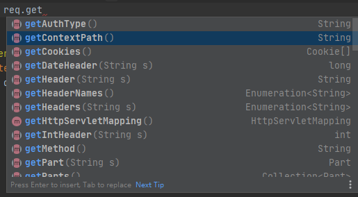

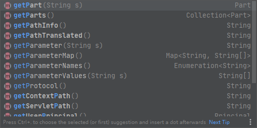

### 1.获取前端的参数

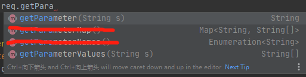

```java
package com.zz.request;

import javax.servlet.ServletException;
import javax.servlet.http.HttpServlet;
import javax.servlet.http.HttpServletRequest;
import javax.servlet.http.HttpServletResponse;
import java.io.IOException;
import java.util.Arrays;

public class LoginServlet extends HttpServlet {
    @Override
    protected void doGet(HttpServletRequest req, HttpServletResponse resp) throws ServletException, IOException {
        req.setCharacterEncoding("utf-8");
        resp.setCharacterEncoding("utf-8");

        String username = req.getParameter("username");
        String password = req.getParameter("password");

        String[] hobbies = req.getParameterValues("hobby");
        System.out.println(username);
        System.out.println(password);
        System.out.println(Arrays.toString(hobbies));

        //通过请求转发
        // 这里的/ 代表当前的web应用
        req.getRequestDispatcher("/success.jsp").forward(req, resp);


    }

    @Override
    protected void doPost(HttpServletRequest req, HttpServletResponse resp) throws ServletException, IOException {
        doGet(req, resp);
    }
}
```

重定向和转发的区别？

相同点：

+ 页面都会发生变化

不同点：

+ 请求转发的时候，url不会发生变化  307
+ 重定向的时候，url地址会发生变化  302

# 7 Cookkie、Session

## 7.1 会话

会话：用户打开一个浏览器，点击了很多超链接，访问多个web资源，关闭浏览器，这个过程可以成为会话

有状态会话：一个同学来过教室，下次再来，就会知道他曾经来过

如何证明是学生？

学生  学校

1. 发票 学校给学生发票
2. 学校登记 学校标记学生来过

一个网站，如何证明来过？

客户端   服务端

1. 服务端给客户端一个信件，客户端下次访问服务端带上信件就可以了；cookie
2. 服务器登记你来过了，下次来服务器来匹配；session

## 7.2保存会话的两种技术

cookie

+ 客户端技术（响应，请求）

session

+ 服务器技术，利用这个技术，可以保存用户信息。可以把信息或者数据放在Session中

  

常见应用：网站登录之后，下次就不用再登录了

## 7.3 Cookie

1. 从请求中拿到cookie信息
2. 服务器给客户端响应cookie

```java
Cookie[] cookies = req.getCookies();//获得cookie
cookie.getName();//获得cookie的key
cookie.getValue();//获得cookie的值
new Cookie("lastLoginTime", System.currentTimeMillis()+"");//新建cookie
cookie.setMaxAge(-1);//设置有效期
resp.addCookie(cookie);//添加cookie
```

cookie:一般回保存在本地的用户目录下 appdata；

一个网站的cookie是否存在上限

+ 一个cookie只能保存一个信息；key-value
+ 一个web站点可以给浏览器发送多个cookie，最多存放20个cookie
+ cookie大小有限制  4kb
+ 浏览器上限 300个cookie

删除Cookie:

+ 不设置有效期，关闭浏览器，自动失效
+ 设置有效期时间为0

编码解码

```java
Cookie cookie = new Cookie("name", URLEncoder.encode("黑怕","utf-8"));
out.write(URLDecoder.decode(cookie.getValue(),"utf-8"));
```

## 7.4 Session（重点）

什么是Session:

+ 服务器会给每一个用户（浏览器）创建一个Session对象
+ 一个Seesion独占一个浏览器，只要浏览器没有关闭，这个session就存在
+ 用户登录之后，整个网站都可以访问-->保存用户信息

```xml
//得到session
HttpSession session = req.getSession();
//给session存东西
//session.setAttribute("name","黑怕");
session.setAttribute("name",new Person("zz",1));
//移除session
session.removeAttribute("name");
//手动注销
session.invalidate();
```

Session与Cookie的区别

+ Cookie 把用户的数据写给用户的浏览器，浏览器保存
+ Session把用户的数据写道用户独占的Session中，服务器端保存（保存重要的信息，减少服务器资源的浪费）
+ Session对象由服务器创建

使用场景：

+ 保存登录用户的信息
+ 购物车
+ 整个网站中经常使用的数据保存在session中

会话自动过期

```xml
    <!--设置session默认的失效时间-->
    <session-config>
        <!--失效时间，分钟为单位-->
        <session-timeout>5</session-timeout>
    </session-config>
```

Cookie：

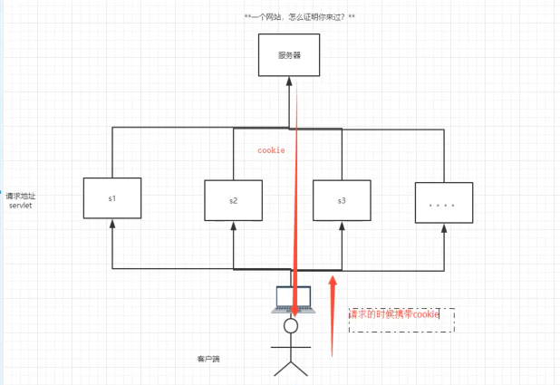

Session

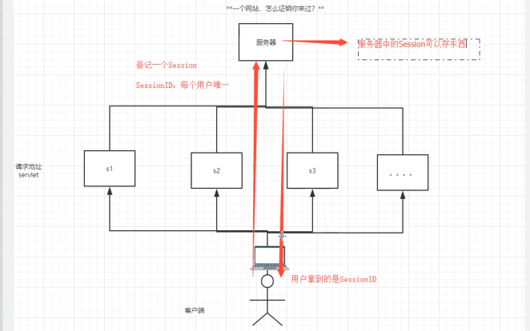

ServletContext

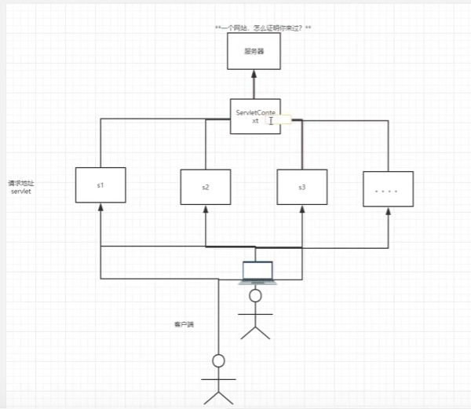

# 8 JSP

## 8.1 什么是JSP

Java Server Pages:Java服务器端页面，也和Servlet一样，用于动态Web技术！

最大的特点：

+ JSP就像HTML

+ 区别

  + HTML只给用户提供静态的数据
  + jsp页面中可以嵌入Java代码，为用户提供动态数据

  

## 8.2 JSP原理

思路：JSP是怎么执行的？

+ 代码层面：与HTML相同

+ 服务器内部工作

  + tomcat中有一个work目录

    IDEA中使用tomcat会在IDEA的tomcat中生成一个work目录

**浏览器向服务器发送请求，不管访问什么资源，其实都是在访问Servlet**

JSP最终也会被转换成一个Java类

**JSP本质实就是一个Servlet**

```java
//初始化
  public void _jspInit() {
      
  }
//销毁
  public void _jspDestroy() {
  }
//JSPService
  public void _jspService(.HttpServletRequest request,HttpServletResponse response)
```

1. 判断请求
2. 内置了一些对象

```java
final javax.servlet.jsp.PageContext pageContext;  //页面上下文
javax.servlet.http.HttpSession session = null;    //session
final javax.servlet.ServletContext application;   //applicationContext
final javax.servlet.ServletConfig config;         //config
javax.servlet.jsp.JspWriter out = null;           //out
final java.lang.Object page = this;               //page：当前
HttpServletRequest request                        //请求
HttpServletResponse response                      //响应
```

3. 输出页面前增加的代码

```java
response.setContentType("text/html");       //设置响应的页面类型
pageContext = _jspxFactory.getPageContext(this, request, response,
       null, true, 8192, true);
_jspx_page_context = pageContext;
application = pageContext.getServletContext();
config = pageContext.getServletConfig();
session = pageContext.getSession();
out = pageContext.getOut();
_jspx_out = out;
```

4. 以上的这些个对象我们可以在JSP页面中直接使用！


在JSP页面中；

只要是 JAVA代码就会原封不动的输出；

如果是HTML代码，就会被转换为：

```java
out.write("<html>\r\n");
```

输出到前端

## 8.3、JSP基础语法

任何语言都有自己的语法，JAVA中有,。 JSP 作为java技术的一种应用，它拥有一些自己扩充的语法（了解，知道即可！），Java所有语法都支持！

```jsp
<%--JSP表达式
作用：用来将程序的输出，输出到客户端
<%= 变量或者表达式%>
--%>
<%= new java.util.Date()%>
```

jsp脚本片段

```jsp
  <%--jsp脚本片段--%>
  <%
    int sum = 0;
    for (int i = 1; i <=100 ; i++) {
      sum+=i;
    }
    out.println("<h1>Sum="+sum+"</h1>");
  %>
```

脚本片段的再实现

```jsp
 <%
    int x = 10;
    out.println(x);
  %>
  <p>这是一个JSP文档</p>
  <%
    int y = 2;
    out.println(y);
  %>

  <hr>


  <%--在代码嵌入HTML元素--%>
  <%
    for (int i = 0; i < 5; i++) {
  %>
  <h1>Hello,World  <%=i%> </h1>
  <%
    }
  %>
```

JSP声明

```jsp
  <%!
    static {
      System.out.println("Loading Servlet!");
    }

    private int globalVar = 0;

    public void kuang(){
      System.out.println("进入了方法Kuang！");
    }
  %>
```

JSP声明：会被编译到JSP生成Java的类中！其他的，就会被生成到_jspService方法中！

在JSP，嵌入Java代码即可！

```jsp
<%%>//中间写java代码
<%=%>//输出（变量或表达式）
<%!%>//声明（全局变量）
<%--注释--%>
```

JSP的注释，不会在客户端显示，HTML的会！

## 8.4 JSP指令

```jsp
<%@page args.... %>
<%@include file=""%>

<%--@include会将两个页面合二为一--%>

<%@include file="common/header.jsp"%>
<h1>网页主体</h1>

<%@include file="common/footer.jsp"%>

<hr>


<%--jSP标签
    jsp:include：拼接页面，本质还是三个
    --%>
<jsp:include page="/common/header.jsp"/>
<h1>网页主体</h1>
<jsp:include page="/common/footer.jsp"/>
```

## 8.5 9大内置对象

- PageContext    存东西

- Request     存东西

- Response

- Session      存东西

- Application   【SerlvetContext】   存东西

- config    【SerlvetConfig】

- out

- page ，不用了解

- exception

- ```java
  pageContext.setAttribute("name1","zz1");//保存的数据只在一个页面中有效
  request.setAttribute("name2","zz2"); //保存的数据只在一次请求中有效，请求转发会携带这个数据
  session.setAttribute("name3","zz3"); //保存的数据只在一次会话中有效，从打开浏览器到关闭浏览器
  application.setAttribute("name4","zz4");  //保存的数据只在服务器中有效，从打开服务器到关闭服务器
  ```

  request：客户端向服务器发送请求，产生的数据，用户看完就没用了，比如：新闻，用户看完没用的！

  session：客户端向服务器发送请求，产生的数据，用户用完一会还有用，比如：购物车；

  application：客户端向服务器发送请求，产生的数据，一个用户用完了，其他用户还可能使用，比如：聊天数据；

## 8.6、JSP标签、JSTL标签、EL表达式

```xml
<dependency>
    <groupId>javax.servlet.jsp.jstl</groupId>
    <artifactId>jstl-api</artifactId>
    <version>1.2</version>
</dependency>
<dependency>
    <groupId>taglibs</groupId>
    <artifactId>standard</artifactId>
    <version>1.1.2</version>
</dependency>
```

EL表达式：  ${ }

- **获取数据**
- **执行运算**
- **获取web开发的常用对象**

JSP标签

```jsp
<%--jsp.include--%>
<jsp:forward page="jsptag2.jsp">
<jsp:param name="name" value="zz"/>
<jsp:param name="age" value="1"/>
</body>
</jsp:forward>
```

**JSTL表达式**

JSTL标签库的使用就是为了弥补HTML标签的不足；它自定义许多标签，可以供我们使用，标签的功能和Java代码一样！

**格式化标签**

**SQL标签**

**XML 标签**

**核心标签** （掌握部分）

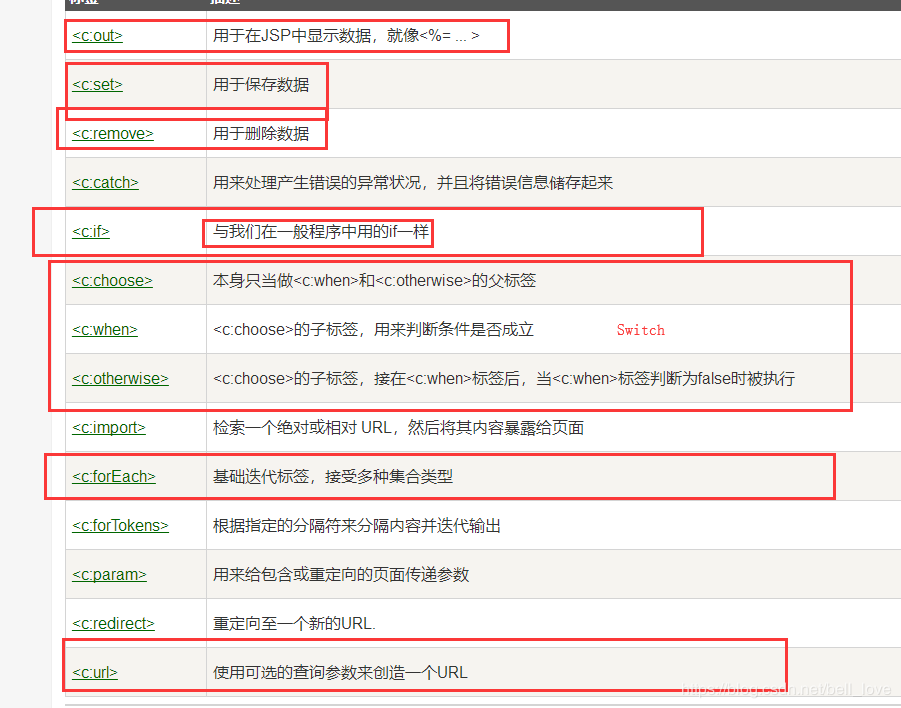

**JSTL标签库使用步骤**

- 引入对应的 taglib
- 使用其中的方法
- **在Tomcat 也需要引入 jstl的包，否则会报错：JSTL解析错误**

**c：if**

```html
<h4>if测试</h4>

<hr>

<form action="coreif.jsp" method="get">
    <%--
    EL表达式获取表单中的数据
    ${param.参数名}
    --%>
    <input type="text" name="username" value="${param.username}">
    <input type="submit" value="登录">
</form>

<%--判断如果提交的用户名是管理员，则登录成功--%>
<c:if test="${param.username=='admin'}" var="isAdmin">
    <c:out value="管理员欢迎您！"/>
</c:if>

<%--自闭合标签--%>
<c:out value="${isAdmin}"/>

```

**c:choose   c:when**

```html
    <c:set var="score" value="85"/>
    <c:choose>
        <c:when test="${score>90}">
            90
        </c:when>
        <c:when test="${score>80}">
            80
        </c:when>
        <c:when test="${score>70}">
            70
        </c:when>

    </c:choose>
```

**c:forEach**

```html
<%

    ArrayList<String> people = new ArrayList<>();
    people.add(0,"张三");
    people.add(1,"李四");
    people.add(2,"王五");
    people.add(3,"赵六");
    people.add(4,"田六");
    request.setAttribute("list",people);
%>


<%--
var , 每一次遍历出来的变量
items, 要遍历的对象
begin,   哪里开始
end,     到哪里
step,   步长
--%>
<c:forEach var="people" items="${list}">
    <c:out value="${people}"/> <br>
</c:forEach>

<hr>

<c:forEach var="people" items="${list}" begin="1" end="3" step="1" >
    <c:out value="${people}"/> <br>
</c:forEach>

```

# 9 JavaBean

实体类

JavaBean有特定的写法：

- 必须要有一个无参构造
- 属性必须私有化
- 必须有对应的get/set方法；

一般用来和数据库的字段做映射  ORM；

ORM ：对象关系映射

- 表—>类
- 字段–>属性
- 行记录---->对象

| id   | name | age  | address |
| ---- | ---- | ---- | ------- |
| 1    | zz1  | 3    | 西安    |
| 2    | zz2  | 18   | 西安    |
| 3    | zz3  | 100  | 西安    |

```java
class People{
    private int id;
    private String name;
    private int age;
    private String address;
}

class A{
    new People(1,"zz1",3，"西安");
    new People(2,"zz2",18，"西安");
    new People(3,"zz3",100，"西安");
}
```

# 10、MVC三层架构

- 什么是MVC：  Model     view     Controller  模型、视图、控制器

## 10.1 以前的架构

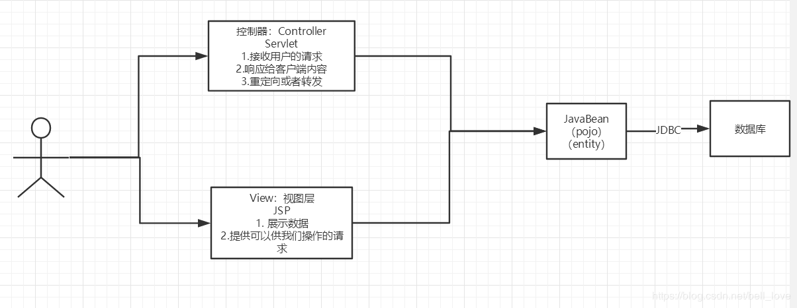

用户直接访问控制层，控制层就可以直接操作数据库；

```java
servlet--CRUD-->数据库
弊端：程序十分臃肿，不利于维护  
servlet的代码中：处理请求、响应、视图跳转、处理JDBC、处理业务代码、处理逻辑代码

架构：没有什么是加一层解决不了的！
程序猿调用
↑
JDBC （实现该接口）
↑
Mysql Oracle SqlServer ....（不同厂商）
```

## 10.2、MVC三层架构

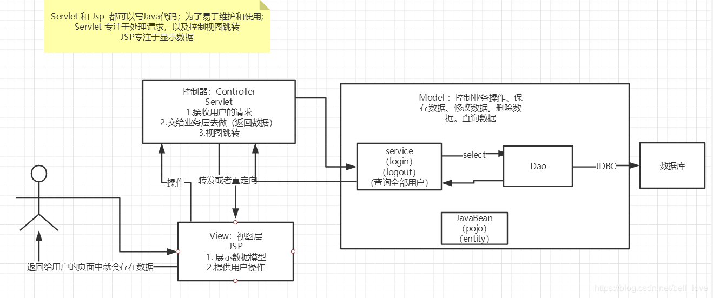

Model

- 业务处理 ：业务逻辑（Service）
- 数据持久层：CRUD   （Dao - 数据持久化对象）

View

- 展示数据
- 提供链接发起Servlet请求 （a，form，img…）

Controller  （Servlet）

- 收用户的请求 ：（req：请求参数、Session信息….）
- 交给业务层处理对应的代码
- 控制视图的跳转

```
登录--->接收用户的登录请求--->处理用户的请求（获取用户登录的参数，username，password）---->交给业务层处理登录业务（判断用户名密码是否正确：事务）--->Dao层查询用户名和密码是否正确-->数据库
```

# 11 Filter （重点）

比如 Shiro安全框架技术就是用Filter来实现的

Filter：过滤器 ，用来过滤网站的数据；

- 处理中文乱码
- 登录验证….

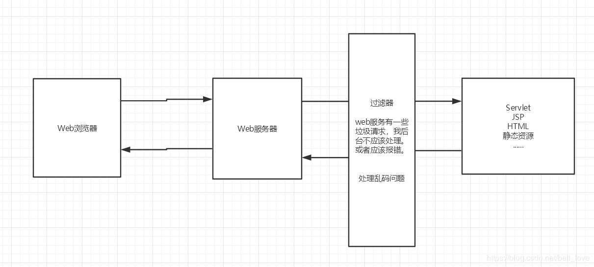

Filter开发步骤：

1. 导包

2. 编写过滤器

   1. 导包不要错 **（注意）**

      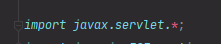

   2. 实现接口，重写对应方法

   ```java
   public class CharatorEncodingFilter implements Filter {
       public void init(FilterConfig filterConfig) throws ServletException {
           System.out.println("init");
       }
       // chain 链
       /*
       * 1 过滤器中所有的代码，在过滤特定请求的时候都会执行
       * 2 必须要让过滤器继续通行
       * */
       public void doFilter(ServletRequest servletRequest, ServletResponse servletResponse, FilterChain filterChain) throws IOException, ServletException {
           servletRequest.setCharacterEncoding("utf-8");
           servletResponse.setCharacterEncoding("utf-8");
           servletResponse.setContentType("text/html;charset=UTG-8");
   
           System.out.println("执行前");
           filterChain.doFilter(servletRequest, servletResponse);//让请求继续，如果不写就停止了
           System.out.println("执行后");
       }
   
       public void destroy() {
           System.out.println("destroy");
       }
   }
   ```

   3. 在xml配置Filter

# 12 监听器

实现一个监听器的接口；（有n种监听器）

1. 编写一个监听器

   实现监听器的接口…

   ```java
   package com.zz.listener;
   
   import javax.servlet.ServletContext;
   import javax.servlet.http.HttpSessionEvent;
   import javax.servlet.http.HttpSessionListener;
   
   public class OnlineCountListener implements HttpSessionListener {
   //创建session监听 看你的一举一动
   //一旦创建session就会触发一次这个事件
   
       public void sessionCreated(HttpSessionEvent se) {
           System.out.println(se.getSession().getId());
           ServletContext context = se.getSession().getServletContext();
           Integer onlineCount = (Integer) context.getAttribute("OnlineCount");
           if(onlineCount==null){
               onlineCount = new Integer(1);
           }else{
               int i = onlineCount.intValue();
               onlineCount = new Integer(i + 1);
           }
   
           context.setAttribute("OnlineCount",onlineCount);
       }
   
       public void sessionDestroyed(HttpSessionEvent se) {
           ServletContext context = se.getSession().getServletContext();
           Integer onlineCount = (Integer) context.getAttribute("OnlineCount");
           if(onlineCount==null){
               onlineCount = new Integer(0);
           }else{
               int i = onlineCount.intValue();
               onlineCount = new Integer(i - 1);
           }
   
           context.setAttribute("OnlineCount",onlineCount);
       }
   
           /*
       Session销毁：
       1. 手动销毁  getSession().invalidate();
       2. 自动销毁
        */
   }
   
   ```

   2. xml注册监听器

      ```xml
      <listener>
          <listener-class>com.zz.listener.OnlineCountListener</listener-class>
      </listener>
      ```

   3. 看情况是否使用

# 13 过滤器、监听器常见应用

**监听器：GUI编程中经常使用；**

```java
public class TestPanel {
    public static void main(String[] args) {
        Frame frame = new Frame("中秋节快乐");  //新建一个窗体
        Panel panel = new Panel(null); //面板
        frame.setLayout(null); //设置窗体的布局

        frame.setBounds(300,300,500,500);
        frame.setBackground(new Color(0,0,255)); //设置背景颜色

        panel.setBounds(50,50,300,300);
        panel.setBackground(new Color(0,255,0)); //设置背景颜色

        frame.add(panel);

        frame.setVisible(true);

        //监听事件，监听关闭事件
        frame.addWindowListener(new WindowAdapter() {
            @Override
            public void windowClosing(WindowEvent e) {
                super.windowClosing(e);
            }
        });

    }
}
```

用户登录之后才能进入主页！用户注销后就不能进入主页了！

1. 用户登录之后，向Sesison中放入用户的数据
2. 进入主页的时候要判断用户是否已经登录；要求：在过滤器中实现！

```java
HttpServletRequest request = (HttpServletRequest) servletRequest;
HttpServletResponse response = (HttpServletResponse) servletResponse;

if (request.getSession().getAttribute("USER_SESSION") == null){
    response.sendRedirect("/failed.jsp");
}

filterChain.doFilter(servletRequest, servletResponse);
```

# 14 JDBC

什么是JDBC ： Java连接数据库！

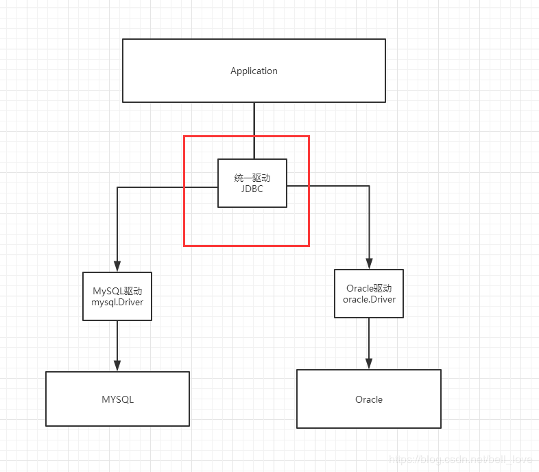

需要jar包的支持：

- java.sql
- javax.sql
- mysql-conneter-java…  连接驱动（必须要导入）

**实验环境搭建**

```sql
CREATE TABLE users(
    id INT PRIMARY KEY,
    `name` VARCHAR(40),
    `password` VARCHAR(40),
    email VARCHAR(60),
    birthday DATE
);

INSERT INTO users(id,`name`,`password`,email,birthday)
VALUES(1,'张三','123456','zs@qq.com','2000-01-01');
INSERT INTO users(id,`name`,`password`,email,birthday)
VALUES(2,'李四','123456','ls@qq.com','2000-01-01');
INSERT INTO users(id,`name`,`password`,email,birthday)
VALUES(3,'王五','123456','ww@qq.com','2000-01-01');
```

导入数据库依赖

```xml
<!--mysql的驱动-->
<dependency>
    <groupId>mysql</groupId>
    <artifactId>mysql-connector-java</artifactId>
    <version>5.1.47</version>
</dependency>
```

**JDBC 固定步骤：**

1. 加载驱动
2. 连接数据库,代表数据库
3. 向数据库发送SQL的对象Statement : CRUD
4. 编写SQL （根据业务，不同的SQL）
5. 执行SQL
6. 关闭连接（先开的后关）

```java
public class TestJdbc {
    public static void main(String[] args) throws ClassNotFoundException, SQLException {
        //配置信息
        //useUnicode=true&characterEncoding=utf-8 解决中文乱码
        String url="jdbc:mysql://localhost:3306/jdbc?useUnicode=true&characterEncoding=utf-8";
        String username = "root";
        String password = "123456";

        //1.加载驱动
        Class.forName("com.mysql.jdbc.Driver");
        //2.连接数据库,代表数据库
        Connection connection = DriverManager.getConnection(url, username, password);

        //3.向数据库发送SQL的对象Statement,PreparedStatement : CRUD
        Statement statement = connection.createStatement();

        //4.编写SQL
        String sql = "select * from users";

        //5.执行查询SQL，返回一个 ResultSet  ： 结果集
        ResultSet rs = statement.executeQuery(sql);

        while (rs.next()){
            System.out.println("id="+rs.getObject("id"));
            System.out.println("name="+rs.getObject("name"));
            System.out.println("password="+rs.getObject("password"));
            System.out.println("email="+rs.getObject("email"));
            System.out.println("birthday="+rs.getObject("birthday"));
        }

        //6.关闭连接，释放资源（一定要做） 先开后关
        rs.close();
        statement.close();
        connection.close();
    }
}

```

**事务**

要么都成功，要么都失败！

ACID原则：保证数据的安全。

```java
开启事务
事务提交  commit()
事务回滚  rollback()
关闭事务

转账：
A:1000
B:1000
    
A(900)   --100-->   B(1100) 
```

**Junit单元测试**

依赖

```xml
<!--单元测试-->
<dependency>
    <groupId>junit</groupId>
    <artifactId>junit</artifactId>
    <version>4.12</version>
</dependency>
```

简单使用

@Test注解只有在方法上有效，只要加了这个注解的方法，就可以直接运行！

```java
@Test
public void test(){
    System.out.println("Hello");
}
```

搭建环境

```sql
CREATE TABLE account(
   id INT PRIMARY KEY AUTO_INCREMENT,
   `name` VARCHAR(40),
   money FLOAT
);

INSERT INTO account(`name`,money) VALUES('A',1000);
INSERT INTO account(`name`,money) VALUES('B',1000);
INSERT INTO account(`name`,money) VALUES('C',1000);
```

