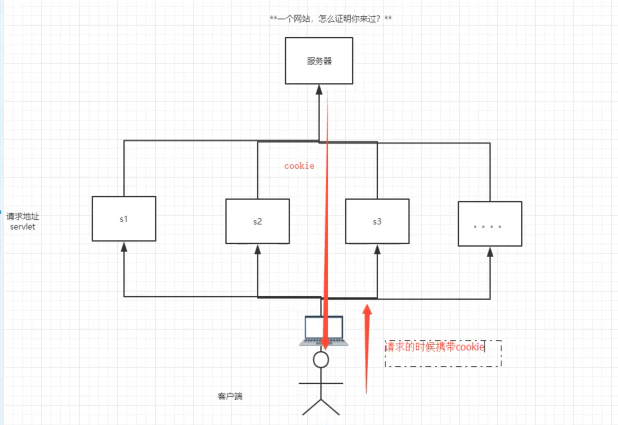
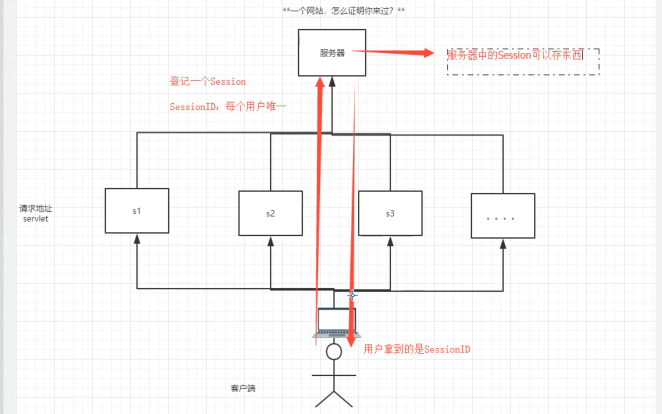
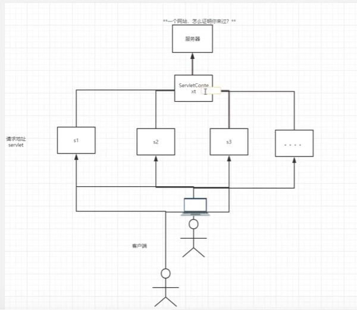

# 7 Cookkie、Session

## 7.1 会话

会话：用户打开一个浏览器，点击了很多超链接，访问多个web资源，关闭浏览器，这个过程可以成为会话

有状态会话：一个同学来过教室，下次再来，就会知道他曾经来过

如何证明是学生？

学生  学校

1. 发票 学校给学生发票
2. 学校登记 学校标记学生来过

一个网站，如何证明来过？

客户端   服务端

1. 服务端给客户端一个信件，客户端下次访问服务端带上信件就可以了；cookie
2. 服务器登记你来过了，下次来服务器来匹配；session

## 7.2保存会话的两种技术

cookie

+ 客户端技术（响应，请求）

session

+ 服务器技术，利用这个技术，可以保存用户信息。可以把信息或者数据放在Session中

  

常见应用：网站登录之后，下次就不用再登录了

## 7.3 Cookie

1. 从请求中拿到cookie信息
2. 服务器给客户端响应cookie

```java
Cookie[] cookies = req.getCookies();//获得cookie
cookie.getName();//获得cookie的key
cookie.getValue();//获得cookie的值
new Cookie("lastLoginTime", System.currentTimeMillis()+"");//新建cookie
cookie.setMaxAge(-1);//设置有效期
resp.addCookie(cookie);//添加cookie
```

cookie:一般回保存在本地的用户目录下 appdata；

一个网站的cookie是否存在上限

+ 一个cookie只能保存一个信息；key-value
+ 一个web站点可以给浏览器发送多个cookie，最多存放20个cookie
+ cookie大小有限制  4kb
+ 浏览器上限 300个cookie

删除Cookie:

+ 不设置有效期，关闭浏览器，自动失效
+ 设置有效期时间为0

编码解码

```java
Cookie cookie = new Cookie("name", URLEncoder.encode("黑怕","utf-8"));
out.write(URLDecoder.decode(cookie.getValue(),"utf-8"));
```

## 7.4 Session（重点）

什么是Session:

+ 服务器会给每一个用户（浏览器）创建一个Session对象
+ 一个Seesion独占一个浏览器，只要浏览器没有关闭，这个session就存在
+ 用户登录之后，整个网站都可以访问-->保存用户信息

```xml
//得到session
HttpSession session = req.getSession();
//给session存东西
//session.setAttribute("name","黑怕");
session.setAttribute("name",new Person("zz",1));
//移除session
session.removeAttribute("name");
//手动注销
session.invalidate();
```

Session与Cookie的区别

+ Cookie 把用户的数据写给用户的浏览器，浏览器保存
+ Session把用户的数据写道用户独占的Session中，服务器端保存（保存重要的信息，减少服务器资源的浪费）
+ Session对象由服务器创建

使用场景：

+ 保存登录用户的信息
+ 购物车
+ 整个网站中经常使用的数据保存在session中

会话自动过期

```xml
    <!--设置session默认的失效时间-->
    <session-config>
        <!--失效时间，分钟为单位-->
        <session-timeout>5</session-timeout>
    </session-config>
```

Cookie：



Session



ServletContext

