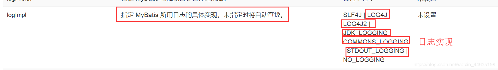
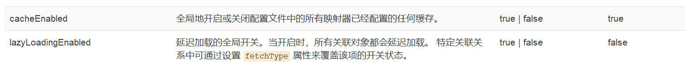
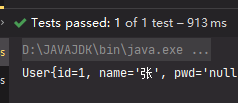
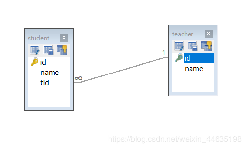

MyBatis

# 1 简介

## 1.1 什么是MyBatis

- **MyBatis 是一款优秀的持久层框架;**
- 它支持自定义 SQL、存储过程以及高级映射。MyBatis 免除了几乎所有的 JDBC 代码以及设置参数和获取结果集的工作。MyBatis 可以通过简单的 XML 或注解来配置和映射原始类型、接口和 Java POJO（Plain Old Java Objects，普通老式 Java 对象）为数据库中的记录。
- MyBatis 可以使用简单的 XML 或注解来配置和映射原生信息，将接口和 Java 的 实体类 【Plain Old Java Objects,普通的 Java对象】映射成数据库中的记录。
- MyBatis 本是apache的一个开源项目ibatis, 2010年这个项目由apache 迁移到了google code，并且改名为MyBatis 。
- 2013年11月迁移到***\*Github\**** .

如何获得MyBatis

+ maven仓库

  ```xml
  <!-- https://mvnrepository.com/artifact/org.mybatis/mybatis -->
  <dependency>
      <groupId>org.mybatis</groupId>
      <artifactId>mybatis</artifactId>
      <version>3.4.6</version>
  </dependency>
  ```

- Mybatis官方文档 : http://www.mybatis.org/mybatis-3/zh/index.html
- GitHub : https://github.com/mybatis/mybatis-3

## 1.2 持久化

数据持久化

- 持久化就是将程序的数据在持久状态和瞬时状态转化的过程
- 内存：**断电即失**
- 数据库（Jdbc）,io文件持久化。

**为什么要持久化？**

- 有一些对象，不能让他丢掉
- 内存太贵

## 1.3 持久层

Dao层、Service层、Controller层

- 完成持久化工作的代码块
- 层界限十分明显

## 1.4 为什么需要MyBatis

- 帮助程序员将数据存入到数据库中
- 方便
- 传统的JDBC代码太复杂了，简化，框架，自动化
- 不用MyBatis也可以，技术没有高低之分
- 优点：
  - 简单易学
  - 灵活
  - sql和代码的分离，提高了可维护性。
  - 提供映射标签，支持对象与数据库的orm字段关系映射
  - 提供对象关系映射标签，支持对象关系组建维护
  - 提供xml标签，支持编写动态sql

# 2 第一个MyBatis程序

**思路流程：搭建环境-->导入Mybatis--->编写代码--->测试**

## 2.1 搭建环境

搭建数据库（创建数据库最好用SQLyog，后面容易发生字符编码错误）

```sql
CREATE DATABASE `mybatis`;
USE `mybatis`;
CREATE TABLE `user`(
`id` INT(20) NOT NULL,
`name` VARCHAR(20) NOT NULL,
`pwd` VARCHAR(20) DEFAULT NULL,
PRIMARY KEY(`id`) 

);ENGINE=INNODB DEFAULT CHARSET=utf-8;

INSERT INTO `user` (`id`,`name`,`pwd`) VALUES
(1,'zz1','123456'),
(2,'zz2','123456'),
(3,'zz3','123456');
```

新建项目

1. 新建maven项目
2. 删除src
3. 导入依赖

```xml
<dependencies>
    <dependency>
        <groupId>org.mybatis</groupId>
        <artifactId>mybatis</artifactId>
        <version>3.5.2</version>
    </dependency>

    <dependency>
        <groupId>mysql</groupId>
        <artifactId>mysql-connector-java</artifactId>
        <version>5.1.47</version>
    </dependency>

    <dependency>
        <groupId>junit</groupId>
        <artifactId>junit</artifactId>
        <version>4.12</version>
    </dependency>
</dependencies>
```

## 2.2 创建模块

+ 编写MyBatis核心配置文件

```xml
<configuration>
    <environments default="development">
        <environment id="development">
            <transactionManager type="JDBC"/>
            <dataSource type="POOLED">
                <property name="driver" value="com.mysql.jdbc.Driver"/>
                <property name="url" value="jdbc:mysql://localhost:3306/mybatis?useSSL=true&amp;useUnicode=true&amp;characterEncoding=utf8"/>
                <property name="username" value="root"/>
                <property name="password" value="123456"/>
            </dataSource>
        </environment>
    </environments>
</configuration>
```

+ 编写MyBatis工具类

```java
public class MybatisUtils {
    private static SqlSessionFactory sqlSessionFactory;

    static {
        try {
            //获取sqlSessionFactory对象
            String resource = "mybatis-config.xml";
            InputStream inputStream = Resources.getResourceAsStream(resource);
            sqlSessionFactory = new SqlSessionFactoryBuilder().build(inputStream);
        } catch (IOException e) {
            e.printStackTrace();
        }
    }
    //获取SqlSession连接
    public static SqlSession getSession(){
        return sqlSessionFactory.openSession();
    }
}
```

## 2.3 编写代码

+ 实体类
+ Dao接口

```java
public interface UserDao {
    public List<User> getUserList();
}
```

+ 接口实现类 （由原来的UserDaoImpl转变为一个Mapper配置文件）

```xml
<?xml version="1.0" encoding="UTF-8" ?>

<!DOCTYPE mapper

        PUBLIC "-//mybatis.org//DTD Mapper 3.0//EN"

        "http://mybatis.org/dtd/mybatis-3-mapper.dtd">
<!--namespace=绑定一个指定的Dao/Mapper接口-->
<mapper namespace="com.zz.dao.UserDao">
<!--id 对应方法名-->
    <select id="getUserList" resultType="com.zz.pojo.User">
    select * from user
  </select>
</mapper>
```

## 2.4 测试

注意点：

org.apache.ibatis.binding.BindingException: Type interface com.kuang.dao.UserDao is not known to the MapperRegistry.

**MapperRegistry是什么?**

核心配置文件中注册mapper

```java
@MyTest
public void test(){
    //获得SqlSession对象
    SqlSession sqlSession = MybatisUtils.getSession();
    //方式一 getMapper
    UserDao userDao = sqlSession.getMapper(UserDao.class);
    List<User> userList = userDao.getUserList();

    for (User user : userList) {
        System.out.println(user);
    }

    sqlSession.close();
}
```

# 3、CURD

## 3.1 namespace

namespace中的包名要和Dao/Mapper接口的包名一致

## 3.2 select

选择，查询语句；

- id：就是对应的namespace中的方法名；

- resultType : Sql语句执行的返回值；

- parameterType : 参数类型；

  1. 编写接口

     ```java
     public interface UserMapper {
         //查询所有用户
         public List<User> getUserList();
         //插入用户
         public void addUser(User user);
     }
     ```

  2. 编写对应的mapper中的sql语句

     ```xml
     <insert id="addUser" parameterType="com.kuang.pojo.User">
         insert into user (id,name,password) values (#{id}, #{name}, #{password})
     </insert>
     ```

  3. 测试

     ```java
     @MyTest
     public void test2() {
         SqlSession sqlSession = MybatisUtils.getSqlSession();
         UserMapper mapper = sqlSession.getMapper(UserMapper.class);
         User user  = new User(3,"黑子","666");
         mapper.addUser(user);
         //增删改一定要提交事务
         sqlSession.commit();
     
         //关闭sqlSession
         sqlSession.close();
     }
     ```

     **注意：增删改查一定要提交事务：**

     ```java
     sqlSession.commit();
     ```

## 3.3 Insert

## 3.4 update

## 3.5 Delete

## 3.6 万能Map

假设，我们的实体类，或者数据库中的表，字段或者参数过多，我们应该考虑使用Map!

1. UserMapper接口

   ```java
   //用万能Map插入用户
   public void addUser2(Map<String,Object> map);
   ```

2. ```xml
   <!--对象中的属性可以直接取出来 传递map的key-->
   <insert id="addUser2" parameterType="map">
       insert into user (id,name,password) values (#{userid},#{username},#{userpassword})
   </insert>
   ```

3. ```java
       @MyTest
       public void test3(){
           SqlSession sqlSession = MybatisUtils.getSqlSession();
           UserMapper mapper = sqlSession.getMapper(UserMapper.class);
           HashMap<String, Object> map = new HashMap<String, Object>();
           map.put("userid",4);
           map.put("username","王虎");
           map.put("userpassword",789);
           mapper.addUser2(map);
           //提交事务
           sqlSession.commit();
           //关闭资源
           sqlSession.close();
       }
   ```

> Map传递参数，直接在sql中取出key即可！	【parameter=“map”】
>
> 对象传递参数，直接在sql中取出对象的属性即可！	【parameter=“Object”】
>
> 只有一个基本类型参数的情况下，可以直接在sql中取到
>
> 多个参数用Map , **或者注解！**

## 7. 模糊查询

1. Java代码执行的时候，传递通配符 % %

```java
List<User> userList = mapper.getUserLike("%李%");
```

2. 在sql拼接中使用通配符！

```sql
select * from mybatis.user where name like "%"#{value}"%"
```

# 4 配置解析

## 4.1 核心配置文件

+ mybatis-config.xml
+ MyBatis 的配置文件包含了会深深影响 MyBatis 行为的设置和属性信息。

```java
configuration（配置）
properties（属性）
settings（设置）
typeAliases（类型别名）
typeHandlers（类型处理器）
objectFactory（对象工厂）
plugins（插件）
environments（环境配置）
environment（环境变量）
transactionManager（事务管理器）
dataSource（数据源）
databaseIdProvider（数据库厂商标识）
mappers（映射器）
```

## 4.2 环境配置（environments）

MyBatis 可以配置成适应多种环境

**不过要记住：尽管可以配置多个环境，但每个 SqlSessionFactory 实例只能选择一种环境。**

学会使用配置多套运行环境！

Mybatis默认的事务管理器就是 JDBC  ， 连接池 ： POOLED

## 4.3 属性（properties）

我们可以通过properties属性来实现引用配置文件

这些属性都是可外部配置且可动态替换的，既可以在典型的 Java 属性文件中配置，亦可通过 properties 元素的子元素来传递。【db.properties】

编写配置文件

```xml
driver=value="com.mysql.jdbc.Driver
url=jdbc:mysql://localhost:3306/mybatis?useSSL=true&amp;useUnicode=true&amp;characterEncoding=utf8
username=root
password=123456

```

在核心配置文件中映入

```xml
    <properties resource="db.properties"/>
```

- 可以直接引入外部文件
- 可以在其中增加一些属性配置
- 如果两个文件有同一个字段，优先使用外部配置文件的！

## 4.4 类型别名（typeAliases）

- 类型别名是为 Java 类型设置一个短的名字。
- 存在的意义仅在于用来减少类完全限定名的冗余。

```xml
<typeAliases>
    <typeAlias type="com.zz.pojo.User" alias="User"/>
</typeAliases>
```

也可以指定一个包名，MyBatis 会在包名下面搜索需要的 Java Bean，比如：

扫描实体类的包，它的默认别名就为这个类的 类名，首字母小写！

```xml
<!--可以给实体类起别名-->
<typeAliases>
    <package name="com.kuang.pojo"/>
</typeAliases>
```

在实体类比较少的时候，使用第一种方式。

如果实体类十分多，建议使用第二种。

第一种可以DIY别名，第二种则·不行·，如果非要改，需要在实体上增加注解

```java
@Alias("user")
public class User {}
```

## 4.5 设置

这是 MyBatis 中极为重要的调整设置，它们会改变 MyBatis 的运行时行为。





## 4.6 其他配置

- [typeHandlers（类型处理器）](https://mybatis.org/mybatis-3/zh/configuration.html#typeHandlers)
- [objectFactory（对象工厂）](https://mybatis.org/mybatis-3/zh/configuration.html#objectFactory)
- plugins插件
  - mybatis-generator-core
  - mybatis-plus
  - 通用mapper

## 4.7 映射器（mappers）

MapperRegistry：注册绑定我们的Mapper文件；

方式一： 【推荐使用】

```xml
<!--每一个Mapper.XML都需要在Mybatis核心配置文件中注册！-->
<mappers>
    <mapper resource="com/zz/dao/UserMapper.xml"/>
</mappers>
```

方式二：使用class文件绑定注册

```xml
<!--每一个Mapper.XML都需要在Mybatis核心配置文件中注册！-->
<mappers>
    <mapper class="com.zz.dao.UserMapper"/>
</mappers>
```

注意点：

- 接口和他的Mapper配置文件必须同名！
- 接口和他的Mapper配置文件必须在同一个包下！

方式三：使用扫描包进行注入绑定

```xml
<!--每一个Mapper.XML都需要在Mybatis核心配置文件中注册！-->
<mappers>
    <package name="com.zz.dao"/>
</mappers>
```

注意点：

- 接口和他的Mapper配置文件必须同名！
- 接口和他的Mapper配置文件必须在同一个包下！

练习时间：

- 将数据库配置文件外部引入
- 实体类别名
- 保证UserMapper 接口 和 UserMapper .xml 改为一致！并且放在同一个包下！

## 5.8 生命周期和作用域


生命周期，和作用域，是至关重要的，因为错误的使用会导致非常严重的**并发问题**。

**SqlSessionFactoryBuilder：**

- 一旦创建了 SqlSessionFactory，就不再需要它了
- 局部变量

**SqlSessionFactory：**

- 说白了就是可以想象为 ：数据库连接池
- SqlSessionFactory 一旦被创建就应该在应用的运行期间一直存在，**没有任何理由丢弃它或重新创建另一个实例。**
- 因此 SqlSessionFactory 的最佳作用域是应用作用域。
- 最简单的就是使用**单例模式**或者静态单例模式。

**SqlSession**

- 连接到连接池的一个请求！
- SqlSession 的实例不是线程安全的，因此是不能被共享的，所以它的最佳的作用域是请求或方法作用域。
- 用完之后需要赶紧关闭，否则资源被占用！


这里面的每一个Mapper，就代表一个具体的业务！5、解决属性名和字段名不一致的问题

# 5、解决属性名和字段名不一致的问题

## 5.1  问题

数据库中的字段


新建一个项目，拷贝之前的，测试实体类字段不一致的情况

```java
public class User {
    
    private int id;
    private String name;
    private String password;
}

```

测出现问题



```java
//    select * from mybatis.user where id = #{id}
//类型处理器
//    select id,name,pwd from mybatis.user where id = #{id}
```

解决方法：

- 起别名

  ```xml
  <select id="getUserById" resultType="com.kuang.pojo.User">
      select id,name,pwd as password from mybatis.user where id = #{id}
  </select>
  ```

## 5.2 结果集映射

```
id   name   pwd
id   name   password
12
```

```xml
<!--结果集映射-->
<resultMap id="UserMap" type="User">
    <!--column数据库中的字段，property实体类中的属性-->
    <result column="id" property="id"/>
    <result column="name" property="name"/>
    <result column="pwd" property="password"/>
</resultMap>
<select id="getUserById" resultMap="UserMap">
    select * from mybatis.user where id = #{id}
</select>
```

- `resultMap` 元素是 MyBatis 中最重要最强大的元素
- ResultMap 的设计思想是，对于简单的语句根本不需要配置显式的结果映射，而对于复杂一点的语句只需要描述它们的关系就行了。
- `ResultMap` 最优秀的地方在于，虽然你已经对它相当了解了，但是根本就不需要显式地用到他们。

# 6、日志

## 6.1 日志工厂

如果一个数据库操作，出现了异常，我们需要排错。日志就是最好的助手！

曾经：sout 、debug

现在：日志工厂！


- SLF4J
- LOG4J  【掌握】
- LOG4J2
- JDK_LOGGING
- COMMONS_LOGGING
- STDOUT_LOGGING   【掌握】
- NO_LOGGING

在Mybatis中具体使用那个一日志实现，在设置中设定！

**STDOUT_LOGGING标准日志输出**

在mybatis核心配置文件中，配置我们的日志！

```xml
<settings>
    <setting name="logImpl" value="STDOUT_LOGGING"/>
</settings>
```


## 6.2 Log4j

什么是Log4j？

- Log4j是[Apache](https://baike.baidu.com/item/Apache/8512995)的一个开源项目，通过使用Log4j，我们可以控制日志信息输送的目的地是[控制台](https://baike.baidu.com/item/控制台/2438626)、文件、[GUI](https://baike.baidu.com/item/GUI)组件
- 我们也可以控制每一条日志的输出格式；
- 通过定义每一条日志信息的级别，我们能够更加细致地控制日志的生成过程。
- 通过一个[配置文件](https://baike.baidu.com/item/配置文件/286550)来灵活地进行配置，而不需要修改应用的代码。

1. 先导入log4j的包

   ```xml
   <!-- https://mvnrepository.com/artifact/log4j/log4j -->
   <dependency>
       <groupId>log4j</groupId>
       <artifactId>log4j</artifactId>
       <version>1.2.17</version>
   </dependency>
   ```

2. log4j.properties

   ```properties
   #将等级为DEBUG的日志信息输出到console和file这两个目的地，console和file的定义在下面的代码
   log4j.rootLogger=DEBUG,console,file
   
   #控制台输出的相关设置
   log4j.appender.console = org.apache.log4j.ConsoleAppender
   log4j.appender.console.Target = System.out
   log4j.appender.console.Threshold=DEBUG
   log4j.appender.console.layout = org.apache.log4j.PatternLayout
   log4j.appender.console.layout.ConversionPattern=[%c]-%m%n
   
   #文件输出的相关设置
   log4j.appender.file = org.apache.log4j.RollingFileAppender
   log4j.appender.file.File=./log/kuang.log
   log4j.appender.file.MaxFileSize=10mb
   log4j.appender.file.Threshold=DEBUG
   log4j.appender.file.layout=org.apache.log4j.PatternLayout
   log4j.appender.file.layout.ConversionPattern=[%p][%d{yy-MM-dd}][%c]%m%n
   
   #日志输出级别
   log4j.logger.org.mybatis=DEBUG
   log4j.logger.java.sql=DEBUG
   log4j.logger.java.sql.Statement=DEBUG
   log4j.logger.java.sql.ResultSet=DEBUG
   log4j.logger.java.sql.PreparedStatement=DEBUG
   ```

3. 配置log4j为日志的实现

   ```xml
   <settings>
       <setting name="logImpl" value="LOG4J"/>
   </settings>
   ```

4. Log4j的使用！，直接测试运行刚才的查询
    

**简单使用**

1. 在要使用Log4j 的类中，导入包  import org.apache.log4j.Logger;

2. 日志对象，参数为当前类的class

   ```java
   static Logger logger = Logger.getLogger(UserDaoTest.class);
   ```

3. 日志级别

   ```java
   logger.info("info:进入了testLog4j");
   logger.debug("debug:进入了testLog4j");
   logger.error("error:进入了testLog4j");
   ```

# 7 分页

   **思考：为什么要分页？**

   - 减少数据的处理量

   ## 7.1 使用Limit分页

   ```sql
   语法：SELECT * from user limit startIndex,pageSize;
   SELECT * from user limit 3;  #[0,n]
   ```

   使用Mybatis实现分页，核心SQL

   1. 接口

      ```java
      //分页
      List<User> getUserByLimit(Map<String,Integer> map);
      12
      ```

   2. Mapper.xml

      ```xml
      <!--//分页-->
      <select id="getUserByLimit" parameterType="map" resultMap="UserMap">
          select * from  mybatis.user limit #{startIndex},#{pageSize}
      </select>
      ```
      
   3. 测试

      ```java
      @MyTest
      public void getUserByLimit(){
      SqlSession sqlSession = MybatisUtils.getSqlSession();
      UserMapper mapper = sqlSession.getMapper(UserMapper.class);
      
      HashMap<String, Integer> map = new HashMap<String, Integer>();
          map.put("startIndex",1);
          map.put("pageSize",2);
      
          List<User> userList =  mapper.getUserByLimit(map);
          for (User user : userList) {
          System.out.println(user);
          }
      
          sqlSession.close();
          }
      ```

### 7.2、RowBounds分页

不再使用SQL实现分页

1. 接口

   ```java
   //分页2
   List<User> getUserByRowBounds();
   ```

2. mapper.xml

   ```xml
   <!--分页2-->
   <select id="getUserByRowBounds" resultMap="UserMap">
       select * from  mybatis.user
   </select>
   ```

3. 测试

   ```java
   @MyTest
   public void getUserByRowBounds(){
   SqlSession sqlSession = MybatisUtils.getSqlSession();
   
   //RowBounds实现
   RowBounds rowBounds = new RowBounds(1, 2);
   
   //通过Java代码层面实现分页
   List<User> userList = sqlSession.selectList("com.kuang.dao.UserMapper.getUserByRowBounds",null,rowBounds);
   
       for (User user : userList) {
       System.out.println(user);
       }
   
       sqlSession.close();
       }
   ```

### 7.3 分页插件


# 8 使用注解开发

## 8.1 面向接口编程

\- 大家之前都学过面向对象编程，也学习过接口，但在真正的开发中，很多时候我们会选择面向接口编程
 \- **根本原因 :  解耦 , 可拓展 , 提高复用 , 分层开发中 , 上层不用管具体的实现 , 大家都遵守共同的标准 , 使得开发变得容易 , 规范性更好**
 \- 在一个面向对象的系统中，系统的各种功能是由许许多多的不同对象协作完成的。在这种情况下，各个对象内部是如何实现自己的,对系统设计人员来讲就不那么重要了；
 \- 而各个对象之间的协作关系则成为系统设计的关键。小到不同类之间的通信，大到各模块之间的交互，在系统设计之初都是要着重考虑的，这也是系统设计的主要工作内容。面向接口编程就是指按照这种思想来编程。

**关于接口的理解**

\- 接口从更深层次的理解，应是定义（规范，约束）与实现（名实分离的原则）的分离。
 \- 接口的本身反映了系统设计人员对系统的抽象理解。
 \- 接口应有两类：
 \- 第一类是对一个个体的抽象，它可对应为一个抽象体(abstract class)；
 \- 第二类是对一个个体某一方面的抽象，即形成一个抽象面（interface）；
 \- 一个体有可能有多个抽象面。抽象体与抽象面是有区别的。

**三个面向区别**

\- 面向对象是指，我们考虑问题时，以对象为单位，考虑它的属性及方法 .
 \- 面向过程是指，我们考虑问题时，以一个具体的流程（事务过程）为单位，考虑它的实现 .
 \- 接口设计与非接口设计是针对复用技术而言的，与面向对象（过程）不是一个问题.更多的体现就是对系统整体的架构

## 8.2 使用注解开发

1. 注解在接口上实现

   ```java
   @Select("select * from user")
   List<User> getUsers();
   12
   ```

2. 需要再核心配置文件中绑定接口！

   ```xml
   <!--绑定接口-->
   <mappers>
       <mapper class="com.kuang.dao.UserMapper"/>
   </mappers>
   1234
   ```

3. 测试

本质：反射机制实现

底层：动态代理！
 

**Mybatis详细的执行流程！**
 

## 8.3、CRUD

我们可以在工具类创建的时候实现自动提交事务！

```java
public static SqlSession  getSqlSession(){
    return sqlSessionFactory.openSession(true);
}
```

编写接口，增加注解

```java
    @Select("select * from user")
    List<User> getUsers();

    //方法存在多个参数，所有参数前面加@Param
    @Select("select * from user where id = #{id}")
    User getUserById(@Param("id") int id,@Param("name") String name);


    @Insert("insert into user(id,name,pwd) value (#{id},#{name},#{password})")
    int addUser(User user);

    @Update("update user set name=#{name},pwd=#{password} where id=#{id}")
    int updateUser(User user);

    @Delete("delete from user where id=#{id}")
    int deleteUser(int id);
```

测试类

【注意：我们必须要讲接口注册绑定到我们的核心配置文件中！】

**关于@Param() 注解**

- 基本类型的参数或者String类型，需要加上
- 引用类型不需要加
- 如果只有一个基本类型的话，可以忽略，但是建议大家都加上！
- 我们在SQL中引用的就是我们这里的 @Param() 中设定的属性名！

**#{}     ${} 区别**

# 9 Lombok

Project Lombok is a java library that automatically plugs into your editor and build tools, spicing up your java.
Never write another getter or equals method again, with one annotation your class has a fully featured builder, Automate your logging variables, and much more.

- java library
- plugs
- build tools
- with one annotation your class

使用步骤：

1. 在IDEA中安装Lombok插件！
2. 在项目中导入lombok的jar包

```xml
<dependency>
    <groupId>org.projectlombok</groupId>
    <artifactId>lombok</artifactId>
    <version>1.18.10</version>
</dependency>
```

3. 在实体类上加注解即可！

```java
@Data
@AllArgsConstructor
@NoArgsConstructor
 @Getter and @Setter
 @FieldNameConstants
 @ToString
 @EqualsAndHashCode
 @AllArgsConstructor, @RequiredArgsConstructor and @NoArgsConstructor
 @Log, @Log4j, @Log4j2, @Slf4j, @XSlf4j, @CommonsLog, @JBossLog, @Flogger
 @Data
 @Builder
 @Singular
 @Delegate
 @Value
 @Accessors
 @Wither
 @SneakyThrows
```

```java
@Data：无参构造，get、set、tostring、hashcode，equals
@AllArgsConstructor
@NoArgsConstructor
@EqualsAndHashCode
@ToString
@Getter
```

# 10 多对一处理

多对一：


- 多个学生，对应一个老师
- 对于学生这边而言，  **关联** …  多个学生，关联一个老师  【多对一】
- 对于老师而言， **集合** ， 一个老师，有很多学生 【一对多】



SQL：

```sql
CREATE TABLE `teacher` (
  `id` INT(10) NOT NULL,
  `name` VARCHAR(30) DEFAULT NULL,
  PRIMARY KEY (`id`)
) ENGINE=INNODB DEFAULT CHARSET=utf8;

INSERT INTO teacher(`id`, `name`) VALUES (1, '秦老师'); 

CREATE TABLE `student` (
  `id` INT(10) NOT NULL,
  `name` VARCHAR(30) DEFAULT NULL,
  `tid` INT(10) DEFAULT NULL,
  PRIMARY KEY (`id`),
  KEY `fktid` (`tid`),
  CONSTRAINT `fktid` FOREIGN KEY (`tid`) REFERENCES `teacher` (`id`)
) ENGINE=INNODB DEFAULT CHARSET=utf8;


INSERT INTO `student` (`id`, `name`, `tid`) VALUES ('1', '小明', '1'); 
INSERT INTO `student` (`id`, `name`, `tid`) VALUES ('2', '小红', '1'); 
INSERT INTO `student` (`id`, `name`, `tid`) VALUES ('3', '小张', '1'); 
INSERT INTO `student` (`id`, `name`, `tid`) VALUES ('4', '小李', '1'); 
INSERT INTO `student` (`id`, `name`, `tid`) VALUES ('5', '小王', '1');

```

## 10.1 测试环境搭建

1. 导入lombok
2. 新建实体类 Teacher，Student
3. 建立Mapper接口
4. 建立Mapper.XML文件
5. 在核心配置文件中绑定注册我们的Mapper接口或者文件！【方式很多，随心选】
6. 测试查询是否能够成功！

## 10.2 按照查询嵌套处理

```xml
<!--
    思路:
        1. 查询所有的学生信息
        2. 根据查询出来的学生的tid，寻找对应的老师！  子查询
    -->

<select id="getStudent" resultMap="StudentTeacher">
    select * from student
</select>

<resultMap id="StudentTeacher" type="Student">
    <result property="id" column="id"/>
    <result property="name" column="name"/>
    <!--复杂的属性，我们需要单独处理 对象： association 集合： collection -->
    <association property="teacher" column="tid" javaType="Teacher" select="getTeacher"/>
</resultMap>

<select id="getTeacher" resultType="Teacher">
    select * from teacher where id = #{id}
</select>
```

## 10.2 按照结果嵌套处理

```xml
	<select id="getStudent2" resultMap="StudentTeacher2">
        select s.id sid,s.name sname,t.name tname
        from mybatis.student s, mybatis.teacher t
        where  s.tid = t.id;
	</select>
    
    <resultMap id="StudentTeacher2" type="Student">
        <result property="id" column="sid"/>
        <result property="name" column="sname"/>
        <association property="teacher" javaType="Teacher">
            <result property="name" column="tname"/>
        </association>
    </resultMap>
```

回顾Mysql 多对一查询方式：

- 子查询
- 联表查询

# 11 一对多处理

比如：一个老师拥有多个学生！

对于老师而言，就是一对多的关系!

## 环境搭建

1. 环境搭建

```java
@Data
public class Teacher {
    private int id;
    private String name;
    private List<Student> studentList;

}

```

```java
@Data
public class Student {
    private int id;
    private String name;
    private int tid;
}

```

## 按照结果嵌套处理

```xml
   <select id="getTeacher" resultMap="TeacherStudent">
        select s.id sid,s.name sname,t.name tname,t.id tid
        from mybatis.student s,mybatis.teacher t
        where s.tid = t.id and t.id = #{tid}
    </select>

    <resultMap id="TeacherStudent" type="Teacher">
        <result property="id" column="tid"/>
        <result property="name" column="tname"/>
        <!--复杂的属性，我们需要单独处理 对象： association 集合： collection
javaType="" 指定属性的类型！
集合中的泛型信息，我们使用ofType获取
-->
        <collection property="studentList" ofType="Student">
            <result property="id" column="sid"/>
            <result property="name" column="sname"/>
            <result property="tid" column="tid"/>
        </collection>
        
    </resultMap>
```

## 按查询嵌套处理

```xml
    <select id="getTeacher2" resultMap="TeacherStudent2">
        select * from mybatis.teacher where id=#{tid}
    </select>
    <resultMap id="TeacherStudent2" type="Teacher">
        <collection property="studentList" javaType="ArrayList" ofType="Student" select="getStudentByTeacherId" column="id"/>
    </resultMap>
    
    <select id="getStudentByTeacherId" resultType="Student">
        select * from mybatis.student where tid=#{tid}
    </select>
```

## 小结

1. 关联 - association   【多对一】
2. 集合 - collection   【一对多】
3. javaType    &   ofType
   1. JavaType  用来指定实体类中属性的类型
   2. ofType  用来指定映射到List或者集合中的 pojo类型，泛型中的约束类型！

注意点：

- 保证SQL的可读性，尽量保证通俗易懂
- 注意一对多和多对一中，属性名和字段的问题！
- 如果问题不好排查错误，可以使用日志 ， 建议使用 Log4j

**慢SQL       1s        1000s**

面试高频

- Mysql引擎
- InnoDB底层原理
- 索引
- 索引优化！

# 12 动态 SQL

**什么是动态SQL：动态SQL就是指根据不同的条件生成不同的SQL语句**

利用动态 SQL 这一特性可以彻底摆脱这种痛苦。

```xml
动态 SQL 元素和 JSTL 或基于类似 XML 的文本处理器相似。在 MyBatis 之前的版本中，有很多元素需要花时间了解。MyBatis 3 大大精简了元素种类，现在只需学习原来一半的元素便可。MyBatis 采用功能强大的基于 OGNL 的表达式来淘汰其它大部分元素。

if
choose (when, otherwise)
trim (where, set)
foreach
```

## 搭建环境

```sql
CREATE TABLE `blog` (
  `id` varchar(50) NOT NULL COMMENT '博客id',
  `title` varchar(100) NOT NULL COMMENT '博客标题',
  `author` varchar(30) NOT NULL COMMENT '博客作者',
  `create_time` datetime NOT NULL COMMENT '创建时间',
  `views` int(30) NOT NULL COMMENT '浏览量'
) ENGINE=InnoDB DEFAULT CHARSET=utf8
```

创建一个基础工程

1. 导包
2. 编写配置文件
3. 编写实体类

```java
@Data
public class Blog {
    private int id;
    private String title;
    private String author;
    private Date createTime;
    private int views;
}
```

4. 编写实体类对应Mapper接口 和 Mapper.XML文件

IdUtils（UUID类）

```java
public class IdUtils {
    public static String getId(){
        return UUID.randomUUID().toString().replaceAll("-","");
    }

    @Test
    public  void test(){
        System.out.println(IdUtils.getId());
    }
}

```

mapper

```xml
    <insert id="addBlog" parameterType="Blog">
        insert into mybatis.blog (id, title, author, create_time, views) VALUES
        (#{id}, #{title}, #{author}, #{createTime}, #{views})
    </insert>

```

test

```java
    @Test
    public void addInitBlog(){
        SqlSession session = MybatisUtils.getSession();
        BlogMapper mapper = session.getMapper(BlogMapper.class);
        Blog blog = new Blog();
        blog.setId(IdUtils.getId());
        blog.setTitle("Mybatis");
        blog.setAuthor("狂神说");
        blog.setCreateTime(new Date());
        blog.setViews(9999);

        mapper.addBlog(blog);

        blog.setId(IdUtils.getId());
        blog.setTitle("Java");
        mapper.addBlog(blog);

        blog.setId(IdUtils.getId());
        blog.setTitle("Spring");
        mapper.addBlog(blog);

        blog.setId(IdUtils.getId());
        blog.setTitle("微服务");
        mapper.addBlog(blog);

        session.close();
    }
```

**IF**

