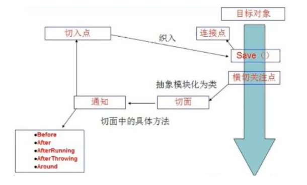

# 1 Spring

## 1.1 简介

- 春天 —>给软件行业带来了春天
- 2002年，Rod Jahnson首次推出了Spring框架雏形interface21框架。
- 2004年3月24日，Spring框架以interface21框架为基础，经过重新设计，发布了1.0正式版。
- Rod Johnson的学历 , 他是悉尼大学的博士，然而他的专业不是计算机，而是音乐学。
- Spring理念 : 使现有技术更加实用 . 本身就是一个大杂烩 , 整合现有的框架技术

官方下载地址 ： https://repo.spring.io/libs-release-local/org/springframework/spring/

```xml
<!-- https://mvnrepository.com/artifact/org.springframework/spring-webmvc -->
<dependency>
    <groupId>org.springframework</groupId>
    <artifactId>spring-webmvc</artifactId>
    <version>5.2.0.RELEASE</version>
</dependency>
<!-- https://mvnrepository.com/artifact/org.springframework/spring-jdbc -->
<dependency>
    <groupId>org.springframework</groupId>
    <artifactId>spring-jdbc</artifactId>
    <version>5.2.0.RELEASE</version>
</dependency>
```

## 1.2 优点

- Spring是一个开源免费的框架 (容器)！
- Spring是一个轻量级的框架 , 非侵入式的
- **控制反转 IoC  , 面向切面 Aop**
- 对事务的支持 , 对框架整合的支持

**Spring是一个轻量级的控制反转(IoC)和面向切面(AOP)的容器（框架）**

## 1.3 组成

Spring 框架是一个分层架构，由 7 个定义良好的模块组成。Spring 模块构建在核心容器之上，核心容器定义了创建、配置和管理 bean 的方式 .


- **核心容器**：核心容器提供 Spring 框架的基本功能。核心容器的主要组件是 BeanFactory，它是工厂模式的实现。BeanFactory 使用*控制反转*（IOC） 模式将应用程序的配置和依赖性规范与实际的应用程序代码分开。
- **Spring 上下文**：Spring 上下文是一个配置文件，向 Spring 框架提供上下文信息。Spring 上下文包括企业服务，例如 JNDI、EJB、电子邮件、国际化、校验和调度功能。
- **Spring AOP**：通过配置管理特性，Spring AOP 模块直接将面向切面的编程功能 , 集成到了 Spring 框架中。所以，可以很容易地使 Spring 框架管理任何支持 AOP的对象。Spring AOP 模块为基于 Spring 的应用程序中的对象提供了事务管理服务。通过使用 Spring AOP，不用依赖组件，就可以将声明性事务管理集成到应用程序中。
- **Spring DAO**：JDBC DAO 抽象层提供了有意义的异常层次结构，可用该结构来管理异常处理和不同数据库供应商抛出的错误消息。异常层次结构简化了错误处理，并且极大地降低了需要编写的异常代码数量（例如打开和关闭连接）。Spring DAO 的面向 JDBC 的异常遵从通用的 DAO 异常层次结构。
- **Spring ORM**：Spring 框架插入了若干个 ORM 框架，从而提供了 ORM 的对象关系工具，其中包括 JDO、Hibernate 和 iBatis SQL Map。所有这些都遵从 Spring 的通用事务和 DAO 异常层次结构。
- **Spring Web 模块**：Web 上下文模块建立在应用程序上下文模块之上，为基于 Web 的应用程序提供了上下文。所以，Spring 框架支持与 Jakarta Struts 的集成。Web 模块还简化了处理多部分请求以及将请求参数绑定到域对象的工作。
- **Spring MVC 框架**：MVC 框架是一个全功能的构建 Web 应用程序的 MVC 实现。通过策略接口，MVC 框架变成为高度可配置的，MVC 容纳了大量视图技术，其中包括 JSP、Velocity、Tiles、iText 和 POI。

## 1.4 拓展

现代化的Java开发，其实就是基于Spring的开发


- Spring Boot
  - 一个快速开发的脚手架
  - 基于SpringBoot可以快速的开发单个微服务
- Spring Cloud
  - Spring Cloud是基于SpringBoot实现的

现在大多数公司都在使用SpringBoot进行快速开发，学习SpringBoot的前提需要完全掌握Spring及SpringMVC

弊端：发展太久了之后，违背了原来的理念，配置十分繁琐

# 2 IOC理论推导

1. UserDao 接口

   ```java
   public interface UserDao {
      public void getUser();
   }
   ```

2. UserDaoImpl 实现类

   ```java
   public class UserDaoImpl implements UserDao {
      @Override
      public void getUser() {
          System.out.println("获取用户数据");
     }
   }
   ```

3. UserService 业务接口

   ```java
   public interface UserService {
      public void getUser();
   }
   ```

4. UserServiceImpl 业务实现类

   ```java
   public class UserServiceImpl implements UserService {
      private UserDao userDao = new UserDaoImpl();
   
      @Override
      public void getUser() {
          userDao.getUser();
     }
   }
   ```

5. 测试一下

   ```java
   @Test
   public void test(){
      UserService service = new UserServiceImpl();
      service.getUser();
   }
   ```

把Userdao的实现类增加一个 .

```java
public class UserDaoMySqlImpl implements UserDao {
   @Override
   public void getUser() {
       System.out.println("MySql获取用户数据");
  }
}
```

紧接着我们要去使用MySql的话 , 我们就需要去service实现类里面修改对应的实现

```java
public class UserServiceImpl implements UserService {
   private UserDao userDao = new UserDaoMySqlImpl();

   @Override
   public void getUser() {
       userDao.getUser();
  }
}
```

**代码量十分大，修改一次的成本十分昂贵！**

我们使用一个Set接口实现，已经发生了革命性的变化！

```java
public class UserServiceImpl implements UserService {
   private UserDao userDao;
	// 利用set实现
   public void setUserDao(UserDao userDao) {
       this.userDao = userDao;
  }

   @Override
   public void getUser() {
       userDao.getUser();
  }
}
```

- 之前，程序是主动创建对象，控制权在程序员手上！
- 使用了set注入后，程序不再具有主动性，而是变成了被动的接受对象！

这种思想，从本质上解决了问题，我们程序员不用再去管对象的创建了。系统的耦合性大大降低，可以专注在业务的实现上！这是IOC的原型！

### IOC本质

**控制反转IoC(Inversion of Control)，是一种设计思想，DI(依赖注入)是实现IoC的一种方法**，也有人认为DI只是IoC的另一种说法。没有IoC的程序中 , 我们使用面向对象编程 , 对象的创建与对象间的依赖关系完全硬编码在程序中，对象的创建由程序自己控制，控制反转后将对象的创建转移给第三方，个人认为所谓控制反转就是：获得依赖对象的方式反转了。


采用XML方式配置Bean的时候，Bean的定义信息是和实现分离的，而采用注解的方式可以把两者合为一体，Bean的定义信息直接以注解的形式定义在实现类中，从而达到了零配置的目的。

**控制反转是一种通过描述（XML或注解）并通过第三方去生产或获取特定对象的方式。在Spring中实现控制反转的是IoC容器，其实现方法是依赖注入（Dependency Injection,DI）。**

# 3 HelloSpring

xml：

```xml
<?xml version="1.0" encoding="UTF-8"?>
<beans xmlns="http://www.springframework.org/schema/beans"
       xmlns:xsi="http://www.w3.org/2001/XMLSchema-instance"
       xsi:schemaLocation="http://www.springframework.org/schema/beans
        https://www.springframework.org/schema/beans/spring-beans.xsd">

<!--使用Spring来创建对象，在Spring这些都称为Bean
    bean = 对象  new Hello（）;
    类型 变量名 = new 类型（）；
    Hello hello = new Hello();
    id= 变量名
    class = new的对象
    property 相当于给对象中的属性设置值

-->
    <bean id="hello" class="com.zz.pojo.Hello">
        <property name="str" value="String"/>
    </bean>
</beans>
```

test

```java
public class MyTest {
    public static void main(String[] args) {
        //获取Spring的上下文对象
        ApplicationContext context = new ClassPathXmlApplicationContext("bean.xml");
        //对象现在都在spring中管理了，要使用直接取就可以了

        Hello hello = (Hello)context.getBean("hello");
        System.out.println(hello.toString());
    }
}
```

# 4、IOC创建对象的方式

1. 使用无参构造创建对象，默认

2. 假设我们要使用有参构造创建对象

   1. 下标赋值

   ```xml
      <bean id="user" class="com.zz.pojo.User">
           <constructor-arg index="0" value="zzz"/>
       </bean>
   ```

   2. 构造参数类型

   ```xml
       <bean id="user" class="com.zz.pojo.User">
           <constructor-arg type="java.lang.String" value="zzz"/>
       </bean>
   ```

   3. 构造参数名

   ```xml
           <bean id="user" class="com.zz.pojo.User">
               <constructor-arg name="name" value="zz"/>
           </bean>
   ```

   

总结：在配置文件加载的时候，容器中管理的对象就已经初始化了

# 5 Spring配置

## 5.1 别名

```xml
<!--设置别名：在获取Bean的时候可以使用别名获取-->
<alias name="user" alias="zzzzzzz"/>
```

## 5.2 Bean的配置

```xml
<!--bean就是java对象,由Spring创建和管理-->

<!--
   id : bean的标识符,要唯一,如果没有配置id,name就是默认标识符
   如果配置id,又配置了name,那么name是别名
   name可以设置多个别名,可以用逗号,分号,空格隔开
   如果不配置id和name,可以根据applicationContext.getBean(.class)获取对象;

   class : bean的全限定名=包名+类名
-->
<bean id="hello" name="hello2 h2,h3;h4" class="com.kuang.pojo.Hello">
   <property name="name" value="Spring"/>
</bean>
```

## 5.2 import

这个import,一般用于团队开发使用，他可以将多个配置文件，导入合并为一个；

假设，现在项目中有多个人开发，这三个人复制不同的类开发，不同的类需要注册在不同的bean中，我们可以利用import将所有人的beans.xml合并为一个总的！

```xml
<import resource="{path}/beans.xml"/>
```

# 6、依赖注入

## 6.1 构造器注入

## 6.2 Set方式注入 【重点】

- 依赖注入：Set注入
  - 依赖：bean对象的创建依赖于容器
  - 注入：bean对象中的所有属性，由容器来注入

1. 模拟环境搭建
2. 两个实体类

```java
public class Student {
    private String name;
    private Address address;
    private String[] books;
    private List<String> hobbies;
    private Map<String,String> card;
    private Set<String> games;
    private Properties info;
    private String wife;


    public String getName() {
        return name;
    }

    public void setName(String name) {
        this.name = name;
    }

    public Address getAddress() {
        return address;
    }

    public void setAddress(Address address) {
        this.address = address;
    }

    public String[] getBooks() {
        return books;
    }

    public void setBooks(String[] books) {
        this.books = books;
    }

    public List<String> getHobbies() {
        return hobbies;
    }

    public void setHobbies(List<String> hobbies) {
        this.hobbies = hobbies;
    }

    public Map<String, String> getCard() {
        return card;
    }

    public void setCard(Map<String, String> card) {
        this.card = card;
    }

    public Set<String> getGames() {
        return games;
    }

    public void setGames(Set<String> games) {
        this.games = games;
    }

    public Properties getInfo() {
        return info;
    }

    public void setInfo(Properties info) {
        this.info = info;
    }

    public String getWife() {
        return wife;
    }

    public void setWife(String wife) {
        this.wife = wife;
    }

    @Override
    public String toString() {
        return "Student{" +
                "name='" + name + '\'' +
                ", address=" + address.toString() +
                ", books=" + Arrays.toString(books) +
                ", hobbies=" + hobbies +
                ", card=" + card +
                ", ganmes=" + games +
                ", info=" + info +
                ", wife='" + wife + '\'' +
                '}';
    }
}
```

address

```java
public class Address {
    private String address;

    public String getAddress() {
        return address;
    }

    public void setAddress(String address) {
        this.address = address;
    }

    @Override
    public String toString() {
        return "Address{" +
                "address='" + address + '\'' +
                '}';
    }
}

```

xml

```xml
<?xml version="1.0" encoding="UTF-8"?>
<beans xmlns="http://www.springframework.org/schema/beans"
       xmlns:xsi="http://www.w3.org/2001/XMLSchema-instance"
       xsi:schemaLocation="http://www.springframework.org/schema/beans
        https://www.springframework.org/schema/beans/spring-beans.xsd">

<!--使用Spring来创建对象，在Spring这些都称为Bean
    bean = 对象  new Hello（）;
    类型 变量名 = new 类型（）；
    Hello hello = new Hello();
    id= 变量名
    class = new的对象
    property 相当于给对象中的属性设置值

-->

    <bean id="address" class="com.zz.pojo.Address">
        <property name="address" value="china"/>
    </bean>
    <bean id="student"  class="com.zz.pojo.Student">
<!--        第一种 普通值注入，直接用value-->
        <property name="name" value="z中z"/>
<!--        第二种，beann注入  ref-->
        <property name="address" ref="address"/>
<!--        第三种，数组注入  ref-->
        <property name="books">
            <array>
                <value>红楼梦</value>
                <value>西游记</value>
                <value>三国演义</value>
            </array>
        </property>
<!--        List-->
        <property name="hobbies">
            <list>
                <value>抽烟</value>
                <value>喝酒</value>
                <value>烫头</value>
            </list>
        </property>
<!--        map-->
        <property name="card">
            <map>
                <entry key="身份证" value="1231231"></entry>
                <entry key="银行卡" value="123123"></entry>
            </map>
        </property>

        <property name="games">
            <set>
                <value>LOL1</value>
                <value>LOL2</value>
                <value>LOL3</value>
            </set>
        </property>

        <property name="wife">
            <null></null>
        </property>

        <property name="info">
            <props>
                <prop key="driver">2019</prop>
                <prop key="url">zz</prop>
                <prop key="username">男</prop>
                <prop key="password">男</prop>
            </props>

        </property>


    </bean>
</beans>
```

3. 测试

   ```java
   public class MyTest {
       public static void main(String[] args) {
           ApplicationContext context = new ClassPathXmlApplicationContext("beans.xml");
           Student student = (Student) context.getBean("student");
   
           System.out.println(student.toString());
       }
   }
   ```

   

## 6.3 扩展方式注入

可以使用p命名空间或c命名空间进行注入

```xml
     <!--        p命名空间注入可以直接注入属性值 property-->
    <bean id="user" class="com.zz.pojo.User" p:name="zz" p:age="3"/>

    <!--        c命名空间注入 通过构造器注入  construct-args -->
    <bean id="user2" class="com.zz.pojo.User" c:age="18" c:name="zz"/>   
```

注意，p命名和c命名不能直接使用，需要导入约束XML

```xml
xmlns:p="http://www.springframework.org/schema/p"
       xmlns:c="http://www.springframework.org/schema/c"
```

6.4 Bean的作用域


1. 代理模式（Spring默认）

   ```xml
       <bean id="user2" class="com.zz.pojo.User" c:age="18" c:name="zz" scope="singleton"/>
   ```

2. 原型模型：每次从容器中get的时候都会产生一个新对象

   ```
       <bean id="user2" class="com.zz.pojo.User" c:age="18" c:name="zz" scope="prototype"/>
   ```

3. 其余的 request session application只能在web开发中使用

# 7 Bean的自动装配

+ 自动装配是Spring满足bean依赖的一种方式
+ Spring会在上下文中自动寻找，并自动给bean装配属性

在Spring中有三种装配方式

1. 在xml中显示的配置
2. 在java中显示的配置
3. 隐式的自动装配的bean 【重要】

## 7.1 测试

环境搭建：一个人有两个宠物

## 7.2 byName自动装配

```xml
<!--
byName 会自动在容器上下文中查找和自己对象set方法后面的值对应的beanid
-->
    <bean id="people" class="com.zz.pojo.People" autowire="byName">
        <property name="name" value="zz"/>
    </bean>

```

## 7.3 byType自动装配

```xml
<--
byType 会自动在容器上下文中查找和自己对象类型对应的bean
-->
    <bean id="people" class="com.zz.pojo.People" autowire="byType">
        <property name="name" value="zz"/>
    </bean>
```

小结

+ byName的需要需要保证bean的id唯一，并且这个bean需要和自动注入的属性的set方法的值一致
+ byType的时候，需要保证所有的bean的class唯一，并且这个bean需要和自动注入的属性的类型一致

## 7.4 使用注解自动装配

jdk1.5支持注解，Spring从2.5开始支持注解

> The introduction of annotation-based configuration raised the question of whether this approach is “better” than XML.

要使用注解须知：

1. 导入约束 context约束

2. 配置注解的支持     <context:annotation-config/>

   ```xml
   <?xml version="1.0" encoding="UTF-8"?>
   <beans xmlns="http://www.springframework.org/schema/beans"
       xmlns:xsi="http://www.w3.org/2001/XMLSchema-instance"
       xmlns:context="http://www.springframework.org/schema/context"
       xsi:schemaLocation="http://www.springframework.org/schema/beans
           https://www.springframework.org/schema/beans/spring-beans.xsd
           http://www.springframework.org/schema/context
           https://www.springframework.org/schema/context/spring-context.xsd">
   
       <context:annotation-config/>
   
   </beans>
   ```
@Autowired
   直接在属性上使用即可，也可以在set方法上使用

   使用Autowired我们可以不用编写set方法了，前提是你这个自动装配的属性在 IOC（Spring）容器中存在，且符合名字byName

@Nullable

```xml
@Nullable	字段标记了这个注解，说明这个字段可以为null;
```

```java
public @interface Autowired {
    boolean required() default true;
}
```

```java
public class People {
    //如果显示定义了Autowired的required属性为false，说明这个对象可以为Null,否则不允许为空
    @Autowired(required = false)
    private Cat cat;
    @Autowired
    private Dog dog;
    private String name;
}
```

如果@Autowired自动装配的环境比较复杂，自动装配无法通过一个注解【**@Autowired**】完成的时候，我们可以使用==**@Qualifier(value = “xxx”)**==去配合@Autowire的使用，指定一个唯一的bean对象注入！

```java
public class People {

    @Autowired
    @Qualifier(value = "cat2")
    private Cat cat;
    @Autowired
    private Dog dog;
    private String name;
}
```

### @Resource

```java
public class People {

    @Resource( name = "cat3")
    private Cat cat;
    @Resource
    private Dog dog;
    private String name;
}
```

> **小结：**
>
> @Resource和@Autowired的区别：
>
> - 都是用来自动转配的，都可以放在属性字段上
> - @Autowired 是通过byType的方式实现，而且必须要求这个对象存在！【常用】
> - @Resource 默认通过byName的方式实现，如果找不到名字，则通过byType实现！如果两个都找不到的情况下，就报错！【常用】
> - 执行顺序不同: @Autowired 通过byType的方式实现。@Resource默认通过byName的方式实现。

# 8 使用注解开发

在spring4之后，使用注解开发，必须要保证aop包的导入


使用注解需要导入contex的约束

```xml
<?xml version="1.0" encoding="UTF-8"?>
<beans xmlns="http://www.springframework.org/schema/beans"
       xmlns:xsi="http://www.w3.org/2001/XMLSchema-instance"
       xmlns:context="http://www.springframework.org/schema/context"
       xsi:schemaLocation="http://www.springframework.org/schema/beans
        https://www.springframework.org/schema/beans/spring-beans.xsd
        http://www.springframework.org/schema/context
        https://www.springframework.org/schema/context/spring-context.xsd">
    <context:component-scan base-package="com.zz.pojo"/>
    <context:annotation-config/>
 

</beans>
```

## 8.1 bean

```java
//等价于<bean id = "user" class= "com.zz.pojo.User">
//组件
@Component
public class User {
    public String name = "zz";
}

```

## 8.2 属性注入

```java
@Component
public class User {

    public String name ;
    @Value("zz")
    public void setName(String name) {
        this.name = name;
    }
}
```

## 8.3、衍生的注解

@Component有几个衍生注解，会按照web开发中，mvc架构中分层。

- dao （@Repository）
- service（@Service）
- controller（@Controller）

**这四个注解的功能是一样的，都是代表将某个类注册到容器中**

## 8.4、自动装配置

@Autowired：默认是byType方式，如果匹配不上，就会byName

@Nullable：字段标记了这个注解，说明该字段可以为空

@Resource：默认是byName方式，如果匹配不上，就会byType

## 8.5、作用域@scope

```java 
//原型模式prototype，单例模式singleton
//scope("prototype")相当于<bean scope="prototype"></bean>
@Component 
@scope("prototype")
public class User { 
    
    //相当于<property name="name" value="kuangshen"/> 
    @value("kuangshen") 
    public String name; 
    
    //也可以放在set方法上面
    @value("kuangshen")
    public void setName(String name) { 
        this.name = name; 
    }
}
```

## 8.6 小结

**xml与注解：**

- xml更加万能，维护简单，适用于任何场合
- 注解，不是自己的类使用不了，维护复杂

**最佳实践：**

- xml用来管理bean
- 注解只用来完成属性的注入
- 要开启注解支持

# 9使用Java的方式配置Spring

完全不适用Spring的xml配置了，全权交给Java来做

JavaConfig是Spring的一个子项目，在Spring4之后，它成为了核心功能


User

```java
public class User {
    private String name;


    public String getName() {
        return name;
    }
    @Value("zz")
    public void setName(String name) {
        this.name = name;
    }

    @Override
    public String toString() {
        return "User{" +
                "name='" + name + '\'' +
                '}';
    }

}

```

Config

```java
//这个也会被Spring容器托管，注册到容器中，因为他本就是就是一个Component
//Configuration 代表这事一个配置类，就等同于beans.xml
@Configuration
@ComponentScan("com.zz.pojo")
@Import(MyConfig2.class)
public class MyConfig {


    //注册一个bean 就相当于之前写的一个bean标签
    //这个方法的名字相当于 id
    // 返回值 相当于class属性
    @Bean
    public User getUser(){
        return new User();
    }
}
```

test

```java
public class MyTest {
    public static void main(String[] args) {
        //如果完全使用配置类方法去做，就只能通过AnnotationConfig上下文来获取容器，通过配置类的class对象加载
        ApplicationContext context = new AnnotationConfigApplicationContext(MyConfig.class);
        User user = (User)context.getBean("getUser");
        System.out.println(user.getName());

    }
}

```

# 10 代理模式

为什么要学习代理模式？

因为这就是SpringAOP的底层【SpringAOP和SpringMVC】

+ 动态代理
+ 静态代理


## 10.1 静态代理

角色分析

+ 抽象角色：一般使用接口或抽象类解决
+ 真实角色：被代理的角色
+ 代理角色：代理真实角色，代理真实角色后，一般会做一些附属操作
+ 客户：访问代理对象的人

步骤：

1. 接口

   ```java
   //租房
   public interface Rent {
       public void rent();
   }
   
   ```

   

2. 真实角色

   ```java
   //房东
   public class Host implements Rent{
       public void rent() {
           System.out.println("房东要出租房子");
       }
   }
   
   ```

   

3. 代理角色

   ```java
   public class Proxy implements Rent{
       private Host host;
   
       public Proxy() {
       }
   
       public Proxy(Host host) {
           this.host = host;
       }
   
       public void rent() {
           host.rent();
       }
   
       //看房
       public void seeHouse(){
           System.out.println("看房");
       }
   
       //中介费
       public void fare(){
           System.out.println("收中介费");
       }
   
       //签合同
       public void hetong(){
           System.out.println("签合同");
       }
   }
   ```

   

4. 客户端访问

   ```java
   public class Client {
       public static void main(String[] args) {
           //房东要租房子
           Host host = new Host();
           //代理，中介帮房东组房子，代理一般会有一些附属操作
           Proxy proxy = new Proxy(host);
           //不用面对房东，直接找中介租房
           proxy.rent();
       }
   }
   
   ```

   

代理模式的好处：

+ 可以使真实角色的操作更加纯粹，不用去关注一些公共业务
+ 公共交给代理角色，实现了业务的分工
+ 公共业务发生扩展的时候，方便集中管理

缺点：

+ 一个真实角色会产生一个代理角色，代码量翻倍，开发效率低

## 10.2 加深理解


UserServive

```java
public interface UserService {
    public void add();
    public void delete();
    public void update();
    public void query();
}

```

Impl

```java
public class UserServiceImpl implements UserService{

    public void add() {
        System.out.println("add");
    }

    public void delete() {
        System.out.println("delete");
    }

    public void update() {
        System.out.println("update");
    }

    public void query() {
        System.out.println("query");
    }
}

```

Proxy

```java
public class UserServiceProxy implements UserService{
    private UserServiceImpl userService;

    public void setUserService(UserServiceImpl userService) {
        this.userService = userService;
    }

    public void add() {
        log("add");
        System.out.println("add");
    }

    public void delete() {
        log("delete");
        System.out.println("delete");
    }

    public void update() {
        log("update");
        System.out.println("update");
    }

    public void query() {
        log("query");
        System.out.println("query");
    }

    public void log(String msg){
        System.out.println("使用了"+msg+"方法");
    }
}

```

Client

```java
public class Client {
    public static void main(String[] args) {
        UserServiceImpl userService = new UserServiceImpl();
        UserServiceProxy proxy = new UserServiceProxy();
        proxy.setUserService(userService);

        proxy.add();
    }
}

```

## 10.3 动态代理

+ 动态代理和静态代理角色一样
+ 动态代理的代理类是动态生成的，不是直接写好的
+ 动态代理分为两大类：基于接口的动态代理，基于类的动态代理
  + 基于接口--JDK动态代理
  + 基于类：cglib
  + java字节码实现 javassist

需要了解两个类：Proxy代理 InvocationHandler调用处理程序

动态代理的好处：

+ 可以使真实角色的操作更加纯粹，不用去关注一些公共业务
+ 公共交给代理角色，实现了业务的分工
+ 公共业务发生扩展的时候，方便集中管理
+ 一个动态代理类代理的是一个接口，一般就是对应的一类业务
+ 一个动态代理类可以实现多个类，只要是实现了同一个接口即可

# 11 AOP

## 11.1 什么是AOP

AOP（Aspect Oriented Programming）意为面向切面编程，通过预编译方式和运行期动态代理实现程序功能的统一维护的一种技术。AOP是OOP的延续，是软件开发中的一个热点，也是Spring框架中一个重要内容，是函数式编程的一种衍生泛型。利用AOP可以对业务逻辑的各个部分进行隔离，从而使得业务逻辑各部分之间的耦合度降低，提高程序的可重用性，同时提高了开发效率


11.2 AOP在Spring中的作用

==提供声明式事务，允许用户自定义切面==

+ 横切关注点：跨越应用程序多个模块的方法或功能。即是，与我们业务逻辑无关的，但是需要关注的部分，就是横切关注点，如日志，安全，缓存，事务等
+ 切面（Aspect）:横切关注点 被模块化的特殊对象。即，它是一个类
+ 通知（Advice）:切面必须要完成的工作，即，它是类中的一个方法
+ 目标（Target）：被通知对象
+ 代理（Proxy）：向目标对象应用通知之后创建的对象
+ 切入点（PointCut）:切面通知执行的“地点”的定义
+ 连接点（JointPoint）：与切入点匹配的执行点



在SpringAOP中，通过Advice定义横切逻辑，Spring支持5中类型的Advice


即AOP在不改变原有代码的情况下，取增加新的功能

## 11.3 使用Spring实现AOP

【重点】使用AOP织入，需要导入一个jar包

```xml
<!-- https://mvnrepository.com/artifact/org.aspectj/aspectjweaver -->
<dependency>
    <groupId>org.aspectj</groupId>
    <artifactId>aspectjweaver</artifactId>
    <version>1.9.4</version>
</dependency>
```

### 方式一：使用Spring的API接口

xml

```xml
<?xml version="1.0" encoding="UTF-8"?>
<beans xmlns="http://www.springframework.org/schema/beans"
       xmlns:xsi="http://www.w3.org/2001/XMLSchema-instance"
       xmlns:aop="http://www.springframework.org/schema/aop"
       xsi:schemaLocation="http://www.springframework.org/schema/beans
		https://www.springframework.org/schema/beans/spring-beans.xsd
		http://www.springframework.org/schema/aop
		https://www.springframework.org/schema/aop/spring-aop.xsd">
<!--    注册bean-->
    <bean id="userService" class="com.zz.service.UserServiceImpl"/>
    <bean id="log" class="com.zz.log.Log"/>
    <bean id="afterLog" class="com.zz.log.AfterLog"/>

<!--    方式一，使用原生的Spring API接口-->
<!--    配置aop 需要导入aop的约束-->
    <aop:config>
<!--        切入点 expression表达式  execution(要执行的位置 * * * * *) -->
        <aop:pointcut id="pointcut" expression="execution(* com.zz.service.UserServiceImpl.*(..))"/>
<!--执行环绕添加-->
        <aop:advisor advice-ref="log" pointcut-ref="pointcut"/>
        <aop:advisor advice-ref="afterLog" pointcut-ref="pointcut"/>

    </aop:config>


</beans>
```

test

```java
public class MyTest {
    public static void main(String[] args) {
        ApplicationContext context = new ClassPathXmlApplicationContext("applicationContext.xml");

        //动态代理代理的是接口，不是实现类
        UserService userService = (UserService) context.getBean("userService");
        userService.select();

    }
}
```

### 方式二：自定义类实现AOP

diy

```java
public class DiyPointCut {
    public void before(){
        System.out.println("=====before=========");
    }

    public void after(){
        System.out.println("=====after=========");
    }
}

```

xml

```xml
<!--    方式二 自定义类-->
    <bean id="diy" class="com.zz.div.DiyPointCut"/>
    <aop:config>
<!--        自定义切面，ref 要引入的类-->
        <aop:aspect ref="diy">
<!--            切入点-->
            <aop:pointcut id="point" expression="execution(* com.zz.service.UserServiceImpl.*(..))"/>
<!--            通知-->
            <aop:before method="before" pointcut-ref="point"/>
            <aop:after method="after" pointcut-ref="point"/>

        </aop:aspect>
    </aop:config>
```

### 方式三：使用注解实现

xml

```xml
<!--    方式三-->
    <bean id="annotationPointCut" class="com.zz.div.AnnotationPointCut"/>
<!--    开启注解支持  JDK（默认）proxy-target-class="false"   cglib  proxy-target-class="true"-->
    <aop:aspectj-autoproxy />
```

Annotation

```java
//标注这个类是一个切面
@Aspect
public class AnnotationPointCut {
    @Before("execution(* com.zz.service.UserServiceImpl.*(..))")
    public void before(){
        System.out.println("=======before======");
    }
    @After("execution(* com.zz.service.UserServiceImpl.*(..))")
    public void after(){
        System.out.println("=======after======");
    }
    //在环绕增强中，我们可以给定一个参数，代表要获取处理切入的点
    @Around("execution(* com.zz.service.UserServiceImpl.*(..))")
    public void around(ProceedingJoinPoint joinPoint) throws Throwable {
        System.out.println("环绕前");

        Signature signature = joinPoint.getSignature();
        System.out.println(signature);
        //执行方法
        Object proceed = joinPoint.proceed();
        System.out.println("环绕后");
    }
}
```

# 12 整合MyBatis

步骤：

1. 导入相关jar包
   + junit
   + mybatis
   + mysql
   + spring
   + aop
   + mybatis-spring
2. 编写配置文件
3. 测试

## 12.1 回忆MyBatis

1. 编写实体类

   ```java
   @Data
   public class User {
       private int id;
       private String name;
       private String pwd;
   
   }
   
   ```

   

2. 编写核心配置文件

   ```xml
   <?xml version="1.0" encoding="UTF-8" ?>
   
   <!DOCTYPE configuration
   
           PUBLIC "-//mybatis.org//DTD Config 3.0//EN"
   
           "http://mybatis.org/dtd/mybatis-3-config.dtd">
   
   <configuration>
       <typeAliases>
           <package name="com.zz.pojo"/>
       </typeAliases>
       <environments default="development">
           <environment id="development">
               <transactionManager type="JDBC"/>
               <dataSource type="POOLED">
                   <property name="driver" value="com.mysql.jdbc.Driver"/>
                   <property name="url" value="jdbc:mysql://localhost:3306/mybatis?useSSL=true&amp;useUnicode=true&amp;characterEncoding=utf8"/>
                   <property name="username" value="root"/>
                   <property name="password" value="123456"/>
               </dataSource>
           </environment>
       </environments>
   
   
       <mappers>
           <mapper class="com.zz.mapper.UserMapper"/>
       </mappers>
   </configuration>
   ```

   

3. 编写接口

   ```java
   public interface UserMapper {
       public List<User> selectUser();
   }
   
   ```

   

4. 编写Mapper.xml

   ```xml
   <mapper namespace="com.zz.mapper.UserMapper">
       <select id="selectUser" resultType="user">
           select * from mybatis.user;
       </select>
   
   </mapper>
   ```

   

5. 测试

   ```java
   public class MyTest {
       @Test
       public void test() throws IOException {
           String resource = "mybatis-config.xml";
           InputStream inputStream = Resources.getResourceAsStream(resource);
           SqlSessionFactory sessionFactory = new SqlSessionFactoryBuilder().build(inputStream);
           SqlSession sqlSession = sessionFactory.openSession(true);
   
   
           UserMapper mapper = sqlSession.getMapper(UserMapper.class);
           List<User> userList = mapper.selectUser();
   
           for (User user : userList) {
               System.out.println(user);
           }
       }
   }
   ```

## 12.2 MyBatis-Spring

1. 编写数据源配置
2. sqlSessionFactory
3. sqlSessionTemplate
4. 给接口加实现类
5. 将实现类注入到Spring

先导入jar包

```xml
<dependencies>

    <!-- https://mvnrepository.com/artifact/org.springframework/spring-webmvc -->
    <dependency>
        <groupId>org.springframework</groupId>
        <artifactId>spring-webmvc</artifactId>
        <version>5.2.7.RELEASE</version>
    </dependency>

    <dependency>
        <groupId>org.aspectj</groupId>
        <artifactId>aspectjweaver</artifactId>
        <version>1.9.4</version>
    </dependency>

    <!-- https://mvnrepository.com/artifact/org.springframework/spring-jdbc -->
    <dependency>
        <groupId>org.springframework</groupId>
        <artifactId>spring-jdbc</artifactId>
        <version>5.2.7.RELEASE</version>
    </dependency>

    <dependency>
        <groupId>org.mybatis</groupId>
        <artifactId>mybatis</artifactId>
        <version>3.5.2</version>
    </dependency>

    <dependency>
        <groupId>org.mybatis</groupId>
        <artifactId>mybatis-spring</artifactId>
        <version>2.0.4</version>
    </dependency>

    <dependency>
        <groupId>mysql</groupId>
        <artifactId>mysql-connector-java</artifactId>
        <version>8.0.12</version>
    </dependency>

    <dependency>
        <groupId>org.projectlombok</groupId>
        <artifactId>lombok</artifactId>
        <version>1.18.12</version>
    </dependency>

</dependencies>
	
<!--在build中配置resources，来防止资源导出失败的问题-->
<!-- Maven解决静态资源过滤问题 -->
<build>
<resources>
    <resource>
        <directory>src/main/java</directory>
        <includes>
            <include>**/*.properties</include>
            <include>**/*.xml</include>
        </includes>
        <filtering>false</filtering>
    </resource>
    <resource>
        <directory>src/main/resources</directory>
        <includes>
            <include>**/*.properties</include>
            <include>**/*.xml</include>
        </includes>
        <filtering>false</filtering>
    </resource>
</resources>
</build>
```

**编写顺序：**
**User -> UserMapper -> UserMapper.xml -> spring-dao.xml -> UserServiceImpl -> applicationContext.xml -> MyTest**

### 方法一

实体类User

```java
@Data
public class User {
    private int id;
    private String name;
    private String pwd;

}

```

UserMapper

```java
public interface UserMapper {
    public List<User> selectUser();
}
```

UserMapper.xml

```xml
<mapper namespace="com.zz.mapper.UserMapper">
    <select id="selectUser" resultType="user">
        select * from mybatis.user;
    </select>

</mapper>
```

spring-dao.xml

```xml
<?xml version="1.0" encoding="UTF-8"?>
<beans xmlns="http://www.springframework.org/schema/beans"
       xmlns:xsi="http://www.w3.org/2001/XMLSchema-instance"
       xmlns:aop="http://www.springframework.org/schema/aop"
       xsi:schemaLocation="http://www.springframework.org/schema/beans
		https://www.springframework.org/schema/beans/spring-beans.xsd
		http://www.springframework.org/schema/aop
		https://www.springframework.org/schema/aop/spring-aop.xsd">


<!--    DataSource:使用Spring的数据源替换Mybatis的配置 c3p0 dbcp druid-->
    <bean id="datasource" class="org.springframework.jdbc.datasource.DriverManagerDataSource">
        <property name="driverClassName" value="com.mysql.jdbc.Driver"/>
        <property name="url" value="jdbc:mysql://localhost:3306/mybatis?useSSL=true&amp;useUnicode=true&amp;characterEncoding=utf8"/>
        <property name="username" value="root"/>
        <property name="password" value="123456"/>

    </bean>

    <!--sqlSessionFactory-->
    <bean id="sqlSessionFactory" class="org.mybatis.spring.SqlSessionFactoryBean">
        <property name="dataSource" ref="datasource" />
        <!--绑定 mybatis 配置文件-->
        <property name="configLocation" value="classpath:mybatis-config.xml"/>
        <property name="mapperLocations" value="classpath:com/zz/mapper/*.xml"/>
    </bean>

    <!-- sqlSessionTemplate 就是之前使用的：sqlsession -->
    <bean id="sqlSession" class="org.mybatis.spring.SqlSessionTemplate">
        <!-- 只能使用构造器注入sqlSessionFactory 原因：它没有set方法-->
        <constructor-arg index="0" ref="sqlSessionFactory"/>
    </bean>


</beans>
```

UserServiceImpl 

```java
public class UserMapperImpl implements UserMapper{
    //原来所有的操作都使用sqlSession执行，现在都使用SqlSessionTemplate；
    private SqlSessionTemplate sqlSession;

    public void setSqlSession(SqlSessionTemplate sqlSession) {
        this.sqlSession = sqlSession;
    }

    public List<User> selectUser() {
        UserMapper mapper = sqlSession.getMapper(UserMapper.class);
        return mapper.selectUser();
    }
}
```

applicationContext.xml 

```xml
<?xml version="1.0" encoding="UTF-8"?>
<beans xmlns="http://www.springframework.org/schema/beans"
       xmlns:xsi="http://www.w3.org/2001/XMLSchema-instance"
       xmlns:aop="http://www.springframework.org/schema/aop"
       xsi:schemaLocation="http://www.springframework.org/schema/beans
		https://www.springframework.org/schema/beans/spring-beans.xsd
		http://www.springframework.org/schema/aop
		https://www.springframework.org/schema/aop/spring-aop.xsd">

    <!-- 导入spring-dao.xml -->
    <import resource="spring-dao.xml"/>
    <bean id="userMapper" class="com.zz.mapper.UserMapperImpl">
        <property name="sqlSession" ref="sqlSession"/>
    </bean>
    <bean id="userMapper2" class="com.zz.mapper.UserMapperImpl2">
        <property name="sqlSessionFactory" ref="sqlSessionFactory"/>
    </bean>

</beans>
```

test

```java
public class MyTest {
    @Test
    public void test() throws IOException {
        ApplicationContext context = new ClassPathXmlApplicationContext("applicationContext.xml");
        UserMapper userMapper = context.getBean("userMapper", UserMapper.class);
        for (User user : userMapper.selectUser()) {
            System.out.println(user);
        }
    }
}
```

### 方法二  SqlSessionDaoSupport

UserMapperImpl2

```java
public class UserMapperImpl2 extends SqlSessionDaoSupport implements UserMapper{
    public List<User> selectUser() {
        SqlSession sqlSession = getSqlSession();

        return sqlSession.getMapper(UserMapper.class).selectUser();
    }
}
```

spring-dao

```xml
    <bean id="userMapper2" class="com.zz.mapper.UserMapperImpl2">
        <property name="sqlSessionFactory" ref="sqlSessionFactory"/>
    </bean>
```

# 13 声明式事务

## 13.1 回顾事务

+ 把一组业务当成一个业务来做，要么都成功，要么都失败
+ 事务在项目开发中，十分的重要，涉及到数据的一致性问题，不能马虎
+ 确保完整性和一致性

事务的ACID原则：

+ 原子性
+ 一致性
+ 隔离性
  + 多个业务可能操作同一个资源，防止数据损坏
+ 持久性
  + 事务一旦提交，无论系统发生什么问题，结果都不会被影响，被持久化的写到存储器中

ACID参考文章：https://www.cnblogs.com/malaikuangren/archive/2012/04/06/2434760.html

13.2 Spring中的事务管理

- 声明式事务：AOP
- 编程式事务：需要再代码中，进行事务管理

**声明式事务**

spring-dao

```xml
<?xml version="1.0" encoding="UTF-8"?>
<beans xmlns="http://www.springframework.org/schema/beans"
       xmlns:xsi="http://www.w3.org/2001/XMLSchema-instance"
       xmlns:aop="http://www.springframework.org/schema/aop"
       xmlns:tx="http://www.springframework.org/schema/tx"
       xsi:schemaLocation="http://www.springframework.org/schema/beans
        https://www.springframework.org/schema/beans/spring-beans.xsd
        http://www.springframework.org/schema/tx
        https://www.springframework.org/schema/tx/spring-tx.xsd
        http://www.springframework.org/schema/aop
        https://www.springframework.org/schema/aop/spring-aop.xsd">

<!--    DataSource:使用Spring的数据源替换Mybatis的配置 c3p0 dbcp druid-->
    <bean id="datasource" class="org.springframework.jdbc.datasource.DriverManagerDataSource">
        <property name="driverClassName" value="com.mysql.jdbc.Driver"/>
        <property name="url" value="jdbc:mysql://localhost:3306/mybatis?useSSL=true&amp;useUnicode=true&amp;characterEncoding=utf8"/>
        <property name="username" value="root"/>
        <property name="password" value="123456"/>

    </bean>

    <!--sqlSessionFactory-->
    <bean id="sqlSessionFactory" class="org.mybatis.spring.SqlSessionFactoryBean">
        <property name="dataSource" ref="datasource" />
        <!--绑定 mybatis 配置文件-->
        <property name="configLocation" value="classpath:mybatis-config.xml"/>
        <property name="mapperLocations" value="classpath:com/zz/mapper/*.xml"/>
    </bean>

    <!-- sqlSessionTemplate 就是之前使用的：sqlsession -->
    <bean id="sqlSession" class="org.mybatis.spring.SqlSessionTemplate">
        <!-- 只能使用构造器注入sqlSessionFactory 原因：它没有set方法-->
        <constructor-arg index="0" ref="sqlSessionFactory"/>
    </bean>

    <!--声明式事务-->
    <bean id="transactionManager" class="org.springframework.jdbc.datasource.DataSourceTransactionManager">
        <property name="dataSource" ref="datasource"/>
    </bean>

    <!--结合aop实现事务织入-->
    <!--配置事务的通知类-->
    <tx:advice id="txAdvice" transaction-manager="transactionManager">
        <!--给哪些方法配置事务-->
        <!--新东西：配置事务的传播特性 propagation-->
        <tx:attributes>
<!--            给哪些方法配置事务   -->
            <tx:method name="add*" propagation="REQUIRED"/>
            <tx:method name="delete*" propagation="REQUIRED"/>
            <tx:method name="update*" propagation="REQUIRED"/>
            <tx:method name="select*" read-only="true"/>
            <!-- *号包含上面4个方法：
            <tx:method name="*" propagation="REQUIRED"/> -->
        </tx:attributes>
    </tx:advice>

    <!--配置事务切入-->
    <aop:config>
        <aop:pointcut id="txPointCut" expression="execution(* com.zz.mapper.*.*(..))"/>
        <aop:advisor advice-ref="txAdvice" pointcut-ref="txPointCut"/>
    </aop:config>
</beans>
```

UserMapperImpl

```java
package com.zz.mapper;

import com.zz.pojo.User;
import org.apache.ibatis.session.SqlSession;
import org.mybatis.spring.support.SqlSessionDaoSupport;

import java.util.List;

public class UserMapperImpl extends SqlSessionDaoSupport implements UserMapper{
    public List<User> selectUser() {

        User user = new User(3, "zzzzz", "1231241");

        UserMapper mapper = getSqlSession().getMapper(UserMapper.class);
        addUser(user);
        deleteUser(3);
        return mapper.selectUser();

    }

    public int addUser(User user) {
        return getSqlSession().getMapper(UserMapper.class).addUser(user);
    }

    public int deleteUser(int id) {
        return getSqlSession().getMapper(UserMapper.class).deleteUser(id);
    }
}

```

**思考：**
为什么需要事务？

- 如果不配置事务，可能存在数据提交不一致的情况下；
- 如果不在spring中去配置声明式事务，我们就需要在代码中手动配置事务！
- 事务在项目的开发中非常重要，涉及到数据的一致性和完整性问题！