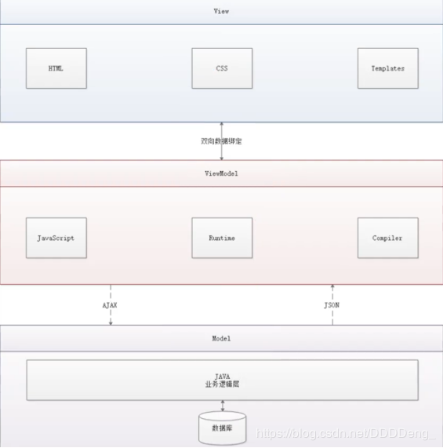
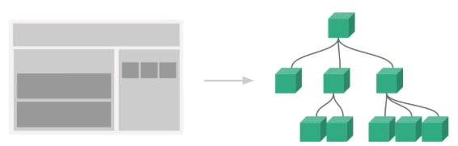

# 1 Vue概述

 Vue (读音/vju/, 类似于view)是一套用于构建用户界面的**渐进式框架**，发布于2014年2月。与其它大型框架不同的是，Vue被设计为可以自底向上逐层应用。**Vue的核心库只关注视图层**，不仅易于上手，还便于与第三方库(如: **vue-router: 跳转，vue-resource: 通信，vuex:管理**)或既有项目整合。

# 2 前端知识体系

 想要成为真正的“互联网Java全栈工程师”还有很长的一段路要走，其中“我大前端”是绕不开的一门必修课。本阶段课程的主要目的就是带领我Java后台程序员认识前端、了解前端、掌握前端,为实现成为“互联网Java全栈工程师”再向前迈进一步。

## 2.1 前端三要素

+ HTML (结构) :超文本标记语言(Hyper Text Markup Language) ，决定网页的结构和内容
+ CSS (表现) :层叠样式表(Cascading Style sheets) ，设定网页的表现样式
+ JavaScript (行为) :是一种弱类型脚本语言，其源代码不需经过编译，而是由浏览器解释运行,用于控制网页的行为

## 2.2结构层（HTML）

略

## 2.3表现层（CSS）

 CSS层叠样式表是**一门标记语言**,并不是编程语言，因此不可以自定义变量，不可以引用等，换句话说就是不具备任何语法支持，它主要缺陷如下:

+ 语法不够强大，比如无法嵌套书写，导致模块化开发中需要写很多重复的选择器;
  
+ 没有变量和合理的样式复用机制，使得逻辑上相关的属性值必须以字面量的形式重复输出，导致难以维护;
  这就导致了我们在工作中无端增加了许多工作量。为了解决这个问题，前端开发人员会使用一种称之为[**CSS预处理器**]的工具，提供CSS缺失的样式层复用机制、减少冗余代码，提高样式代码的可维护性。大大提高了前端在样式上的开发效率。（例如页面在不同的时候有不同的需求，淘宝在双11和618的样式就会不一样）

**CSS预处理器**

 CSS预处理器定义了一种新的语言，其基本思想是，用一种专门的**编程语言**，为CSS增加了一些编程的特性，将CSS作为目标生成文件,然后开发者就只要使用这种语言进行CSS的编码工作。转化成通俗易懂的话来说就是“**用一种专门的编程语言,进行Web页面样式设计，再通过编译器转化为正常的CSS文件，以供项目使用”**
常用的CSS预处理器有哪些

+ **SASS**:基于Ruby,通过服务端处理，功能强大。解析效率高。需要学习Ruby语言，上手难度高于LESS。

+ **LESS**:基于NodeJS,通过客户端处理，使用简单。功能比SASS简单，解析效率也低于SASS,但在实际开发中足够了，所以我们后台人员如果需要的话，**建议使用LESS。**

## 2.4行为层（JavaScript）

 JavaScript一门弱类型脚本语言，其源代码在发往客户端运行之前不需经过编译，而是将文本格式的字符代码发送给浏览器由浏览器解释运行。
 

**Native原生JS开发**
 

原生JS开发，也就是让我们按照[ECMAScript] 标准的开发方式，简称是ES,特点是所有浏览器都支持。截止到当前博客发布时间，ES 标准已发布如下版本:

●ES3

●ES4 (内部,未征式发布)

**●ES5 (全浏览器支持)**

**●ES6 (常用，当前主流版本: webpack打包成为ES5支持! )**

●ES7

●ES8

●ES9 (草案阶段)
区别就是逐步增加新特性。

**TypeScript**

 TypeScript是一种由微软开发的自由和开源的编程语言。它是JavaScript的一个超集，而且本质上向这个语言添加了可选的静态类型和基于类的面向对象编程。由安德斯海尔斯伯格(C#、Delphi、TypeScript 之父; .NET 创立者)主导。
 该语言的特点就是除了具备ES的特性之外还纳入了许多不在标准范围内的新特性，所以会导致很多浏览器不能直接支持TypeScript语法，需要编译后(编译成JS)才能被浏览器正确执行。

**JavaScript框架**

+ **jQuery**: 大家熟知的JavaScript框架，优点是简化了DOM操作，缺点是**DOM操作太频繁**,影响前端性能;在前端眼里使用它仅仅是为了兼容IE6、7、8;

+ **Angular**: Google收购的前端框架，由一群Java程序员开发，其特点是将后台的MVC模式搬到了前端并增加了**模块化开发的理念**，与微软合作，采用TypeScript语法开发;对后台程序员友好，对前端程序员不太友好;最大的缺点是版本迭代不合理(如: 1代-> 2代，除了名字，基本就是两个东西;截止发表博客时已推出了Angular6)

+ **React**: Facebook出品，一款高性能的JS前端框架;特点是提出了新概念[**虚拟DOM**]用于
  **减少真实DOM操作**，在内存中模拟DOM操作，有效的提升了前端渲染效率;缺点是使用复
  杂，因为需要额外学习一门[JSX] 语言;

+ **Vue**:一款渐进式JavaScript框架，所谓渐进式就是逐步实现新特性的意思，如实现模块化开发、路由、状态管理等新特性。**其特点是综合了Angular (模块化)和React (虚拟DOM)的优点;**

+ **Axios** :前端通信框架;因为Vue 的边界很明确，就是为了处理DOM,所以并不具备通信能
  力，此时就需要额外使用一个通信框架与服务器交互;当然也可以直接选择使用jQuery提供的AJAX通信功能;
  前端三大框架：**Angular**、**React**、**Vue**

**UI框架**

+ Ant-Design:阿里巴巴出品，基于React的UI框架
  
+ **ElementUI、 iview、 ice: 饿了么出品，基于Vue的UI框架**

+ Bootstrap: Twitter推出的一个用于前端开发的开源工具包
  
+ AmazeUI:又叫"妹子UI"，一款HTML5跨屏前端框架.
  JavaScript 构建工具
  ●Babel: JS编译工具，主要用于浏览器不支持的ES新特性，比如用于编译TypeScript

+ WebPack: 模块打包器，主要作用是打包、压缩、合并及按序加载
  注：以上知识点将WebApp开发所需技能全部梳理完毕

## 2.5 三端合一

## 混合开发（Hybid App）

 主要目的是实现一套代码三端统一(PC、Android:.apk、iOS:.ipa )并能备够调用到底层件(如:传感器、GPS、 摄像头等)，打包方式主要有以下两种:


+ 云打包: **HBuild -> HBuildX， DCloud出品; API Cloud**
  
+ 本地打包: **Cordova** (前身是PhoneGap)
  后端技术
   

## 2.6 后端技术

前端人员为了方便开发也需要掌握一定的后端技术， 但我们Java后台人员知道后台知识体系极其庞大复杂，所以为了方便前端人员开发后台应用，就出现了NodeJS这样的技术。

 NodeJS的作者已经声称放弃NodeJS (说是架构做的不好再加上笨重的node_ modules，可能让作者不爽了吧)，开始开发全新架构的Deno
 

既然是后台技术，那肯定也需要框架和项目管理工具，NodeJS 框架及项目管理工具如下:

+ Express: NodeJS框架
  
+ Koa: Express简化版
  
+ NPM:项目综合管理工具，类似于Maven
  
+ YARN: NPM的替代方案，类似于Maven和Gradle的关系

## 主流前端框架

Vue.js

**iView**

iview是一个强大的基于Vue的UI库， 有很多实用的基础组件比element ui的组件更丰富， 主要服务于PC界面的中后台产品。使用单文件的Vue组件化开发模式基于npm+webpack+babel开发， 支持ES 2015高质量、功能丰富友好的API， 自由灵活地使用空间。

- 官网地址
- Github
- iview-admin

**备注：属于前端主流框架，选型时可考虑使用，主要特点是移动端支持较多**

Element UI

Element是饿了么前端开源维护的Vue UI组件库， 组件齐全， 基本涵盖后台所需的所有组件，文档讲解详细， 例子也很丰富。主要用于开发PC端的页面， 是一个质量比较高的Vue UI组件库。
·官网地址
·Git hub
·vue-element-admin
**备注：属于前端主流框架，选型时可考虑使用，主要特点是桌面端支持较多**

ICE

飞冰是阿里巴巴团队基于React/Angular/Vue的中后台应用解决方案， 在阿里巴巴内部， 已经有270多个来自几乎所有BU的项目在使用。飞冰包含了一条从设计端到开发端的完整链路，帮助用户快速搭建属于自己的中后台应用。
·官网地址。

- Git hub

**备注：主要组件还是以React为主， 截止2019年02月17日更新博客前对Vue的支持还不太完善，目前尚处于观望阶段**

VantUI

Vant UI是有赞前端团队基于有赞统一的规范实现的Vue组件库， 提供了-整套UI基础组件和业务组件。通过Vant， 可以快速搭建出风格统一的页面，提升开发效率。

- 官网地址
- Github

AtUI

at-ui是一款基于Vue 2.x的前端UI组件库， 主要用于快速开发PC网站产品。它提供了一套n pm+web pack+babel前端开发工作流程， CSS样式独立， 即使采用不同的框架实现都能保持统一的UI风格。
·官网地址
·Git hub

Cube Ul

cube-ui是滴滴团队开发的基于Vue js实现的精致移动端组件库。支持按需引入和后编译， 轻量灵活；扩展性强，可以方便地基于现有组件实现二次开发。

- 官网地址
- Github

## 混合开发

Flutter

Flutter是谷歌的移动端UI框架， 可在极短的时间内构建Android和iOS上高质量的原生级应用。Flutter可与现有代码一起工作， 它被世界各地的开发者和组织使用， 并且Flutter是免费和开源的。

- 官网地址
- Github
  **备注：Google出品， 主要特点是快速构建原生APP应用程序， 如做混合应用该框架为必选框架**

lonic

lonic既是一个CSS框架也是一个Javascript UI库， lonic是目前最有潜力的一款HTML 5手机应用开发框架。通过SASS构建应用程序， 它提供了很多UI组件来帮助开发者开发强大的应用。它使用JavaScript MV VM框架和Angular JS/Vue来增强应用。提供数据的双向绑定， 使用它成为Web和移动开发者的共同选择。

- 官网地址

·官网文档
·Git hub

## 微信小程序

mpvue

mpvue是美团开发的一个使用`Vue.js`开发小程序的前端框架， 目前支持微信小程序、百度智能小程序，头条小程序和支付宝小程序。框架基于`Vue.js`， 修改了的运行时框架`runtime`和代码编译器`compiler`实现， 使其可运行在小程序环境中， 从而为小程序开发引入了`Vue.js`开发体验。
·官网地址
·Git hub
**备注：完备的Vue开发体验， 井且支持多平台的小程序开发， 推荐使用**

WeUI

WeUI是一套同微信原生视觉体验一致的基础样式库， 由微信官方设计团队为微信内网页和微信小程序量身设计， 令用户的使用感知更加统一。包含button、cell、dialog、toast、article、icon等各式元素。

- 官网地址
- Github

# 3 了解前后分离的演变史


## 3.1 后端为主的MVC时代

为了降低开发的复杂度， 以后端为出发点， 比如：Struts、Spring MVC等框架的使用， 就是后端的MVC时代；
以`SpringMVC`流程为例：


- 发起请求到前端控制器(`Dispatcher Servlet`)
- 前端控制器请求`HandlerMapping`查找`Handler`，可以根据`xml`配置、注解进行查找
- 处理器映射器`HandlerMapping`向前端控制器返回`Handler`
- 前端控制器调用处理器适配器去执行`Handler`
- 处理器适配器去执行`Handler`
- `Handler`执行完成给适配器返回`ModelAndView`
- 处理器适配器向前端控制器返回`ModelAndView`，`ModelAndView`是`SpringMvc`框架的一个底层对象，包括`Model`和`View`
- 前端控制器请求视图解析器去进行视图解析，根据逻辑视图名解析成真正的视图(`JSP`)
- 视图解析器向前端控制器返回`View`
- 前端控制器进行视图渲染，视图渲染将模型数据(在`ModelAndView`对象中)填充到`request`域
- 前端控制器向用户响应结果
  **优点**
  MVC是一个非常好的协作模式， 能够有效降低代码的耦合度从架构上能够让开发者明白代码应该写在哪里。为了让View更纯粹， 还可以使用Thyme leaf、Frree marker等模板引擎， 使模板里无法写入Java代码， 让前后端分工更加清晰。
  **缺点**
- 前端开发重度依赖开发环境，开发效率低，这种架构下，前后端协作有两种模式：
  - 第一种是前端写DEMO， 写好后， 让后端去套模板。好处是DEMO可以本地开发， 很高效。不足是还需要后端套模板，有可能套错，套完后还需要前端确定，来回沟通调整的成本比较大；
  - 另一种协作模式是前端负责浏览器端的所有开发和服务器端的View层模板开发。好处是UI相关的代码都是前端去写就好，后端不用太关注，不足就是前端开发重度绑定后端环境，环境成为影响前端开发效率的重要因素。
- 前后端职责纠缠不清：模板引擎功能强大，依旧可以通过拿到的上下文变量来实现各种业务逻辑。这样，只要前端弱势一点，往往就会被后端要求在模板层写出不少业务代码，还有一个很大的灰色地带是Controller， 页面路由等功能本应该是前端最关注的， 但却是由后端来实现。Controller本身与Model往往也会纠缠不清，看了让人咬牙的业务代码经常会出现在Controller层。这些问题不能全归结于程序员的素养， 否则JSP就够了。
- 对前端发挥的局限性：性能优化如果只在前端做空间非常有限，于是我们经常需要后端合作，但由于后端框架限制，我们很难使用[Comet】、【Big Pipe】等技术方案来优化性能。
  **注：在这期间(2005年以前) ， 包括早期的JSP、PHP可以称之为Web 1.0时代。在这里想说一句， 如果你是一名Java初学者， 请你不要再把一些陈旧的技术当回事了， 比如JSP， 因为时代在变、技术在变、什么都在变(引用扎克伯格的一句话：唯一不变的是变化本身)；当我们去给大学做实训时，有些同学会认为我们没有讲什么干货，其实不然，只能说是你认知里的干货对于市场来说早就过时了而已**

## 3.2 基于AJAX带来的SPA时代

时间回到2005年A OAX(Asynchronous JavaScript And XML， 异步JavaScript和XML，老技术新用法)被正式提出并开始使用CDN作为静态资源存储， 于是出现了JavaScript王者归来(在这之前JS都是用来在网页上贴狗皮膏药广告的) 的SPA(Single Page Application) 单页面应用时代。

**优点**
这种模式下， **前后端的分工非常清晰， 前后端的关键协作点是AJAX接口。**看起来是如此美妙， 但回过头来看看的话， 这与JSP时代区别不大。复杂度从服务端的JSP里移到了浏览器的JavaScript，浏览器端变得很复杂。类似Spring MVC， **这个时代开始出现浏览器端的分层架构**：

缺点

- **前后端接口的约定**：如果后端的接口一塌糊涂，如果后端的业务模型不够稳定，那么前端开发会很痛苦；不少团队也有类似尝试，通过接口规则、接口平台等方式来做。**有了和后端一起沉淀的接口规则，还可以用来模拟数据，使得前后端可以在约定接口后实现高效并行开发。**
- 前端开发的复杂度控制：SPA应用大多以功能交互型为主，JavaScript代码过十万行很正常。大量JS代码的组织，与View层的绑定等，都不是容易的事情。

## 3.3 前端为主的MV*时代

此处的MV*模式如下：

- MVC(同步通信为主) ：Model、View、Controller
- MVP(异步通信为主) ：Model、View、Presenter
- MVVM(异步通信为主)：Model、View、View Model为了降低前端开发复杂度，涌现了大量的前端框架，比如：`Angular JS`、`React`、`Vue.js`、`Ember JS`等， 这些框架总的原则是先按类型分层， 比如Templates、Controllers、Models， 然后再在层内做切分，如下图：


**优点**

- **前后端职责很清晰**：前端工作在浏览器端，后端工作在服务端。清晰的分工，可以让开发并行，测试数据的模拟不难， 前端可以本地开发。后端则可以专注于业务逻辑的处理， 输出RESTful等接口。
- **前端开发的复杂度可控**：前端代码很重，但合理的分层，让前端代码能各司其职。这一块蛮有意思的，简单如模板特性的选择，就有很多很多讲究。并非越强大越好，限制什么，留下哪些自由，代码应该如何组织，所有这一切设计，得花一本书的厚度去说明。
- **部署相对独立**：可以快速改进产品体验缺点
- 代码不能复用。比如后端依旧需要对数据做各种校验，校验逻辑无法复用浏览器端的代码。如果可以复用，那么后端的数据校验可以相对简单化。
- 全异步， 对SEO不利。往往还需要服务端做同步渲染的降级方案。
- 性能并非最佳，特别是移动互联网环境下。
- SPA不能满足所有需求， 依旧存在大量多页面应用。URL Design需要后端配合， 前端无法完全掌控。

## 3.4 Node JS带来的全栈时代

前端为主的MV*模式解决了很多很多问题， 但如上所述， 依旧存在不少不足之处。随着Node JS的兴起， JavaScript开始有能力运行在服务端。这意味着可以有一种新的研发模式：

在这种研发模式下，前后端的职责很清晰。对前端来说，两个UI层各司其职：

- Front-end Ul layer处理浏览器层的展现逻辑。通过CSS渲染样式， 通过JavaScript添加交互功能， HTML的生成也可以放在这层， 具体看应用场景。
- Back-end Ul layer处理路由、模板、数据获取、Cookie等。通过路由， 前端终于可以自主把控URL Design， 这样无论是单页面应用还是多页面应用， 前端都可以自由调控。后端也终于可以摆脱对展现的强关注，转而可以专心于业务逻辑层的开发。
  通过Node， WebServer层也是JavaScript代码， 这意味着部分代码可前后复用， 需要SEO的场景可以在服务端同步渲染，由于异步请求太多导致的性能问题也可以通过服务端来缓解。前一种模式的不足，通过这种模式几乎都能完美解决掉。
  与JSP模式相比， 全栈模式看起来是一种回归， 也的确是一种向原始开发模式的回归， 不过是一种螺旋上升式的回归。
  基于Node JS的全栈模式， 依旧面临很多挑战：
- 需要前端对服务端编程有更进一步的认识。比如TCP/IP等网络知识的掌握。
- Node JS层与Java层的高效通信。Node JS模式下， 都在服务器端， RESTful HTTP通信未必高效， 通过SOAP等方式通信更高效。一切需要在验证中前行。
- 对部著、运维层面的熟练了解，需要更多知识点和实操经验。
- 大量历史遗留问题如何过渡。这可能是最大最大的阻力。
  **注：看到这里，相信很多同学就可以理解，为什么我总在课堂上说：“前端想学后台很难，而我们后端程序员学任何东西都很简单”；就是因为我们后端程序员具备相对完善的知识体系。**
  全栈!So Easy!

## 3.5 总结

综上所述，模式也好，技术也罢，没有好坏优劣之分，只有适合不适合；前后分离的开发思想主要是基于`Soc`(关注度分离原则)，上面种种模式，都是让前后端的职责更清晰，分工更合理高效。

# 4 第一个Vue程序

## 4.1 什么是MVVM?

MVVM (Model-View-ViewModel) 是一种软件架构设计模式，由微软WPF (用于替代
WinForm，以前就是用这个技术开发桌面应用程序的)和Silverlight (类似于Java Applet,简单点说就是在浏览器上运行的WPF)的架构师Ken Cooper和Ted Peters 开发，是一种简化用户界面的**事件驱动编程方式**。由John Gossman (同样也是WPF和Silverlight的架构师)于2005年在他的博客上发表。

MVVM源自于经典的MVC (ModI-View-Controller) 模式。**MVVM的核心是ViewModel**
层，**负责转换Model中的数据对象来让数据变得更容易管理和使用**，其作用如下:

+ **该层向上与视图层进行双向数据绑定
  **
+ **向下与Model层通过接口请求进行数据交互**
  


**为什么要使用MVVM**

MVVM模式和MVC模式一样，主要目的是**分离视图(View)\**和\**模型(Model)**,有几大好处


+ 低耦合:视图(View)可以独立于Model变化和修改,一个ViewModel可以绑定到不同的
  View上，当View变化的时候Model可以不变，当Model变化的时候View也可以不变。

+ 可复用:你可以把一些视图逻辑放在一个ViewModel里面，让很多View重用这段视图逻辑。
  
+ 独立开发:开发人员可以专注于业务逻辑和数据的开发(ViewModel),设计人员可以专注于页面设计。
  
+ 可测试:界面素来是比较难于测试的，而现在测试可以针对ViewModel来写。

Vue 是 MVVM 模式的实现者



- Model : 模型层，在这里表示JavaScript对象
- View : 视图层,在这里表示DOM (HTML操作的元素)
- ViewModel : 连接视图和数据的中间件，Vue.js就是MVVM中的ViewModel层的实现者在MVVM架构中，是不允许数据和视图直接通信的，只能通过ViewModel来通信，而ViewModel就是定义了一个Observer观察者
- ViewModel 能够观察到数据的变化，并对视图对应的内容进行更新
- ViewModel 能够监听到视图的变化，并能够通知数据发生改变

## 4.2 Vue

 Vue (读音/vju/, 类似于view)是一套用于**构建用户界面的渐进式框架**，发布于2014年2月。与其它大型框架不同的是，Vue被设计为可以自底向上逐层应用。Vue的核心库只关注视图层，不仅易于上手，还便于与第三方库(如: vue-router, vue-resource, vuex)或既有项目整合。

**MVVM模式的实现者**

+ Model:模型层，在这里表示JavaScript对象
  
+ View:视图层,在这里表示DOM (HTML操作的元素)
  
+ ViewModel:连接视图和数据的中间件，Vue.js就是MVVM中的ViewModel层的实现者
  在MVVM架构中，是不允许数据和视图直接通信的，只能通过ViewModel来通信，而
  ViewModel就是定义了一个Observer观察者

+ ViewModel能够观察到数据的变化，并对视图对应的内容进行更新
  
+ ViewModel能够监听到视图的变化，并能够通知数据发生改变
  **至此，我们就明白了，Vue.js 就是一个MVVM的实现者，他的核心就是实现了DOM监听与数据绑定**

**为什么要使用Vue.js**

+ 轻量级，体积小是一个重要指标。Vue.js 压缩后有只有20多kb (Angular 压缩后56kb+ ,
  React压缩后44kb+ )
+ 移动优先。更适合移动端，比如移动端的Touch事件
  
+ 易上手，学习曲线平稳,文档齐全
  
+ **吸取了Angular (模块化)和React (虚拟DOM)的长处，并拥有自己独特的功能，如:计算属性**

+ 开源，社区活跃度高

代码 demo1.html 初入门之绑定数据

```html
<!DOCTYPE html>
<html lang="en">
<head>
    <meta charset="UTF-8">
    <title>Title</title>

</head>
<body>
<div id="app">
    {{message}}
</div>
<!--    导入vue.js-->
<script type="text/javascript" src="https://unpkg.com/vue"></script>
<script>
    var vm = new Vue({
        el:"#app",
        data:{
            message:"hello,vue"
        }
    });
</script>
</body>
</html>
```

# 5 Vue基本语法

## 5.1 v-bind

 现在数据和DOM已经被建立了关联，所有的东西都是响应式的。我们在控制台操作对象的属性，界面可以实时更新。

 我们可以使用`v-bind`来绑定元素属性！

```html
<!DOCTYPE html>
<html lang="en">
<head>
    <meta charset="UTF-8">
    <title>Title</title>
</head>
<body>
<p>狂神说Java</p>

<!--view层 模板-->
<div id="app">
    <span v-bind:title="message">鼠标悬停几秒钟查看此处动态绑定的提示信息！</span>
</div>
</body>

<!--导入js-->
<script src="https://cdn.jsdelivr.net/npm/vue@2.5.21/dist/vue.min.js"></script>
<script>
    var vm = new Vue({
        el: "#app",
        data: {
            message: "hello,vue"
        }
    })
</script>
</html>
```

## 5.2 v-if v-else v-else-if

```html
<!DOCTYPE html>
<html lang="en">
<head>
    <meta charset="UTF-8">
    <title>Title</title>
</head>
<body>
    <div id="app">
    <h1 v-if="type==='A'">A</h1>
    <h1 v-else-if="type==='B'">B</h1>
    <h1 v-else>C</h1>
    </div>
<!--    导入vue.js-->
    <script type="text/javascript" src="https://unpkg.com/vue"></script>
    <script>
        var vm = new Vue({
            el:"#app",
            data:{
                type:'A'
            }

        });
</script>
</body>
</html>
```

## 5.3 v-for

```html
<!DOCTYPE html>
<html lang="en">
<head>
    <meta charset="UTF-8">
    <title>Title</title>
</head>
<body>
<div id="app">
    <li v-for="item in items">
        {{item.message}}
    </li>
</div>
<!--    导入vue.js-->
<script type="text/javascript" src="https://unpkg.com/vue"></script>
<script>
    var vm = new Vue({
        el:"#app",
        data:{
            items:[
                {message:'zz1'},
                {message:'zz2'},
                {message:'zz3'}
            ]
        }

    });
</script>
</body>
</html>
```

# 6 绑定事件 v-on

```html
<!DOCTYPE html>
<html lang="en">
<head>
    <meta charset="UTF-8">
    <title>Title</title>
</head>
<body>
<div id="app">
    <button v-on:click="sayHi">click me</button>
</div>
<!--    导入vue.js-->
<script type="text/javascript" src="https://unpkg.com/vue"></script>
<script>
    var vm = new Vue({
        el:"#app",
        data:{
            message:"Hi"
        },
        methods:{
            //方法必须定义在vue的methods中
            sayHi:function () {
                alert(this.message);
            }
        }

    });
</script>
</body>
</html>
```

# 7 双向绑定

## 1 什么是双向绑定

 Vue.js是一个MVVM框架，即数据双向绑定,即当数据发生变化的时候,视图也就发生变化，当视图发生变化的时候，数据也会跟着同步变化。这也算是Vue.js的精髓之处了。

 值得注意的是，我们所说的数据双向绑定，一定是对于UI控件来说的，非UI控件不会涉及到数据双向绑定。单向数据绑定是使用状态管理工具的前提。如果我们使用vuex，那么数据流也是单项的，这时就会和双向数据绑定有冲突。

## 2 为什么要实现数据的双向绑定

在Vue.js 中，如果使用vuex ，实际上数据还是单向的，之所以说是数据双向绑定，这是用的UI控件来说，对于我们处理表单，Vue.js的双向数据绑定用起来就特别舒服了。即两者并不互斥，在全局性数据流使用单项,方便跟踪;局部性数据流使用双向，简单易操作。

## 3 在表单中使用双向数据绑定

你可以用`v-model`指令在表单 `<input>`、`<textarea>` 及`<select>` 元素上创建双向数据绑定。它会根据控件类型自动选取正确的方法来更新元素。尽管有些神奇，但`v-model`本质上不过是语法糖。它负责监听户的输入事件以更新数据，并对一些极端场景进行一些特殊处理。

 **注意：v-model会忽略所有元素的value、checked、selected特性的初始值而总是将Vue实例的数据作为数据来源，你应该通过JavaScript在组件的data选项中声明。**

```html
<!DOCTYPE html>
<html lang="en">
<head>
    <meta charset="UTF-8">
    <title>Title</title>
</head>
<body>
<div id="app">
    输入的文本：<input type="text" v-model="message">
    {{message}}<br/>

    <input type="radio" name="sex" value="男" v-model="sex"> 男
    <input type="radio" name="sex" value="女" v-model="sex"> 女
    <p>
        选中了{{sex}}
    </p>
    <select v-model="selected">
        <option value="" disabled>--请选择--</option>
        <option>A</option>
        <option>B</option>
        <option>C</option>
    </select><br/>
    <span>选中了{{selected}}</span>

</div>
<!--    导入vue.js-->
<script type="text/javascript" src="https://unpkg.com/vue"></script>
<script>
    var vm = new Vue({
        el:"#app",
        data:{
            message:"123",
            sex:'男',
            selected:""
        }

    });
</script>
</body>
</html>
```

# 8 Vue组件

 组件是可复用的`Vue`实例，说白了就是一组可以重复使用的模板，跟JSTL的自定义标签、Thymeleaf的`th:fragment` 等框架有着异曲同工之妙。通常一个应用会以一棵嵌套的组件树的形式来组织：



```html
<!DOCTYPE html>
<html lang="en">
<head>
    <meta charset="UTF-8">
    <title>Title</title>
</head>
<body>
<div id="app">
<zz v-for="item in items" v-bind:z="item"></zz>
</div>
<!--    导入vue.js-->
<script type="text/javascript" src="https://unpkg.com/vue"></script>
<script>
    Vue.component("zz",{
        props:['z'],
        template:'<li>{{z}}</li>'
    });
    var vm = new Vue({
        el:"#app",
        data:{
            items:["Java","Linux","前端"]
        }
    });
</script>
</body>
</html>
```

# 9 Axios异步通信(通信框架)

 Axios是一个开源的可以用在**浏览器端**和**NodeJS** 的**异步通信框架**，她的**主要作用就是实现AJAX异步通信**，其功能特点如下:

+ 从浏览器中创建XMLHttpRequests
  
+ 从node.js创建http请求
  
+ 支持Promise API [JS中链式编程]
  
+ 拦截请求和响应
  
+ 转换请求数据和响应数据
  
+ 取消请求
  
+ 自动转换JSON数据
  
+ 客户端支持防御XSRF (跨站请求伪造)
+ GitHub: https://github.com/ axios/axios
  中文文档: http://www.axios-js.com/

为什么要使用Axios

由于Vue.js是一个视图层框架且作者(尤雨溪) 严格准守SoC (关注度分离原则)，所以Vue.js并不包含AJAX的通信功能，为了解决通信问题，作者单独开发了一个名为vue-resource的插件，不过在进入2.0 版本以后停止了对该插件的维护并推荐了Axios 框架。少用jQuery，因为它操作Dom太频繁!

Vue的生命周期

官方文档：https://cn.vuejs.org/v2/guide/instance.html#生命周期图示

Vue 实例有一个完整的生命周期，也就是从开始创建、初始化数据、编译模板、挂载 DOM、渲染→更新→渲染、卸载等一系列过程，我们称这是 Vue 的生命周期。通俗说就是 Vue 实例从创建到销毁的过程，就是生命周期。

在 Vue 的整个生命周期中，它提供了一系列的事件，可以让我们在事件触发时注册 JS 方法，可以让我们用自己注册的 JS 方法控制整个大局，在这些事件响应方法中的 this 直接指向的是 Vue 的实例。


data.json

```json
{
  "name": "cqh",
  "age": "18",
  "sex": "男",
  "url":"https://www.baidu.com",
  "address": {
    "street": "缇香郡",
    "city": "宁波",
    "country": "中国"
  },
  "links": [
    {
      "name": "bilibili",
      "url": "https://www.bilibili.com"
    },
    {
      "name": "baidu",
      "url": "https://www.baidu.com"
    },
    {
      "name": "cqh video",
      "url": "https://www.4399.com"
    }
  ]
}
```

demo7

```html
<!DOCTYPE html>
<html lang="en">
<head>
    <meta charset="UTF-8">
    <title>Title</title>
</head>
<body>
<!DOCTYPE html>
<html lang="en">
<head>
    <meta charset="UTF-8">
    <title>Title</title>
    <!--在线CDN-->
    <!--1.导入vue.js-->
    <script src="https://cdn.jsdelivr.net/npm/vue@2.5.21/dist/vue.min.js"></script>
    <!--导入axios-->
    <script src="https://cdn.bootcdn.net/ajax/libs/axios/0.19.2/axios.min.js"></script>

</head>
<body>
<div id="app">
    <div>{{info.name}}</div>
    <a v-bind:href="info.url">点我到百度链接</a>
</div>
<script>
    let vm = new Vue({
        el: "#app",
        //和data: 不同 属性：vm
        data() {
            return {
                info: {
                    name:null,
                    url:null,
                },
            }
        },
        mounted() {
            //钩子函数 链式编程 ES6新特性
            axios.get("../data.json").then(response => (this.info=response.data));
        }
    });
</script>
</body>
</html>
</body>
</html>
```

# 10 计算属性

什么是计算属性？（VUE相比Angular和React的特性）

 计算属性的重点突出在属性两个字上(属性是名词)，首先它是个属性其次这个属性有计算的能力(计算是动词)，这里的计算就是个函数;简单点说，它就是一个能够将计算结果缓存起来的属性(将行为转化成了静态的属性)，仅此而已;可以想象为**缓存**!

**说明：**

- methods：定义方法，调用方法使用 currentTime1()，需要带括号
- computed：定义计算属性，调用属性使用 currentTime2，不需要带括号；this.message 是为了能够让 currentTime2 观察到数据变化而变化
- 如何在方法中的值发生了变化，则缓存就会刷新！可以在控制台使用 `vm.message="qinjiang"`,改变下数据的值，再次测试观察效果！

**结论：**

调用方法时，每次都需要进行计算，既然有计算过程则必定产生系统开销，那如果这个结果是不经常变化的呢？此时就可以考虑将这个结果缓存起来，采用计算属性可以很方便的做到这一点,**计算属性的主要特性就是为了将不经常变化的计算结果进行缓存，以节约我们的系统开销;**

```html
<!DOCTYPE html>
<html lang="en">
<head>
    <meta charset="UTF-8">
    <title>Title</title>
    <!--1.导入vue.js-->
    <script src="https://cdn.jsdelivr.net/npm/vue@2.5.21/dist/vue.min.js"></script>

</head>
<body>
<div id="app">
    <p>{{currentTime1()}}</p>
    <p>{{currentTime2}}</p>
</div>
<script>
    let vm = new Vue({
        el: "#app",
        data: {
            message:"hello"
        },
        methods: {
            currentTime1:function () {
                return Date.now();
            }
        },
        computed:{
            //methods和computed中的方法名不能重名
            currentTime2:function () {
                return Date.now();
            }
        }
    });
</script>
</body>
</html>
```

11 内容分发（插槽）

在 `Vue.js` 中我们使用 `<slot>` 元素作为承载分发内容的出口，作者称其为 插槽，可以应用在组合组件的场景中

```html
<!DOCTYPE html>
<html lang="en">
<head>
    <meta charset="UTF-8">
    <title>Title</title>
    <script src="https://cdn.jsdelivr.net/npm/vue@2.5.21/dist/vue.min.js"></script>
</head>
<body>
<div id="app">
    <p>
        <todo>
            <todo-title slot="todo-title" v-bind:title="todoTitle"></todo-title>
            <todo-items slot="todo-items" v-for="item in todoItems" v-bind:item="item"></todo-items>
        </todo>
    </p>
</div>
<script>
    Vue.component("todo",{
        template:'<div>'+
                    '<slot name="todo-title"></slot>'+
                    '<ul>'+
                        '<slot name="todo-items"></slot>'+
                    '</ul>'+
                '</div>'
    });
    Vue.component("todo-title",{
        props:['title'],
        template:'<div>{{title}}</div>'
    });
    Vue.component("todo-items",{
        props:['item'],
        template:'<li>{{item}}</li>'
    });
    let vm = new Vue({
        el: "#app",
        data: {
            todoItems:['Java','Linux','Web'],
            todoTitle:'目录'
        }
    });
</script>
</body>
</html>
```

# 11 vue-cli

vue-cli 官方提供的一个脚手架,用于快速生成一个 vue 的项目模板;
 

预先定义好的目录结构及基础代码，就好比咱们在创建 Maven 项目时可以选择创建一个骨架项目，这个骨架项目就是脚手架,我们的开发更加的快速;
主要的功能:
 

+ 统一的目录结构
  
+ 本地调试
  
+ 热部署
  
+ 单元测试
  
+ 集成打包上线

需要的环境

Node.js : http://nodejs.cn/download/
安装就无脑下一步就好,安装在自己的环境目录下

Git : https://git-scm.com/downloads

镜像:https://npm.taobao.org/mirrors/git-for-windows/

确认nodejs安装成功:
cmd 下输入 node -v,查看是否能够正确打印出版本号即可!

cmd 下输入 npm-v,查看是否能够正确打印出版本号即可!

这个npm,就是一个软件包管理工具,就和linux下的apt软件安装差不多!
安装 Node.js 淘宝镜像加速器（cnpm）
这样子的话,下载会快很多~
在命令台输入

```powershell
# -g 就是全局安装
npm install cnpm -g
# 或使用如下语句解决 npm 速度慢的问题
npm install --registry=https://registry.npm.taobao.org

```

安装的位置:C:\Users\Administrator\AppData\Roaming\npm

## 安装 vue-cli

```powershell
#在命令台输入
cnpm install vue-cli -g
#查看是否安装成功
vue list
```

## 第一个 vue-cli 应用程序

 创建一个Vue项目,我们随便建立一个空的文件夹在电脑上,我这里在D盘下新建一个目录D:\Project\vue-study;
 创建一个基于 webpack 模板的 vue 应用程序

```powershell
# 这里的 myvue 是项目名称，可以根据自己的需求起名
vue init webpack myvue
```

一路都选择no即可;
初始化并运行

```powershell
cd myvue
npm install
npm run dev
```

执行完成后,登录http://localhost:8080查看

# 12 webpack

WebPack 是一款**模块加载器兼打包工具**，它能把各种资源，如 JS、JSX、ES6、SASS、LESS、图片等**都作为模块来处理和使用。**

```powershell
npm install webpack -g
npm install webpack-cli -g

```

测试安装成功: 输入以下命令有版本号输出即为安装成功

```powershell
webpack -v
webpack-cli -v

```

什么是Webpack

 本质上，webpack是一个现代JavaScript应用程序的静态模块打包器(module bundler)。当webpack处理应用程序时，它会递归地构建一个依赖关系图(dependency graph),其中包含应用程序需要的每个模块，然后将所有这些模块打包成一个或多个bundle.
 Webpack是当下最热门的前端资源模块化管理和打包工具，它可以将许多松散耦合的模块按照依赖和规则打包成符合生产环境部署的前端资源。还可以将按需加载的模块进行代码分离，等到实际需要时再异步加载。通过loader转换，任何形式的资源都可以当做模块，比如CommonsJS、AMD、ES6、 CSS、JSON、CoffeeScript、LESS等;
 伴随着移动互联网的大潮，当今越来越多的网站已经从网页模式进化到了WebApp模式。它们运行在现代浏览器里，使用HTML5、CSS3、ES6 等新的技术来开发丰富的功能，网页已经不仅仅是完成浏览器的基本需求; WebApp通常是一个SPA (单页面应用) ，每一个视图通过异步的方式加载，这导致页面初始化和使用过程中会加载越来越多的JS代码，这给前端的开发流程和资源组织带来了巨大挑战。
 前端开发和其他开发工作的主要区别，首先是前端基于多语言、多层次的编码和组织工作，其次前端产品的交付是基于浏览器的，这些资源是通过增量加载的方式运行到浏览器端，如何在开发环境组织好这些碎片化的代码和资源，并且保证他们在浏览器端快速、优雅的加载和更新，就需要一个模块化系统，这个理想中的模块化系统是前端工程师多年来一直探索的难题。

## webpack demo

1. 先创建一个包 交由idea打开 会生成一个.idea文件 那么就说明该文件就交由idea负责
2. 在idea中创建modules包，再创建hello.js
   hello.js 暴露接口 相当于Java中的类

```js
exports.sayHi = function () {
    document.write("<h1>H1</h1>")
}
```

3. 创建main.js 当作是js主入口
   main.js 请求hello.js 调用sayHi()方法

```js
let hello=require("./hello");
hello.sayHi()
```

4. 在主目录创建webpack-config.js
   webpack-config.js 这个相当于webpack的配置文件 enrty请求main.js的文件 output是输出的位置和名字

```js
module.exports = {
    entry: './modules/main.js',
    output: {
        filename: "./js/bundle.js"
    }
};
```

5. 在idea命令台输入webpack命令（idea要设置管理员启动）
   

图 webpack命令效果

6. 完成上述操作之后会在主目录生成一个dist文件 生成的js文件夹路径为/dist/js/bundle.js

7. 在主目录创建index.html 导入bundle.js
   index.html

```html
<html lang="en">
<head>
    <meta charset="UTF-8">
    <title>Title</title>
    <script src="dist/js/bundle.js"></script>
</head>
<body>
</body>
</html>
```

# 13 router

Vue Router是Vue.js官方的**路由管理器**（路径跳转）。它和Vue.js的核心深度集成，让构建单页面应用变得易如反掌。包含的功能有:

1. 嵌套的路由/视图表
2. 模块化的、基于组件的路由配置
3. 路由参数、查询、通配符
4. 基于Vue.js过渡系统的视图过渡效果
5. 细粒度的导航控制
6. 带有自动激活的CSS class的链接
7. HTML5历史模式或hash模式，在IE9中自动降级
8. 自定义的滚动条行为
   安装
    基于第一个vue-cli进行测试学习;先查看node_modules中是否存在 vue-router
    vue-router 是一个插件包，所以我们还是需要用 npm/cnpm 来进行安装的。打开命令行工具，进入你的项目目录，输入下面命令。

```powershell
npm install vue-router --save-dev
```

安装完之后去node_modules路径看看是否有vue-router信息 有的话则表明安装成功

## vue-router demo实例

1． 将之前案例由vue-cli生成的案例用idea打开
2． 清理不用的东西 assert下的logo图片 component定义的helloworld组件 我们用自己定义的组件
3． 清理代码 以下为清理之后的代码 src下的App.vue 和main.js以及根目录的index.html
这三个文件的关系是 **index.html 调用 main.js 调用 App.vue**
index.html

```html
<!DOCTYPE html>
<html>
<head>
  <meta charset="utf-8">
  <meta name="viewport" content="width=device-width,initial-scale=1.0">
</head>
<body>
<div id="app">
</div>
</body>
</html>

```

main.js

```js
import Vue from 'vue'
import App from './App'
Vue.config.productionTip = false

new Vue({
  el: '#app',
  components: {App},
  template: '<App/>'
})

```

App.vue

```html
<template>
  <div id="app">
  </div>
</template>

<script>
  export default {
    name: 'App',
  }
</script>

<style>
  #app {
    font-family: 'Avenir', Helvetica, Arial, sans-serif;
    -webkit-font-smoothing: antialiased;
    -moz-osx-font-smoothing: grayscale;
    text-align: center;
    color: #2c3e50;
    margin-top: 60px;
  }
</style>

```

4  在components目录下创建一个自己的组件Content,Test,Main(这两个和Content内容一样的就不放示例代码了)
Content.vue

```html
<template>
  <div><h1>内容</h1>
  </div>
</template>
<script>
  export default {
    name: "Content"
  }
</script>
<!--scoped ：style作用域-->
<style scoped>
</style>

```

5  安装路由,在src目录下,新建一个文件夹 : router,专门存放路由
index.js(默认配置文件都是这个名字)

```javascript
/**
 * vue router的配置
 */
//导入vue和vu-router
import Vue from 'vue'
import VueRouter from 'vue-router';
//导入组件
import Content from "../components/Content";
import Main from "../components/Main";
import Test from "../components/Test";
//安装路由
Vue.use(VueRouter)

//配置导出路由
export default new VueRouter({
  routes: [
    //Content组件
    {
      //  路由的路径
      path: '/content',
      name: 'content',
      //  跳转的组件
      component: Content
    },
    //Main组件
    {
      //  路由的路径
      path: '/main',
      name: 'main',
      //  跳转的组件
      component: Main
    },
    //Test组件
    {
      //  路由的路径
      path: '/test',
      name: 'test',
      //  跳转的组件
      component: Test
    }
  ]
});
```

6  在main.js中配置路由
main.js

```javascript
import Vue from 'vue'
import App from './App'
//自动扫描里面的路由配置
import router from "./router";

Vue.config.productionTip = false

new Vue({
  el: '#app',
  //配置路由
  router,
  components: {App},
  template: '<App/>'
})
```

7 在App.vue中使用路由
App.vue

```html
<template>
  <div id="app">
    <h1>vue-router</h1>
    <!--a标签 to就是href属性-->
    <router-link to="/main">首页</router-link>
    <router-link to="/content">内容页</router-link>
    <router-link to="/test">测试页</router-link>
    <!--这个标签就是用来展示视图-->
    <router-view></router-view>
  </div>
</template>
<script>

  export default {
    name: 'App',
  }
</script>
<style>
  #app {
    font-family: 'Avenir', Helvetica, Arial, sans-serif;
    -webkit-font-smoothing: antialiased;
    -moz-osx-font-smoothing: grayscale;
    text-align: center;
    color: #2c3e50;
    margin-top: 60px;
  }
</style>
```

8  启动测试一下 ： npm run dev

# 14vue+elementUI实战

根据之前创建vue-cli项目一样再来一遍 创建项目
1． 创建一个名为 hello-vue 的工程 vue init webpack hello-vue
2． 安装依赖，我们需要安装 vue-router、element-ui、sass-loader 和 node-sass 四个插件

```powershell
# 进入工程目录
cd hello-vue
# 安装 vue-router
npm install vue-router --save-dev
# 安装 element-ui
npm i element-ui -S
# 安装依赖
npm install
# 安装 SASS 加载器
cnpm install sass-loader node-sass --save-dev
# 启动测试
npm run dev	

12345678910111213
```

3． 创建成功后用idea打开，并删除净东西 创建views和router文件夹用来存放视图和路由


图 整体目录结构

4． 在views创建Main.vue
Main.vue

```html
<template>
  <h1>首页</h1>
</template>
<script>
  export default {
    name: "Main"
  }
</script>
<style scoped>
</style>
```

5． 在views中创建Login.vue视图组件
Login.vue（用的饿了么UI中的代码）

```markup
<template>
  <div>
    <el-form ref="loginForm" :model="form" :rules="rules" label-width="80px" class="login-box">
      <h3 class="login-title">欢迎登录</h3>
      <el-form-item label="账号" prop="username">
        <el-input type="text" placeholder="请输入账号" v-model="form.username"/>
      </el-form-item>
      <el-form-item label="密码" prop="password">
        <el-input type="password" placeholder="请输入密码" v-model="form.password"/>
      </el-form-item>
      <el-form-item>
        <el-button type="primary" v-on:click="onSubmit('loginForm')">登录</el-button>
      </el-form-item>
    </el-form>

    <el-dialog
      title="温馨提示"
      :visible.sync="dialogVisible"
      width="30%"
      :before-close="handleClose">
      <span>请输入账号和密码</span>
      <span slot="footer" class="dialog-footer">
        <el-button type="primary" @click="dialogVisible = false">确 定</el-button>
      </span>
    </el-dialog>
  </div>
</template>

<script>
  export default {
    name: "Login",
    data() {
      return {
        form: {
          username: '',
          password: ''
        },

        // 表单验证，需要在 el-form-item 元素中增加 prop 属性
        rules: {
          username: [
            {required: true, message: '账号不可为空', trigger: 'blur'}
          ],
          password: [
            {required: true, message: '密码不可为空', trigger: 'blur'}
          ]
        },

        // 对话框显示和隐藏
        dialogVisible: false
      }
    },
    methods: {
      onSubmit(formName) {
        // 为表单绑定验证功能
        this.$refs[formName].validate((valid) => {
          if (valid) {
            // 使用 vue-router 路由到指定页面，该方式称之为编程式导航
            this.$router.push("/main");
          } else {
            this.dialogVisible = true;
            return false;
          }
        });
      }
    }
  }
</script>

<style lang="scss" scoped>
  .login-box {
    border: 1px solid #DCDFE6;
    width: 350px;
    margin: 180px auto;
    padding: 35px 35px 15px 35px;
    border-radius: 5px;
    -webkit-border-radius: 5px;
    -moz-border-radius: 5px;
    box-shadow: 0 0 25px #909399;
  }

  .login-title {
    text-align: center;
    margin: 0 auto 40px auto;
    color: #303133;
  }
</style>

```

6． 创建路由,在 router 目录下创建一个名为 index.js 的 vue-router 路由配置文件
index.js

```javascript
//导入vue
import Vue from 'vue';
import VueRouter from 'vue-router';
//导入组件
import Main from "../views/Main";
import Login from "../views/Login";
//使用
Vue.use(VueRouter);
//导出
export default new VueRouter({
  routes: [
    {
      //登录页
      path: '/main',
      component: Main
    },
    //首页
    {
      path: '/login',
      component: Login
    },
  ]


})

```

7． 在main.js中配置相关
main.js main.js是index.html调用的 所以基本上所有东西都导出到这
一定不要忘记扫描路由配置并将其用到new Vue中

```javascript
import Vue from 'vue'
import App from './App'
import VueRouter from "vue-router";
//扫描路由配置
import router from "./router"
//导入elementUI
import ElementUI from "element-ui"
//导入element css
import 'element-ui/lib/theme-chalk/index.css'
//使用
Vue.use(VueRouter)
Vue.use(ElementUI)
Vue.config.productionTip = false
new Vue({
  el: '#app',
  router,
  render: h => h(App),//ElementUI规定这样使用
})


```

8． 在App.vue中配置显示视图
App.vue

```markup
<template>
  <div id="app">
    <!--展示视图-->
    <router-view></router-view>
  </div>
</template>
<script>
  export default {
    name: 'App',
  }
</script>

```

9． 最后效果


图 vue+elementUI实战效果图

测试：在浏览器打开 http://localhost:8080/#/login
如果出现错误: 可能是因为sass-loader的版本过高导致的编译错误，当前最高版本是8.0.2，需要退回到7.3.1 ；
去package.json文件里面的 "sass-loader"的版本更换成7.3.1，然后重新cnpm install就可以了；

# 15 路由嵌套

嵌套路由又称子路由，在实际应用中，通常由多层嵌套的组件组合而成。

```
/user/foo/profile                     /user/foo/posts
+------------------+                  +-----------------+
| User             |                  | User            |
| +--------------+ |                  | +-------------+ |
| | Profile      | |  +------------>  | | Posts       | |
| |              | |                  | |             | |
| +--------------+ |                  | +-------------+ |
+------------------+                  +-----------------+
```

1 创建用户信息组件，在 views/user 目录下创建一个名为 Profile.vue 的视图组件；
Profile.vue

```markup
<template>
  <h1>个人信息</h1>
</template>
<script>
  export default {
    name: "UserProfile"
  }
</script>
<style scoped>
</style>

```

2 在用户列表组件在 views/user 目录下创建一个名为 List.vue 的视图组件；
List.vue

```markup
<template>
  <h1>用户列表</h1>
</template>
<script>
  export default {
    name: "UserList"
  }
</script>
<style scoped>
</style>

```

3 修改首页视图，我们修改 Main.vue 视图组件，此处使用了 ElementUI 布局容器组件，代码如下：
Main.vue

```html
<template>
    <div>
      <el-container>
        <el-aside width="200px">
          <el-menu :default-openeds="['1']">
            <el-submenu index="1">
              <template slot="title"><i class="el-icon-caret-right"></i>用户管理</template>
              <el-menu-item-group>
                <el-menu-item index="1-1">
                <!--插入的地方-->
                  <router-link to="/user/profile">个人信息</router-link>
                </el-menu-item>
                <el-menu-item index="1-2">
                <!--插入的地方-->
                  <router-link to="/user/list">用户列表</router-link>
                </el-menu-item>
              </el-menu-item-group>
            </el-submenu>
            <el-submenu index="2">
              <template slot="title"><i class="el-icon-caret-right"></i>内容管理</template>
              <el-menu-item-group>
                <el-menu-item index="2-1">分类管理</el-menu-item>
                <el-menu-item index="2-2">内容列表</el-menu-item>
              </el-menu-item-group>
            </el-submenu>
          </el-menu>
        </el-aside>

        <el-container>
          <el-header style="text-align: right; font-size: 12px">
            <el-dropdown>
              <i class="el-icon-setting" style="margin-right: 15px"></i>
              <el-dropdown-menu slot="dropdown">
                <el-dropdown-item>个人信息</el-dropdown-item>
                <el-dropdown-item>退出登录</el-dropdown-item>
              </el-dropdown-menu>
            </el-dropdown>
          </el-header>
          <el-main>
          <!--在这里展示视图-->
            <router-view />
          </el-main>
        </el-container>
      </el-container>
    </div>
</template>
<script>
    export default {
        name: "Main"
    }
</script>
<style scoped lang="scss">
  .el-header {
    background-color: #B3C0D1;
    color: #333;
    line-height: 60px;
  }
  .el-aside {
    color: #333;
  }
</style>

```

4 配置嵌套路由修改 router 目录下的 index.js 路由配置文件，使用children放入main中写入子模块，代码如下
index.js

```js
//导入vue
import Vue from 'vue';
import VueRouter from 'vue-router';
//导入组件
import Main from "../views/Main";
import Login from "../views/Login";
//导入子模块
import UserList from "../views/user/List";
import UserProfile from "../views/user/Profile";

//使用
Vue.use(VueRouter);
//导出
export default new VueRouter({
  routes: [
    {
      //登录页
      path: '/main',
      component: Main,
      //  写入子模块
      children: [
        {
          path: '/user/profile',
          component: UserProfile,
        }, {
          path: '/user/list',
          component: UserList,
        },
      ]
    },
    //首页
    {
      path: '/login',
      component: Login

    },
  ]
})


```

5  路由嵌套实战效果图


# 16 参数传递及重定向

## 第一种取值方式

1 修改路由配置, 主要是router下的index.js中的 path 属性中增加了 :id 这样的占位符

```javascript
{
	path: '/user/profile/:id', 
	name:'UserProfile', 
	component: UserProfile
}
```

2 传递参数
 此时我们在Main.vue中的route-link位置处 to 改为了 :to，是为了将这一属性当成对象使用，注意 router-link 中的 name 属性名称 一定要和 路由中的 name 属性名称 匹配，因为这样 Vue 才能找到对应的路由路径；

```html
<!--name是组件的名字 params是传的参数 如果要传参数的话就需要用v:bind:来绑定-->
<router-link :to="{name:'UserProfile',params:{id:1}}">个人信息</router-link>
```

3 在要展示的组件Profile.vue中接收参数 使用 {{$route.params.id}}来接收
Profile.vue 部分代码

```markup
<template>
  <!--  所有的元素必须在根节点下-->
  <div>
    <h1>个人信息</h1>
    {{$route.params.id}}
  </div>
</template>

```

## 第二种取值方式 使用props 减少耦合

1 修改路由配置 , 主要在router下的index.js中的路由属性中增加了 props: true 属性

```javascript
{
	path: '/user/profile/:id', 
	name:'UserProfile', 
	component: UserProfile, 
	props: true
}

```

2 传递参数和之前一样 在Main.vue中修改route-link地址

```html
<!--name是组件的名字 params是传的参数 如果要传参数的话就需要用v:bind:来绑定-->
<router-link :to="{name:'UserProfile',params:{id:1}}">个人信息</router-link>
12
```

3 在Profile.vue接收参数为目标组件增加 props 属性
Profile.vue

```markup
<template>
  <div>
    个人信息
    {{ id }}
  </div>
</template>
<script>
    export default {
      props: ['id'],
      name: "UserProfile"
    }
</script>
<style scoped>
</style>
```


## 组件重定向

重定向的意思大家都明白，但 Vue 中的重定向是作用在路径不同但组件相同的情况下，比如：

```javascript
    {
      path: '/main',
      name: 'Main',
      component: Main
    },
    {
      path: '/goHome',
      redirect: '/main'
    }
```

说明：这里定义了两个路径，一个是 /main ，一个是 /goHome，其中 /goHome 重定向到了 /main 路径，由此可以看出重定向不需要定义组件；

使用的话，只需要设置对应路径即可；

```javascript
<el-menu-item index="1-3">
    <router-link to="/goHome">回到首页</router-link>
</el-menu-item>
```

# 17 404和路由钩子

`beforeRouteEnter`：在进入路由前执行
`beforeRouteLeave`：在离开路由前执行

```javascript
  export default {
    props: ['id'],
    name: "UserProfile",
    beforeRouteEnter: (to, from, next) => {
      console.log("准备进入个人信息页");
      next();
    },
    beforeRouteLeave: (to, from, next) => {
      console.log("准备离开个人信息页");
      next();
    }
  }

```

参数说明：

- to：路由将要跳转的路径信息
- from：路径跳转前的路径信息
- next：路由的控制参数
  - next() 跳入下一个页面
  - next(’/path’) 改变路由的跳转方向，使其跳到另一个路由
  - next(false) 返回原来的页面
  - next((vm)=>{}) 仅在 beforeRouteEnter 中可用，vm 是组件实例

**在钩子函数中使用异步请求**

1 安装 Axios `cnpm install --save vue-axios`
2、`main.js`引用 Axios

```javascript
import axios from 'axios'
import VueAxios from 'vue-axios'

Vue.use(VueAxios, axios)

```

3 准备数据 ： 只有我们的 static 目录下的文件是可以被访问到的，所以我们就把静态文件放入该目录下。

```javascript
// 静态数据存放的位置
static/mock/data.json

```

4 在 beforeRouteEnter 中进行异步请求

```javascript
 export default {
    props: ['id'],
    name: "UserProfile",
    beforeRouteEnter: (to, from, next) => {
      console.log("准备进入个人信息页");
      // 注意，一定要在 next 中请求，因为该方法调用时 Vue 实例还没有创建，此时无法获取到 this 对象，在这里使用官方提供的回调函数拿到当前实例
      next(vm => {
        vm.getData();
      });
    },
    beforeRouteLeave: (to, from, next) => {
      console.log("准备离开个人信息页");
      next();
    },
    methods: {
      getData: function () {
        this.axios({
          method: 'get',
          url: 'http://localhost:8080/static/mock/data.json'
        }).then(function (repos) {
          console.log(repos);
        }).catch(function (error) {
          console.log(error);
        });
      }
    }
  }
```