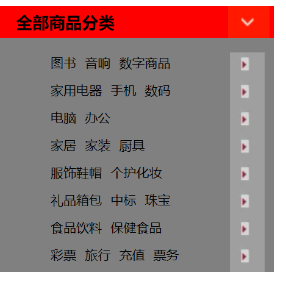
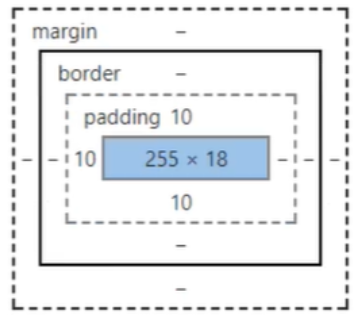
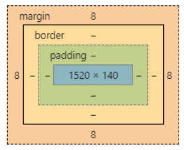
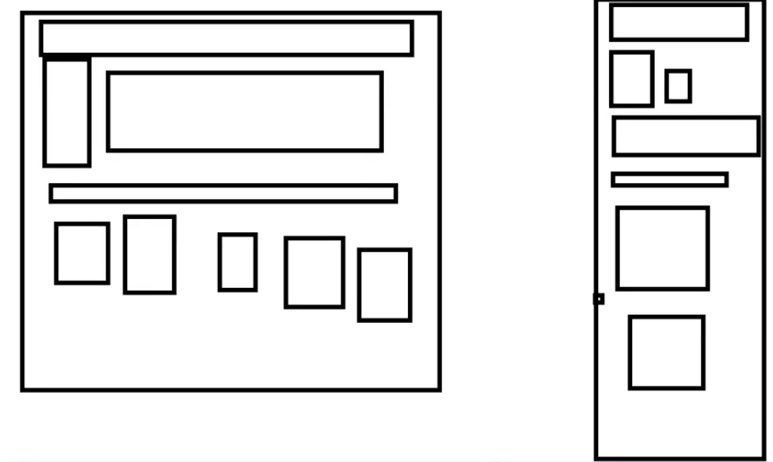
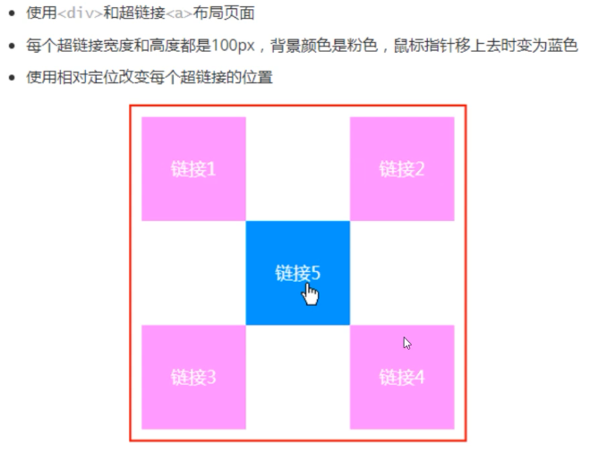
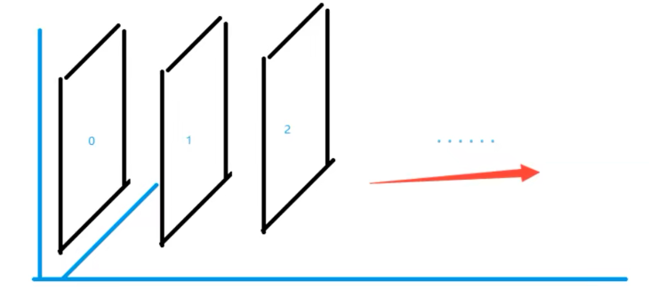

# 1 CSS

如何学习

1. CSS是什么
2. CSS怎么用（快速入门）
3. **CSS选择器（重点+难点）**
4. 美化网页（文字，阴影，超链接，列表，渐变…）
5. 盒子模型
6. 浮动
7. 定位
8. 网页动画（特效效果）

## 1.1 什么是CSS

Cascading Style Sheet层叠样式表

CSS：表现（美化网页）

字体，颜色，边距，高度，宽度，背景图片，网页定位，网页浮动

## 1.2 发展史

CSS1.0

CSS2.0：DIV（块）+CSS，HTML与CSS结构分离的思想，网页变得简单，SEO

CSS2.1：浮动，定位

CSS3.0：圆角、阴影、动画…浏览器兼容性~

## 1.3 快速入门

```html
<!DOCTYPE html>
<html lang="en">
<head>
    <meta charset="UTF-8">
    <title>Title</title>

<!--    规范，<style> 可以编写css代码
        语法：
        选择器{
            声明1；
            声明2；
            ...
        }
        -->
    <style>
        h1{
            color: red;
        }
    </style>
</head>
<body>


<h1>标题</h1>
</body>
</html>
```

html与css分离

html

```html
<!DOCTYPE html>
<html lang="en">
<head>
    <meta charset="UTF-8">
    <title>Title</title>

<!--    规范，<style> 可以编写css代码
        语法：
        选择器{
            声明1；
            声明2；
            ...
        }
        -->
    <link rel="stylesheet" href="css/style.css">
</head>
<body>


<h1>标题</h1>
</body>
</html>
```

css：

```css
h1{
    color: red;
}
```

css的优势：

1. 内容与表现分离
2. 网页结构表现统一，可以实现复用
3. 样式丰富
4. 建议使用独立于html的css
5. 利于SEO，容易被搜索引擎收录

## 1.4 CSS的三种导入方式

行内样式

```html
<!--行内样式 在标签元素中，编写一个style属性，编写样式-->
<h1 style="color: red">标题</h1>
```

内部样式

```html
<!--    内部样式-->
    <style>
        h1{
            color: green;
        }
    </style>
```

外部样式

```css
/*外部样式*/
h1{
    color: blue;
}
```

```html
<link rel="stylesheet" href="css/style.css">
```

优先级 就近原则

外部样式两种写法

+ 链接式

  ```html
  <!--外部样式-->
      <link rel="stylesheet" href="css/style.css" />
  ```

+ 导入式 CSS2.1

  ```html
  <!--导入式-->
      <style>
          @import url("css/style.css");
      </style>
  ```

# 2 选择器

> 作用：选择页面上的某一个或某一类元素

## 2.1基本选择器

1. 标签选择器 选择一类标签  标签{}

   ```html
   <!DOCTYPE html>
   <html lang="en">
   <head>
       <meta charset="UTF-8">
       <title>Title</title>
       <style>
           h1{
               color: red;
           }
           p{
               font-size: 80px;
           }
       </style>
   </head>
   <body>
   <h1>标题</h1>
   <h1>标题</h1>
   <p>12312sa</p>
   </body>
   </html>
   ```

   

2. 类 选择器class 选中所有class属性一致的标签,跨标签,  .class{}

   ```html
   <!DOCTYPE html>
   <html lang="en">
   <head>
       <meta charset="UTF-8">
       <title>Title</title>
       <style>
   /*类选择器的格式  .class的名称{}
   好处：可以多个标签归类，是同一个class*/
           .zz{
               color: red;
           }
           .zzz{
               color: green;
           }
           .zzzz{
               color: blue;
           }
       </style>
   </head>
   <body>
   <h1 class="zz">标题</h1>
   <h1 class="zzz">标题</h1>
   <h1 class="zzzz">标题</h1>
   
   <p class="zz">sadasd</p>
   </body>
   </html>
   ```

   

3. id选择器 全局唯一 #id{}

```html
<!DOCTYPE html>
<html lang="en">
<head>
    <meta charset="UTF-8">
    <title>Title</title>

    <style>
        /*id 选择器格式:id必须保证全局唯一
        #id名称{}
        不遵循就近原则 id>class>标签选择器
        */
        #zz{
            color: red;
        }
        .zz{
            color: green;
        }
        h1{
            color: blue;
        }

    </style>
</head>
<body>
<h1 id="zz">标题</h1>
<h1 class="zz">标题</h1>
<h1>标题</h1>
<h1>标题</h1>
<h1>标题</h1>

</body>
</html>
```

优先级: 不遵循就近原则 id>class>标签选择器

## 2.2层次选择器

1. 后代选择器在某个元素的后面 

   ```css
   body p{
       background: red;
   }
   ```

   

2. 子选择器

   ```css
           body>p{
               background: green;
           }
   ```

3. 相邻兄弟选择器

   ```css
           /*相邻兄弟，只有一个（向下）*/
           .p1+p{
               background: chocolate;
           }
   ```

   

4. 通用选择器

```css
        /*通用兄弟选择器 （向下）*/
        .p1~p{background: aqua;
        }
```

## 2.3结构伪类选择器

伪类：伪类对元素进行分类是基于特征(characteristics)而不是它们的名字、属性或者内容

```css
        /*ul的第一个子元素*/
        ul li:first-child{
            background: red;
        }
        /*ul的最后一个子元素*/
        ul li:last-child{
            background: green;
        }
        /*选中p1  定位到父元素，选择当前的第一个元素
        选中当前元素的父元素，选择父元素的第n个,并且只有是当前元素才生效*/
        p:nth-child(2){
            background: aquamarine;
        }
        /*选中父元素下的第n个p元素*/
        p:nth-of-type(2){
            color: yellow;
        }
```

## 2.4 属性选择器

id+class结合

```html
<!DOCTYPE html>
<html lang="en">
<head>
    <meta charset="UTF-8">
    <title>Title</title>
    <style>
        .demo a{
            float: left;
            display: block;
            height: 50px;
            width: 50px;
            border-radius: 10px;
            background: red;
            text-align: center;
            color: #000000;
            text-decoration: none;
            margin-right: 5px;
            font: bold 20px/50px Arial;
        }
        /*
        存在id属性的元素 a[]{}
        属性名   属性名=属性值（正则）
        */
        a[id]{
            background: yellow;
        }
        a[id=first]{
            background: green;
        }
        /*class中又links的元素  =绝对等于  *=包含 ^=开头  $=结尾*/
        a[class*="links"]{
            color: blue;
        }
        /*选中href中以http开头的元素*/
        a[href^=http]{
            background: black;
        }
    </style>
</head>
<body>
<p class="demo">
    <a href="http://www.baidu.com" class="links item first" id="first">1</a>
    <a href="" class="links item active" target="_blank" title="test" >2</a>
    <a href="" class="link item" >3</a>
    <a href="" class="link item">4</a>
    <a href="http" class="link item">5</a>
    <a href="" class="link item">6</a>
    <a href="" class="link item" id="last">7</a>
</p>
</body>
</html>
```

# 3 美化网页元素

## 3.1 为什么要美化页面

1. 有效传递页面信息
2. 美化网页，页面漂亮才能吸引用户
3. 凸显页面主题
4. 提高用户体验

span标签：重点要突出的字，使用span标签套起来

```html
<!DOCTYPE html>
<html lang="en">
<head>
    <meta charset="UTF-8">
    <title>Title</title>
    <style>
        #title1{
            font-size: 50px;
        }
    </style>

</head>
<body>
欢迎学习   <span id="title1">Java</span>
</body>
</html>
```

## 3.2 字体样式

```css
    <style>
<!--
font-family 字体
font-size 字体大小
font-weight 粗细
color 颜色
-->
        body{
            font-family: 楷体;
        }
        h1{
            font-size: 50px;
        }
        .p1{
            font-weight: bolder;
        }
        .p2{
            color: red;
        }
    </style>
```

## 3.3 文本样式

1. 颜色–>color
2. 文本对齐方式–>text-align：center
3. 首行缩进–>text-indent：2em
4. 行高–>line-height：300px；行高跟块高一致就可以上下居中
5. 下划线–>text-decoration

```css
text-align: center;
text-indent: 2em;
line-height: 20px;
text-decoration:underline/*下划线*/
text-decoration:line-through/*中划线*/
text-decoration:overline/*上划线*/
text-decoration:none/*超链接去下划线*/
text-decoration-color: red;/*线的颜色*/
```

## 3.4 阴影

```css
/* text-shadow: 阴影颜色，水平偏移，垂直偏移，阴影半径*/
        #author{
            text-shadow: aqua 10px 10px 2px ;
        }
/*	第一个参数：表示水平偏移
	第二个参数：表示垂直偏移
	第三个参数：表示模糊半径
	第四个参数：表示颜色
*/
text-shadow:5px 5px 5px 颜色
```

3.5 超链接伪类

常用：a， a:hover

```css
        /*默认的颜色*/
        a{
            text-decoration: none;
            color: #000000;
        }
        /*鼠标悬停的颜色*/
        a：hover{
            color: yellow;
        }
        /*鼠标按住未释放的状态*/
        a:active{
            color: green;
            font-size: 50px;
        }
        a:visited{
            color: red;
        }
```

## 3.6 列表

```html
<!DOCTYPE html>
<html lang="en">
<head>
    <meta charset="UTF-8">
    <title>Title</title>
    <link rel="stylesheet" href="css/style.css" type="text/css">
</head>
<body>
<div id="nav">
    <h2 class="title">全部商品分类</h2>
    <ul>
        <li><a href="#">图书</a>&nbsp;&nbsp;<a href="#">音响</a>&nbsp;&nbsp;<a href="#">数字商品</a></li>
        <li><a href="#">家用电器</a>&nbsp;&nbsp;<a href="#">手机</a>&nbsp;&nbsp;<a href="#">数码</a></li>
        <li><a href="#">电脑</a>&nbsp;&nbsp;<a href="#">办公</a></li>
        <li><a href="#">家居</a>&nbsp;&nbsp;<a href="#">家装</a>&nbsp;&nbsp;<a href="#">厨具</a></li>
        <li><a href="#">服饰鞋帽</a>&nbsp;&nbsp;<a href="#">个护化妆</a></li>
        <li><a href="#">礼品箱包</a>&nbsp;&nbsp;<a href="#">中标</a>&nbsp;&nbsp;<a href="#">珠宝</a></li>
        <li><a href="#">食品饮料</a>&nbsp;&nbsp;<a href="#">保健食品</a></li>
        <li><a href="#">彩票</a>&nbsp;&nbsp;<a href="#">旅行</a>&nbsp;&nbsp;<a href="#">充值</a>&nbsp;&nbsp;<a href="#">票务</a></li>
    </ul>
</div>
</body>
</html>
```

```css
#nav{
    width: 300px;
    background: grey;
}
.title{
    font-size: 18px;
    font-weight: bold;
    text-indent: 1em;
    line-height: 35px;
    background: red;
}
/*ul li
list-style:
    none：去掉圆点
    circle：空心圆
    decimal：数字
    spuare：正方形
*/
ul{
    background: grey;
}
ul li{
    height: 30px;
    list-style: none;
    text-indent: 1em
;
}
a{
    text-decoration: none;
    font-size: 14px;
    color: black;
}
a:hover{
    color: darkorange;
}
```

## 3.7 背景

背景图片

```css
div{
    width: 1000px;
    height: 700px;
    border: 1px solid red;
    /*默认的平铺的*/
    background-image: url("image/a.jpg");
    /*水平和竖直平铺 不平铺*/
    /*background-repeat: repeat-x;*/
    /*background-repeat: repeat-y;*/
    /*background-repeat: no-repeat;*/

}
```

```css
#nav{
    width: 300px;
    background: grey;
}
.title{
    font-size: 18px;
    font-weight: bold;
    text-indent: 1em;
    line-height: 35px;
    /*颜色 图片 位置 平铺方式*/
    background: red url("../images/d.jpg") 250px no-repeat ;
}
/*ul li
list-style:
    none：去掉圆点
    circle：空心圆
    decimal：数字
    spuare：正方形
*/
ul{
    background: grey;
}
ul li{
    height: 30px;
    list-style: none;
    text-indent: 1em;
    background-image: url("../images/l.jpg");
    background-repeat: no-repeat;
    background-position: 212px;
}
a{
    text-decoration: none;
    font-size: 14px;
    color: black;
}
a:hover{
    color: darkorange;
}
```



3.8 渐变

https://www.grabient.com/

```css
        body{
            background-color: #FFFFFF;
            background-image: linear-gradient(66deg, #FFFFFF 0%, #6284FF 50%, #FF0000 100%);
        }
```

## 4 盒子模型

## 4.1 什么是盒子模型



margin：外边距

padding：内边距

border：边框

## 4.2.边框

1、边框的粗细

2、边框的样式

3、边框的颜色

```css
        /*默认的边距 设为0*/
        h1,ul,li,a,body{
            margin: 0;
            padding: 0;
            text-decoration: none;
        }
        form{
            background: green;
        }
        div:nth-of-type(1) input{
            border: 3px solid black;
        }
        #box{
            width: 300px;
            /*border: 粗细 样式 颜色*/
            border: 1px solid red;
        }
        h2{
            background-color: burlywood;
            font-size: 16px;
            line-height: 30px;
            margin: 0;
        }
```

## 4.3 内外边距

margin: 0 auto; 居中元素

```
        #box{
            width: 300px;
            /*border: 粗细 样式 颜色*/
            border: 1px solid red;
            /*margin: 0 auto; 居中元素*/
            margin: 0 auto;
        }
        /*
顺时针选中
margin: 0px; 上下左右全0
margin: 0px 1px; 上下0 左右1
margin: 1px 2px 3px 4px; 上右下左 顺时针
*/
        h2{
            background-color: burlywood;
            font-size: 16px;
            line-height: 30px;
            margin: 0 1px 2px 3px;
        }
        div:nth-of-type(1) input{
            border: 3px solid black;
            padding: 10px;
        }
```

盒子计算方式：元素的大小



margin + border + padding + 内容宽度

## 4.4 圆角边框

```html
    <!--
左上 右上 右下 左下，顺时针方向
-->
    <!--
        圆圈： 圆角 = 半径
    -->
    <style>
        div{
            width: 100px;
            height: 100px;
            border: 10px solid red;
            border-radius: 50px;
        }
    </style>
```

## 4.5 盒子阴影

```html
<!DOCTYPE html>
<html lang="en">
<head>
    <meta charset="UTF-8">
    <title>Title</title>
    <style>

        div{
            width: 100px;
            height: 100px;
            border: 1px solid red;
            box-shadow:10px 10px 100px yellow;
        }
        img  {
            margin: 0 auto;
            border-radius: 100px;
            box-shadow:0px 0px 100px yellow;

        }
    </style>
</head>
<body>
<div></div>
<br><br>

</body>
</html>
```

# 5 浮动

## 5.1 标准文档流



块级元素：独占一行	h1-h6 p div 列表…

行内元素：不独占一行	span a img strong

>注：行内元素可以被包含在 块级元素中，反之，则不可以

## 5.2 display

一种实现行内元素排列的方式,但很多时候都是使用float

block 块元素

inline 行内元素

inline-block 是块元素，但是可以内联，在一行

none 消失

```html
<!DOCTYPE html>
<html lang="en">
<head>
    <meta charset="UTF-8">
    <title>Title</title>
<!--
block 块元素
inline 行内元素
inline-block 是块元素，但是可以内联，在一行
none 消失
-->
    <style>
        div{
            width: 100px;
            height: 100px;
            border: 1px solid black;
            display: inline;
        }
        span{
            width: 100px;
            height: 100px;
            border: 1px solid black;
            display: inline-block;
        }

    </style>
</head>
<body>
<div>div块元素</div>
<span>span 行内元素</span>
</body>
</html>
```

## 5.3 float

1 左右浮动

```html
<!DOCTYPE html>
<html lang="en">
<head>
    <meta charset="UTF-8">
    <title>Title</title>
    <link rel="stylesheet" href="css/style.css" type="text/css">
</head>
<body>
<div id="father">
    <div class="layer01"></div>
    <div class="layer02"></div>
    <div class="layer03"></div>
    <div class="layer04">
        浮动的盒子可以向左浮动，也可以向右浮动，知道它的外边缘碰到包含或另一个浮动盒子为止
    </div>
</div>
</body>
</html>
```

```css
div{
    margin: 10px;
    padding: 5px;
}
#father{
    border: 1px #000 solid;
}
.layer01{
    border: 1px #F00 dashed;
    display: inline-block;
    float: left;/*向左浮动*/
    clear: both;/*清楚浮动*/
}
.layer02{
    border: 1px #00F dashed;
    display: inline-block;
    float: left;
    clear: both;
}
.layer03{
    border: 1px #060 dashed;
    display: inline-block;
    float: left;
    clear: both;
}
.layer04{
    border: 1px #666 dashed;
    font-size: 12px;
    line-height: 23px;
    float: left;
    clear: both;
}
```

## 5.4.父级边框塌陷问题

clear

clear：right；右侧不允许有浮动元素 

clear：left； 左侧不允许有浮动元素 

clear：both； 两侧不允许有浮动元素 

clear：none；

解决方案:

1. 增加父级元素高度

```css
#father{
    border: 1px #000 solid;
    height: 800px;
}
```

2. 增加一个空的div(class="clear")标签

```css
.clear{
    clear: both;
    margin: 0;
    padding: 0;
}
```

```html
    <div class="clear"></div>
```

3. overflow

在父级元素增加一个overflow:hidden

```css
#father{
    border: 1px #000 solid;
    height: 800px;
    overflow: hidden;
}
```

4. 在父类元素后添加伪类after

```css
#father:after{
    content: '';
    display: block;
    clear: both;
}
```

小结:

+ 浮动元素后面增加空div
  + 简单,但代码应中尽量避免空div
+ 设置父元素高度
  + 简单,元素假设有了固定的高度,就会被限制
+ overflow
  + 简单,下拉的场面避免使用
+ 添加伪类after(推荐)
  + 没有副作用

## 5.5 对比

+ display
  + 方向不可控
+ float 
  + 浮动起来的话会脱离标准文档流,要解决父级边框塌陷的问题

# 6 定位

默认情况

```html
<!DOCTYPE html>
<html lang="en">
<head>
    <meta charset="UTF-8">
    <title>Title</title>
    <style>
        div{
            margin: 10px;
            padding: 5px;
            font-size: 12px;
            line-height: 25px;
        }
        #father{
            border: 10px dashed black;
        }
        #first{
            border: 10px dashed red;
            background-color: green;
        }
        #second{
            border: 10px dashed green;
            background-color: blue;
        }
        #third{
            border: 10px dashed blue;
            background-color: red;
        }

    </style>
</head>
<body>

<div id="father">
    <div id="first">第一个盒子</div>
    <div id="second">第二个盒子</div>
    <div id="third">第三个盒子</div>
</div>

</body>
</html>
```


## 6.1 相对定位

相对定位:position:relative;

相对于原来的位置进行指定的偏移,仍在标准文档流中,原来的位置会被保留

```html
<!DOCTYPE html>
<html lang="en">
<head>
    <meta charset="UTF-8">
    <title>Title</title>
<!--    相对定位
        相对于自己原来的位置进行偏移
        -->
    <style>
        div{
            margin: 10px;
            padding: 5px;
            font-size: 12px;
            line-height: 25px;
        }
        #father{
            border: 10px dashed black;
        }
        #first{
            border: 10px dashed red;
            background-color: green;
            position: relative;
            top:-20px;
            left:20px;
        }
        #second{
            border: 10px dashed green;
            background-color: blue;
        }
        #third{
            border: 10px dashed blue;
            background-color: red;
            position: relative;
            bottom:-10px;
            right: 20px;
        }

    </style>
</head>
<body>

<div id="father">
    <div id="first">第一个盒子</div>
    <div id="second">第二个盒子</div>
    <div id="third">第三个盒子</div>
</div>

</body>
</html>
```

练习



```html
<!DOCTYPE html>
<html lang="en">
<head>
    <meta charset="UTF-8">
    <title>Title</title>
    <style>
        #father{
            width: 300px;
            height: 300px;
            padding: 10px;
            border: 5px solid #FF0000;
        }
        #father:after{
            content: '';
            display: block;
            clear: both;
        }
        a{
            display: block;
            width: 100px;
            height: 100px;
            background-color: pink;
            text-decoration: none;
            line-height: 100px;
            text-align: center;
            color: #FFFFFF;
        }
        a:hover{
            color: green;
        }
        #a2,#a4{
            position: relative;
            left: 200px;
            bottom: 100px;
        }
        #a5{
            background-color: #0000FF;
            position: relative;
            left: 100px;
            bottom: 300px;
        }


    </style>
</head>
<body>
<div id="father">
    <a href="#" id="a1">链接1</a>
    <a href="#" id="a2">链接2</a>
    <a href="#" id="a3">链接3</a>
    <a href="#" id="a4">链接4</a>
    <a href="#" id="a5">链接5</a>


</div>
</body>
</html>
```


## 6.2 绝对定位

定位:基于xxx定位

+ 没有父级元素定位的前提下,相对于浏览器定位
+ 假设父级元素存在定位,通常会相对于父级元素进行偏移
+ 在父级元素范围内移动

相对于父级或浏览器的位置进行指定的偏移,绝对定位后,仍在标准文档流中,原来的位置不会被保留

## 6.3 固定定位

```css
        div:nth-of-type(2){
            /*固定定位*/
            width: 50px;
            height: 50px;
            background: #0000FF;
            position: fixed;
            right: 0;
            bottom: 0;
        }
```


## 6.4 z-index



```html
<!DOCTYPE html>
<html lang="en">
<head>
    <meta charset="UTF-8">
    <title>Title</title>
    <link rel="stylesheet" href="css/style.css">
</head>
<body>
<div id="content">
    <ul>
        <li></li>
        <li class="tipText">sadasdasdasdasdadasasdas</li>
        <li class="tipBg">asdasd</li>
        <li>2131244</li>
    </ul>
</div>
</body>
</html>
```

```css
#content{
    width: 1000px;
    height: 800px;
    margin: 0;
    padding: 0;
    overflow: hidden;
    font-size: 12px;
    line-height: 25px;
    border: 1px solid black;
}
ul,li{
    margin: 0;
    padding: 0;
    list-style: none;
    text-align: center;
}
#content ul{
    position: relative;
}
.tipText,.tipBg{
    position:absolute;
    width: 1000px;
    height: 50px;
    line-height: 50px;
    font-size: 25px;
    top: 500px;
}
.tipText{
    color: #FFFFFF;
    z-index: 999;
}
.tipBg{
    background: black;
    /*透明度*/
    opacity: 0.5;
}
```

# 7 动画