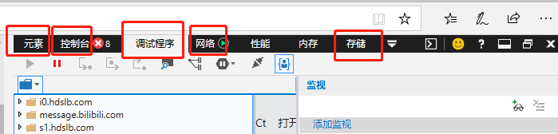
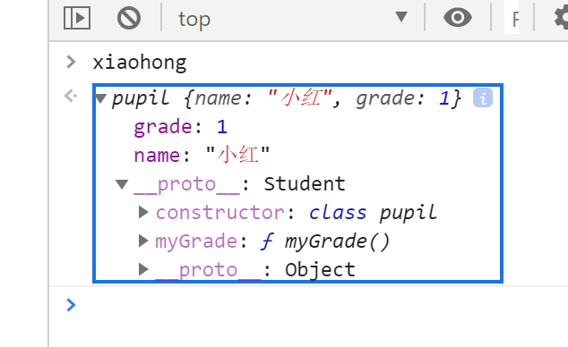
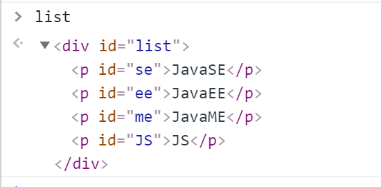

# 1 什么是JavaScript

## 1.1 概述

JavaScript是一门世界上最流行的脚本语言

==合格的后端人员必须精通JavaScript==

## 1.2 历史

ECMAScript它可以理解为JavaScript的一个标准

最新版本已经到es6版本~

但是大部分浏览器还只停留在支持es5代码上！

开发环境–线上环境，版本不一致

# 2 快速入门

## 2.1 引入JavaScript

1. 内部引入

   ```javascript
   <script>
   	//...
   </script>
   ```

2. abc.js

   ```javascript
   //...
   ```

   test.html

   ```html
   <script src = "abc.js"></script>
   ```

   

```html
<!DOCTYPE html>
<html lang="en">
<head>
    <meta charset="UTF-8">
    <title>Title</title>
<!--    script标签内写js代码  -->
<!--    <script>    -->
<!--        alert('hello world');   -->
<!--    </script>   -->

<!--    外部引入    -->
<!--    注意：script标签必须成对出现   -->
    <script src="js/zz.js"></script>
<!--    不用显示定义type  -->
    <script type="text/javascript">

    </script>
</head>
<body>

</body>
</html>
```

## 2.2 基本语法入门

```javascript
<script>
    // 1.定义变量 变量类型 变量名 = 变量值；
    var num = 1;
var name = "zz";
var score = 60;
// 2. 条件控制
if (score > 60 && score <70){
    alert("60-70");
}else if(score > 70 && score <80){
    alert("70-80");
}else {
    alert("other");
}
/*
        * 多行注释
        * */
//console.log(socre) 在浏览器控制台打印变量
</script>
```

浏览器调试



## 2.3 数据类型

数值 文本 图形 音频 视频

==变量==

```javascript
var x = xxx;
```

==number==

js不区分小数和整数

```javascript
123//整数123
123.//浮点数123.1
1.123e3//科学计数法
-99//负数
NaN//not a number
Infinity //无限大
```

==字符串==

‘abc’ “abc”

==布尔值==

true false

==逻辑运算==

&& || !

==比较运算符==

```javascript
= //赋值
== //等于 类型不一样，值一样 也是true
=== //绝对等于 类型一样值一样
```

这是JS的一个缺陷，不要用==比较

注意：

+ NaN===NaN 为false，这个值与所有数值都不想等，包括自己
+ 只能通过isNaN（NaN）来判断这个数是不是NaN

浮点数问题

```javascript
console.log((1/3)===(1-2/3))
//false

```

有精度损失，尽量避免使用浮点数进行运算

```javascript
console.log(((1/3)-(1-2/3))<0.00000000001)
// true
```

==null和undefined==

null 空

undefined 未定义

==数组==

一些==列==类型相同的对象

```javascript
//保证代码可读性，尽量使用[]
var arr = [1,2,"hello",null,true]
new arr(1,2,"hello",null,true)
```

取数组下标越界会undefined

==对象==

对象是{} 数组是[]

每个属性直接用逗号隔开，最后一个不需要添加

```javascript
var person{
	name:'zz',
	age:3,
	tages['js','java']
}
```

```javascript
person.name
> zz
```

## 2.4 严格检查模式

```html
<!DOCTYPE html>
<html lang="en">
<head>
    <meta charset="UTF-8">
    <title>Title</title>
</head>
<!--
    'use strict'; 严格检查模式，预防JS的随意性产生的一些问题
    必须卸载第一行
    局部变量建议使用let 定义

-->
<script>
    'use strict';
    //全局变量
    i = 1;
    //局部变量
    var i1 = 1;
    //ES6 let
    let i2 = 1;
</script>
<body>

</body>
</html>
```

# 3 数据类型

## 3.1 字符串

1. 正常的字符串使用单引号或双引号包裹
2. 使用转义字符

```javascript
\'
\n
\t
\u4e2t //\u#### Unicode字符
\x41 //Ascll字符
```

3. 多行字符串编写

   ```javascript
   let msg =`hello
   world`
   ```

4. 模板字符串

   ```javascript
   let name = 'zz';
   let age = 3;
   let msg1 = `hello,${name}`
   ```

5. 字符串长度

   ```javascript
   str.length
   ```

6. 字符串可变性：不可变

7. 大小写转换 是方法不是属性

   ```javascript
   str.toUpperCase()
   str.toLowerCase()
   ```

8. ```javascript
   str.indexOf('substr')
   ```

9. ```javascript
   str.substring(1,3) //[} 左闭右开
   str.substring(1) //从第一个到最后一个
   ```

## 3.2 数组

**Array可以包含任意的数据类型**

```javascript
var arr = [1,2,3,4,5]
```

1. 长度

   ```javascript
   arr.length = 10;
   ```

   注意：给arr.length赋值，数组大小会发生变化，赋值国小元素会丢失，过大会得到undefined

2. indexOf 通过元素获得下标所以

   ```javascript
   arr.indexOf(2)
   ```

   字符串的‘1’和数字1不同

3. slice()截取array的一部分，返回一个新的数组，类似于substring

4. push pop

   ```javascript
   arr.push('a','b')
   arr.pop
   ```

5. unshift,shift 头部压入 弹出

   ```
   arr.unshift()
   arr.shift()
   ```

6. 排序 sort

   ```javascript
   ['B','C','A']
   arr.sort()
   ['A','B','C']
   ```

7. 元素反转

   ```javascript
   arr.reverse()
   ['C','B','A']
   ```

8. concat() 拼接字符串 

   ```javascript
   ['C','B','A']
   arr.concat([1,2,3])
   ['C','B','A',1,2,3]
   arr
   ['C','B','A']
   ```

   concat()不改变原来的数组，只是返回一个新数组

9. 连接符 join

   打印拼接数组，使用特定的字符串连接

   ```javascript
   ['C','B','A']
   arr.join
   "C-B-A"
   ```

10. 多维数组

    ```javascript
    arr=[[1,2],[4,5],["5","6"]]
    arr[1][1]
    4
    ```

数组：存储数据（如何存 取）

## 3.3 对象

若干个键值对

```
var 对象名 = {
	属性名：属性值，
	属性名：属性值，
}
```

```javascript
let person = {
    name:'zz',
    age : 3,
    email:"sadada@qq.com"      
}
```

JS中的对象，{...}表示一个对象，键值对描述属性 xxx：xxx，多个属性之间使用逗号隔开，最后一个属性不加逗号

JS中的所有键都是字符串，值是任意对象

1. 对象赋值

   ```javascript
   person.name = 'zz'
   ```

2. 使用一个不存在的对象属性不会报错

   ```javascript
   person.haha
   undefined
   ```

3. 动态的删减属性

   ```javascript
   delete person.name
   ```

4. 动态的添加,直接给新的属性添加值即可

   ```
   person.haha = "haha"
   ```

5. 判断属性值是否在这个对象中 xxx in xxx

   ```
   'age' in person
   true
   //继承
   'toString' in person
   true
   ```

6. 判断一个属性是否是这个对象自身拥有的hasOwnProperty（）

   ```javascript
   person.hasOwnProperty('toString')
   false
   person.hasOwnProperty('age')
   true
   ```

## 3.4 流程控制

if判断

```javascript
if (score > 60 && score <70){
    alert("60-70");
}else if(score > 70 && score <80){
    alert("70-80");
}else {
    alert("other");
}
```

循环

while

```javascript
while (age < 100){
	age = age + 1;
}
do (age < 100){
	age = age + 1;
}while (age < 100)
```

for

```javascript
for(let i = 0; i< 100; i++){
	i = i + 1;
}
```

> forEach 循环，5.1引入

数组循环

```javascript
age.forEach(function (value){
	console.log(value)
})

for(var num in age){
    console.log(age[num])
}
```

## 3.5 Map和Set

> ES6新特性

Map

```javascript
var map = new Map([['tom',100],['jack',90],['haha',80]]);
var name = map.get('tom')；
map.set('admin',123456)；
map.delete('tom')；
console.log(name);
```

Set: 无序不重复集合

```javascript
var set = new Set([3,1,1,1,1]);//去重
//[3,1]
set.add(2);
set.delete(1);
console.log(set.has(3));
```

## 3.6 iterator

遍历数组

```javascript
// for of   for in是下标
var arr = [3,4,5]
for(var x of arr){
	console.log(x)
}
```

遍历map

```javascript
 var map = new Map([['tom',100],['jack',90],['haha',80]]);
 for(let x of map){
 	console.log(x)
 }
```

遍历set

```javascript
var set = new Set([5,6,7]);
for(let x of set){
	console.log(x)
}
```

# 4 函数及面向对象

## 4.1 函数定义及变量作用域

> 定义方式1

绝对值函数

```javascript
function abs(){
	if (x > 0){
		return x;
	}else {
	return -x;
	}
}
```

一旦执行到return代表函数结束，返回结果

如果没有执行return，函数也会返回结果，结果是undefined

> 定义方式2

```javascript
var abs = function(x){
		if (x > 0){
		return x;
	}else {
	return -x;
	}
}
```

function(x){...}是一个匿名函数，可以把结果赋值给abs，通过abs就可以调用函数

方法一和方法二等价

> 调用函数

```javascript
abs(10)//10
ab(-10)//10
```

参数问题：JS可以传任意个参数也可以不传

参数传进来是否存在？

如果不存在参数，如何规避？

```javascript
var abs = function(x){
	if(typeif x!== 'number'){
	throw 'not a number';
	}
	if (x > 0){
		return x;
	}else {
	return -x;
	}
}
```

> arguments

arguments是一个JS免费赠送的关键字，代表传递进来的所有参数，是一个数组

```javascript
var abs = function(x){
	console.log("x=>"+x);
	for(var i = 0; i <arguments.length; i++){
		console.log(arguments[i]);
	}
	if (x > 0){
		return x;
	}else {
	return -x;
	}
}
```

问题:arguments 包含所有的参数，有时候想使用多余的参数来进行附加操作，需要排除已有的参数

> rest

以前：

```javascript
if(arguments.length>2){
    for (let i = 2; i < arguments.length; i++) {
        console.log(arguments[i]);
    }
}
```

ES6 引入的新特性，获取除了已定义参数之外的所有参数

```javascript
function aaa(a,b,...rest) {
    console.log(a);
    console.log(b);
    console.log(rest);
}
```

rest参数只能写在最后面，必须用...标识

## 4.2 变量作用域

在JS中，var定义变量实际上是由作用域

加入在函数体中声明，则在函数体外不能使用（可以通过闭包实现）

```javascript
function zz() {
    var x = 1;
    x = x + 1;
}

 //x = x + 2 ;Uncaught ReferenceError: x is not defined
```

两个函数使用了相同的变量名，只要在函数内部，就不冲突

```javascript
function zz() {
    var x = 1;
    x = x + 1;
}
function zz2() {
    var x = 1;
    x = x + 1;
}
```

内部函数可以访问外部函数的变量，反之则不行

```javascript
function zz() {
        var x = 1;
        function zz2() {
            //内部函数可以访问外部函数的变量
            var y = x + 1;
        }
        //外部函数不能访问内部函数的变量
        //var z = y + 1;
    }
```

函数变量重名时，函数查找变量从自身开始，由内向外查找

```javascript
<script>
    function zz() {
        var x = 1;
        function zz2() {
            //内部函数可以访问外部函数的变量
            var x =  2;
            console.log(x);//2
        }
        zz2();
        console.log(x);
    }
    zz();

</script>
```

> 提升变量的作用域

```javascript
function zz(){
	var x = "x" + y;
	console.log(x);
	var y = 'y';
}
```

结果 xundefined

说明JS的执行引擎自动提升了y的声明，但不会提升变量y的赋值

```javascript
function zz2(){
	var y;
	var x = "x" + y;
	console.log(x);
	var y = 'y';
}
```

这是在JS建立之初就存在的特性。规范：所有变量的定义都卸载函数头部，便于维护；

```javascript
function zz3(){
	var x = 1,
		y = x + 1,
		z,i,a;//undefined
}
```

> 全局函数

```javascript
//全局变量
var x = 1;
function f(){
	console.log(x);
}
f();
console.log(x);
```

> 全局对象window

```javascript
var x = 'xxx';
alert(x);
alert(window.x);//默认的所有全局变量都自动绑定在window对象下
```

alert()函数本身也是window的一变量

```javascript
var x ='xxx';
window. alert(x);
var o1d_ _alert = window. alert;
//o1d_ alert(x);
window.alert = function () {};
//发现alertO 失效了
window. alert(123);
//恢复
window.alert = o1d_ _alert;
window. alert(456);
```

Javascript实际上只有一个全局作用域，任何变量（函数也可以视为变量），假设没有在函数作用范围，就会向外查找，如果在全局作用域都没有找到，报错`RefrenceError`

> 规范

由于我们所有的全局变量都会绑定到我们的window上。如果不同的js文件，使用了相同的全局变量，冲突->如何能够减少冲突？

```javascript
//唯一全局变量
var ZzApp = {};

//定义全局变量
ZzApp.name = 'zz';
ZzApp.add = function (a,b) {
    return a + b;
}
```

把自己的代码全部放入自己定义的唯一空间名字中，降低全局命名冲突的问题。（jQuery）

> 局部作用域let

```javascript
function aaa(){
    for(var i = 0; i < 100 ;i++){
        console.log(i);
    }
    console.log(i+1);//问题，i 出了这个作用域还可以使用
}
```

ES6：`let`关键字，解决局部作用域冲突问题！

```javascript
function aaa(){
    for(let i = 0; i < 100 ;i++){
        console.log(i);
    }
    console.log(i+1);//问题，i 出了这个作用域还可以使用
}
```

建议大家都用`let`取定义局部作用域的变量

> 常量：const

**ES6之前，怎么定义常量：只有用全部大写字母命名的变量就是常量：建议不要修改这样的值。**

在ES6引入了常量关键字：`const`

```javascript
const PI = '3.14';//只读效果
console.log(PI);
PI = '123';//Uncaught TypeError: Assignment to constant variable.
console.log(PI);
```

## 4.3 方法

> 定义方法（方法就是把函数放在对象里面，对象中只有2个东西：属性和方法）

```javascript
var zz = {
    name = 'zz',
    brith :2020,
    //方法
    age:function () {
        //今年-出生年月
        var now = new Date().getFullYear();
        return now - this.brith;
    }
}
//属性
zz.name;
//方法，一定要带()
zz.age();
```

```javascript
function getAge() {
    var now = new Date().getFullYear();
    return now-this.birth;
}
var zz = {
    name : 'zz',
    birth : 2000,
    //方法
    age:getAge
};

//zz.age()    =>ok
//getAge()     =>NaN
```

**this是无法指向的，是默认指向调用它的那个对象**

> apply 所有对象都有apply

```javascript
getAge.apply(zz,[]);//this 指向了zz
```

# 5 内部对象

> 标准对象 

```javascript
typeof 123
"number"
typeof '123'
"string"
typeof true
"boolean"
typeof NaN
"number"
typeof []
"object"
typeof {}
"object"
typeof Math.abs
"function"
typeof undefined
"undefined"
```


## 5.1 Date

**基本使用**

```javascript
var now = new Date();//
now.getFullYear();//年
now.getMonth();//月
now.getDate();//日
now.getDay();//星期几
now.getHours();//时
now.getMinutes();//分
now.getSeconds();//秒

now.getTime();//时间戳 全世界统一 1970 1.1 0:00:00

console.log(new Date(1589096655409));//时间戳转时间
```

**转换**

```javascript
//本地时间
now.toLocaleString();
"2020/5/10 下午3:44:15"
//东八区
now.toGMTString();
"Sun, 10 May 2020 07:44:15 GMT"
```

## 5.2 JOSN

> JSON是什么

早期，所有数据传输习惯使用XML

- [JSON](https://baike.baidu.com/item/JSON)([JavaScript](https://baike.baidu.com/item/JavaScript) Object Notation, JS 对象简谱) 是一种轻量级的数据交换格式
- 简洁和清晰的**层次结构**使得 JSON 成为理想的数据交换语言。
- 易于人阅读和编写，同时也易于机器解析和生成，并有效地提升网络传输效率。

在Javascript一切皆为对象，任何js 支持的类型都可以用JSON来表示：number，string

格式：

- 对象都用 {}
- 数组都用 []
- 所有的键值对 都是用 key:value

JSON 字符串和 JS 对象的转换

```javascript
var user = {
name: 'zz',
age: 3,
sex: '男'
}
//对象转换json字符串:{"name":"zz","age":3,"sex":"男"}
var jsonUser = JSON.stringify(user);
console.log(jsonUser);

//json  字符串转换为对象，参数为json字符串
var obj = JSON.parse('{"name":"zz","age":3,"sex":"男"}');
console.log(obj);
```

JSON 和 JS 对象的区别：

```javascript
var obj = {name:"zz",age:3,sex:"男"};
var json = '{"name":"zz","age":3,"sex":"男"}';

```

## 5.3 Ajax

- 原生的Javascript写法，xhr异步请求
- jQuery封装好的方法 $(“#name”).ajax(“”)
- axios请求

# 6 面向对象编程

> 原型

Javascript、Java、C#…面向对象：Javascript有些区别

- 类：模板
- 对象：具体实例

在Javascript这个需要大家换一下思维

原型：

```javascript
//面向对象
var Student = {
name: 'liusx',
age: 3,
run:function () {
console.log(this.name+"run.....")
}
}

var xiaoming = {
name: '小明'
}
//小明的原型 是Student
xiaoming.__proto__ = Student;
xiaoming.run();

var Bird = {
fly: function () {
console.log(this.name + "fly......")
}
}
//小明的原型 是Bird
xiaoming.__proto__ = Bird;
```

> class继承：`class`关键字，ES6引入

1 定义一个类，属性，方法

```javascript
//ES6 之后======
class Student{
    constructor(name){
        this.name = name;
    }

    hello(){
        alert('hello');
    }
}

var xiaoming = new Student('小明');
var xiaohong = new Student('小红');
xiaoming.hello();
```

2 继承

```javascript
//ES6 之后======
class Student{
constructor(name){
this.name = name;
}

hello(){
alert('hello');
}
}

class pupil extends Student {
constructor(name,grade){
super(name);
this.grade = grade;
}
myGrade(){
alert('我是一名小学生');
}
}

var xiaoming = new Student('小明');
xiaoming.hello();
var xiaohong = new pupil('小红',1);
xiaohong.myGrade();
```

本质

> 原型链

```javascript
__proto__
```


# 7 操作Bom元素(重点)

> 浏览器介绍

Javascript 和 浏览器关系？ 

Javascript 诞生就是为了能够让他在浏览器中运行

BOM：浏览器对象模型（内核）

- IE 6~11
- Chrome
- Safari
- FireFox

**第三方**：

- QQ浏览器
- 360浏览器

> window（重要）：代表浏览器窗口

```javascript
window.alert(1)
undefined
window.innerHeight
722
window.innerWidth
1148
window.outerHeight
824
window.outerWidth
1536
```

> Navigator：封装了浏览器信息

```javascript
navigator.appName
"Netscape"
navigator.appVersion
"5.0 (Windows NT 10.0; Win64; x64) AppleWebKit/537.36 (KHTML, like Gecko) Chrome/79.0.3945.130 Safari/537.36"
navigator.userAgent
"Mozilla/5.0 (Windows NT 10.0; Win64; x64) AppleWebKit/537.36 (KHTML, like Gecko) Chrome/79.0.3945.130 Safari/537.36"
navigator.platform
"Win32"
```

大多数时候，我们不会使用：`navigator` 对象，因为会被认为修改！不建议使用这些属性判断和编写代码

> screen：代表屏幕尺寸

```javascript
screen.width
1536
screen.height
864
```

> location（重要）：代表当前页面的URL信息

```javascript
host:"www.baidu.com"
href:"https://www.baidu.com/"
proticlo:"https"
reload:f reload()// 刷新网页
// 设置新的地址
location.assign('https://liusuixing.gitee.io/')
```

> document（内容：DOM）：代表当前页面，HTML DOM文档树

```javascript
document.title
"百度一下，你就知道"
document.title = 'zz'
'zz'
```

获取具体的文档数节点：

```javascript
<dl id="app">
<dt>Java</dt>
<dd>JavaSE</dd>
<dd>JavaEE</dd>

</dl>

<script>
	val dl = document.getElementById('app');
</script>
```

获取cookie

```javascript
document.cookie
```

劫持cookie原理

www.taobao.com

```javascript
<script src="aa.js"></script>
<!--恶意人员：获取你的cookie上传到它的服务器-->
```

服务器端可以设置cookie：httpOnly

> history（不建议使用）：代表浏览器的历史记录

```javascript
histor.forward();//前进
history.back();//后退
```

# 8 操作Dom元素（重点）

DOM：文档对象模型

>  核心

浏览器页面就是一个DOM 树形结构

- 更新：更新Dom节点
- 遍历dom节点：得到Dom节点
- 删除：删除一个Dom节点
- 添加：添加一个新的节点


要操作一个Dom节点，就必须要获得这个Dom节点

- 更新：更新Dom节点
- 遍历dom节点：得到Dom节点
- 删除：删除一个Dom节点
- 添加：添加一个新的节点

要操作一个Dom节点，就必须要获得这个Dom节点

> 获得Dom节点

```html
<div id="father">
    <h1>标题一</h1>
    <p id="p1">p1</p>
    <p class="p2">p2</p>

</div>

<script>
    //对应css选择器
    var h1 = document.getElementsByTagName("h1");
    var p1 = document.getElementById("p1");
    var p2 = document.getElementsByClassName("p2");
    var father = document.getElementById("father");

    var children = father.children;
    //father.firstChild;
    //father.lastChild;
</script>
```

> 更新节点

```html
<div id="id1">

</div>
<script>
    var id1 = document.getElementById('id1');
    id1.innerText='456';//修改文本的值
    id1.innerHTML='<strong>456</strong>';//可以解析HTML文本标签
</script>
```

操作文本：

- `id1.innerText='456'`：修改文本的值
- `id1.innerHTML='<strong>456</strong>'`：可以解析HTML文本标签

操作CSS：

```javascript
id1.style.color = 'yellow';// 属性使用 字符串 包裹
id1.style.fontSize = '20px';// - 转 驼峰命名问题
id1.style.padding = '2em'
```

> 删除节点

删除节点的步骤：先获取父节点，再通过父节点删除自己

```html
<div id="father">
    <h1>标题一</h1>
    <p id="p1">p1</p>
    <p class="p2">p2</p>
</div>

<script>
    var self = document.getElementById("p1")
    var father = p1.parentElement;
    father.removeChild(self);

    //删除是一个动态的过程，先删除0，在删除2会找不到2节点
    father.removeChild(father.children[0]);
    father.removeChild(father.children[1])
    father.removeChild(father.children[2])
</script>
```

注意：删除多个节点的时候，children是在时刻变化的

> 插入节点

我们获得了某个Dom节点，假设这个dom节点是空的，我们通过 innerHTML 就可以增加一个元素了，但是这个DOM节点已经存在元素了，会产生覆盖。

追加

```html
<p id="JS">JS</p>
<div id="list">
    <p id="se">JavaSE</p>
    <p id="ee">JavaEE</p>
    <p id="me">JavaME</p>
</div>

<script>
    var js = document.getElementById('js');//已存在的节点
    var list = document.getElementById('list')
    //追加到后面
    list.appendChild(JS);
</script>
```

追加之后

创建一个新的标签并添加

```javascript
///通过JS创建一个新的节点
var newP = document.createElement('p');//创建一个p标签
newP.id = 'newP';
newP.innerText = 'text';
list.append(newP);

//通过这个标签可以设置任意值
var myScript = document.createElement('script');
myScript.setAttribute('type','text/javascript');

//可以创建一个Style标签
var myStyle = document.createElement('style');//创建空style标签
myStyle.setAttribute('type','text/css');
myStyle.innerHTML = 'body{background-color:red}';//设置标签内容

document.getElementsByTagName('head')[0].appendChild(myStyle);
```

> insertBefore

```javascript
var ee = document.getElementById('ee');
var js = document.getElementById('JS');
var list = document.getElementById('list');
list.insertBefore(js,ee);
```

# 9 操作表单（验证）

>  表单是什么 form DOM树

+ 文本框：text
+ 下拉框：select
+ 单选框：radio
+ 多选框：checkbox
+ 隐藏域：hidden
+ 密码框：password
+ …

表单的目的：提交信息

> 获得要提交的信息

```html
<form action="post">
    <p>
        <span>用户名</span>
        <input type="text" id="username">
    </p>
    <p>
        <span>性别：</span>
        <input type="radio" name="sex" value="man" id="boy"> 男
        <input type="radio" name="sex" value="woman" id="girl"> 女
    </p>

</form>

<script>
    //得到输入框的值
    var input_text = document.getElementById('username');

    var boy_radio = document.getElementById('boy');
    var girl_radio = document.getElementById('girl');
    //修改
    input_text.value = '123';
    //单选框 多选框等固定的值，只能得到当前的值
    boy_radio.checked;//查看返回的结果是否为true


</script>
```

> 提交表单：MD5加密，表单优化

+ 一般的md5加密

```html
<!DOCTYPE html>
<html lang="en">
<head>
    <meta charset="UTF-8">
    <title>Title</title>
    <!--MD5加密-->
    <script src="https://cdn.bootcss.com/blueimp-md5/2.10.0/js/md5.js"></script>
</head>
<body>
<form action="#" method="post">
    <p>
        <span>用户名</span>
        <input type="text" id="username" name="username">
    </p>
    <p>
        <span>密码：</span>
        <input type="password" id="pwd" name="password">
    </p>
<!--    绑定事件    -->
    <button type="submit" onclick="f()">提交</button>

</form>

<script>
    function f() {
        var uname = document.getElementById('username');
        var pwd = document.getElementById('pwd');

        console.log(uname.value);
        console.log(pwd.value);
        pwd.value = md5(pwd.value);
        console.log(pwd.value);

    }
</script>
</body>
</html>
```

表单绑定提交事件

```html
<!DOCTYPE html>
<html lang="en">
<head>
    <meta charset="UTF-8">
    <title>Title</title>
    <!--MD5加密-->
    <script src="https://cdn.bootcss.com/blueimp-md5/2.10.0/js/md5.js"></script>
</head>
<body>

<!--表单邦迪提交事件
onsubmit 绑定一个提交检测的函数.true 提交 false不提交-->
<form action="" method="post" onsubmit="aaa">
    <p>
        <span>用户名</span>
        <input type="text" id="username" name="username">
    </p>
    <p>
        <span>密码：</span>
        <input type="password" id="pwd" name="password">
    </p>
<!--    绑定事件    -->
    <button type="submit" onclick="f()">提交</button>

</form>

<script>
    function f() {
        var uname = document.getElementById('username');
        var pwd = document.getElementById('pwd');

        console.log(uname.value);
        console.log(pwd.value);
        pwd.value = md5(pwd.value);
        console.log(pwd.value);
        //判断是否提交 true 提交 false 不提交
        return false;
    }
</script>
</body>
</html>
```

# 10 jQuery

**jQuery库**：里面封装大量JavaScript方法

**jQuery API：**http://jquery.cuishifeng.cn/

> 获取jQuery

```html
<!DOCTYPE html>
<html lang="en">
<head>
    <meta charset="UTF-8">
    <title>Title</title>
    <script src="http://libs.baidu.com/jquery/2.0.0/jquery.min.js"></script>
</head>
<body>
<!--公式
    $(selector)。action（）
    -->
<a href="" id="test-jquery">click</a>
<script>
    //选择器就是css的选择器
    $('#test-jquery').click(function () {
        alert('1');
    })
</script>
</body>
</html>
```

> 选择器

```javascript
<!DOCTYPE html>
<html lang="en">
<head>
    <meta charset="UTF-8">
    <title>Title</title>
    <script src="https://cdn.bootcdn.net/ajax/libs/jquery/3.4.1/jquery.js"></script>
</head>
<body>
<script>
    //原生js，选择器少，麻烦且不好记
    //id、标签、类
    document.getElementById();
    document.getElementsByTagName();
    document.getElementsByClassName();

    //jQuery 就是 css中的选择器
    $('#id').click();//id选择器
    $('div').click();//标签选择
    $('.className').click();//class选择器
</script>
</body>
</html>
```

> 事件

鼠标事件 键盘事件

```html
<!DOCTYPE html>
<html lang="en">
<head>
    <meta charset="UTF-8">
    <title>Title</title>
    <script src="lib/jquery-3.3.1.js"></script>
    <style>
        #div{
            width: 500px;
            height: 500px;
            border: 1px black solid;
        }
    </style>
</head>
<body>
<!--获取鼠标当前的坐标-->
mouse：<span id="move"></span>
<div id="div">
在这里移动鼠标

</div>

<script>
//网页加载完毕后 响应事件
    $(function () {
        $('#div').mousemove(function (e) {
            $('#move').text('x:'+ e.pageX + ',' + e.pageY);
        });

        });
</script>
</body>
</html>
```


> 操作DOM

- 节点文本操作
- css操作
- 元素的显示和隐藏：本质 `display=none;`
- …等等更多查看API

```html
<!DOCTYPE html>
<html lang="en">
<head>
    <meta charset="UTF-8">
    <title>Title</title>
    <script src="https://cdn.bootcdn.net/ajax/libs/jquery/3.4.1/jquery.js"></script>
</head>
<body>
<ul id="test-ul">
    <li id="js" class="js">Javascript</li>
    <li name="python">Python</li>
    <li id="sh">show_hide</li>
</ul>

<script>
    $("#test-ul li[name='python']").text();//获得值
    $("#test-ul li[name='python']").text('Python_new');
    $('#test-ul').html();//获得值
    $('test-ul').html('<strong>html_new</strong>');//设置值

    $('#js').css('color','red');//设置样式

    $('#sh').show();//显示
    $('#sh').hide();//隐藏
    
    $(window).width();
    $(window).height();
    $(document).width();
    $(document).height();
</script>
</body>
</html>
```

