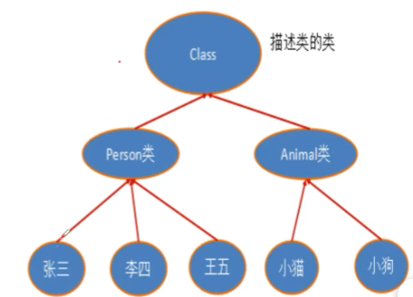
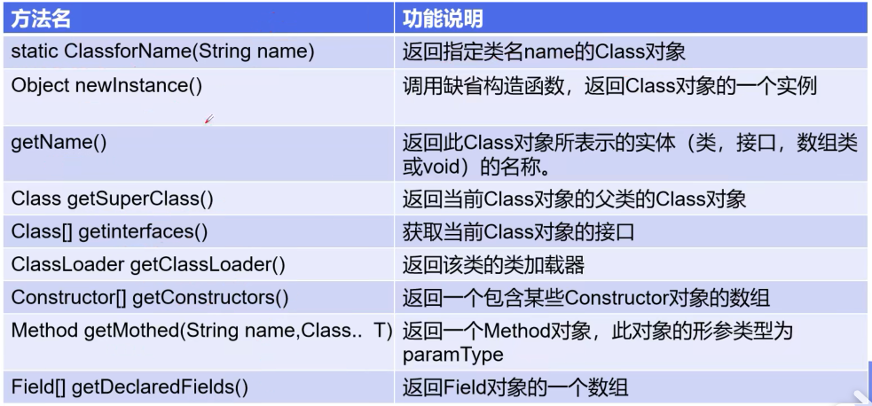
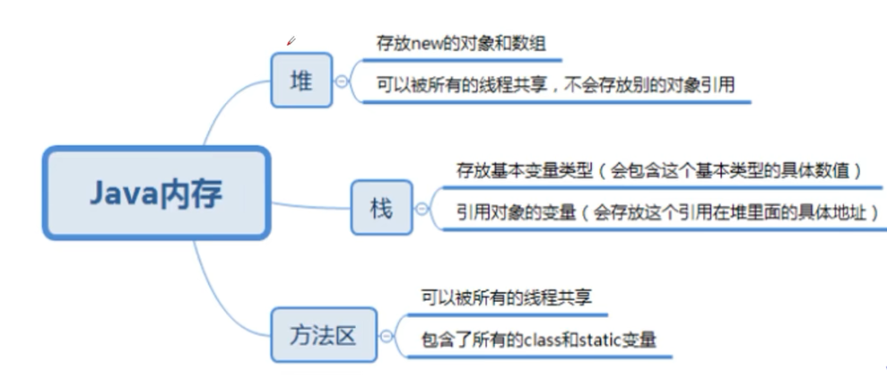
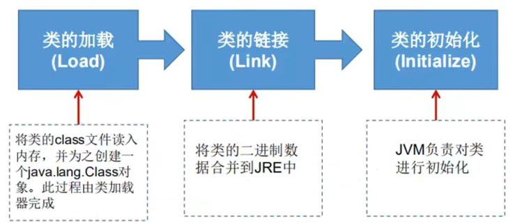
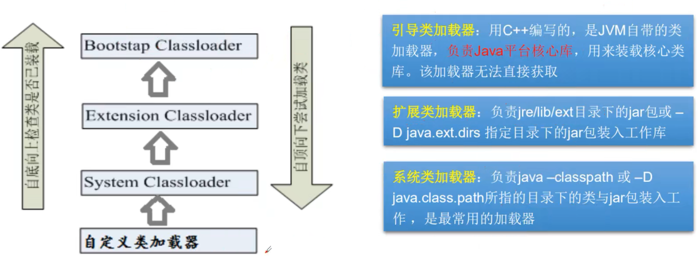

# 1 什么是注解

+ Annotation是从JDK5.0开始引入的新技术
+ 作用

  + 不是程序本身，可以对程序做出解释
  + 可以被其他程序==（编译器）==读取
+ 格式
  + 	以  @注释名  存在，可以添加参数值，例如 @SuppressWarings(value=”unlocked”).
+ 使用位置：
  + 在package class method field 使用，可以通过反射机制实现对元数据的访问

# 2 内置注解

+ @Override : 定义在java.lang.Override中,此注释只适用于修辞方法, 表示一个方法声明打算重写超类中的另一个方法声明.

+ @Deprecated :定义在java.lang.Deprecated中,此注释可以用于修辞方法,属性,类,表示不鼓励程序员使用这样的元素,通常是因为它很危险或者存在更好的选择.

+ SuppressWarnings ：@SuppressWarnings : 定义在java.lang.SuppressWarnings中,用来抑制编译时的警告信息，与前两个注释有所不同,你需要添加一-个参数才能正确使用，这些参数都是已经定义好了的,我们选择性的使用就好了.

  @SuppressWarnings(“all”)

  @SuppressWarnings(“unchecked”)

  @SuppressWarnings(value={“unchecked”,“deprecation”})

```java
public class Test01 extends Object{
    @Override
    public String toString() {
        return super.toString();
    }

    //Deprecated
    @Deprecated
    public static void test(){
        System.out.println("Deprecated");
    }
    @SuppressWarnings({"all"})
    public void test01(){

    }

    public static void main(String[] args) {
            test();
    }
}

```


# 3 元注解


+ 元注解的作用就是负责注解其他注解, Java定义了4个标准的meta -annotation类型,他们被用来提供对其他annotation类型作说明.
+ 这些类型和它们所支持的类在java.lang.annotation包中可以找到.( @ Target , @Retention，@Documented , @Inherited )
  + @Target :用于描述注解的使用范围(即:被描述的注解可以用在什么地方)
  + @Retention :表示需要在什么级别保存该注释信息,用于描述注解的生命周期(SOURCE < CLASS < RUNTIME)
  + @Document:说明该注解将被包含在javadoc中
  + @Inherited: 说明子类可以继承父类中的该注解

```java

public class Test02 {
    @MyAnnotation
    public void test(){
    }
    //定义一个注解
//Target 表示我们的注解可以用在哪些地方.
    @Target(value = {ElementType.METHOD, ElementType.TYPE})
//Retention表示我们的注解在什么地方还有效。
// runtime>class>sources
    @Retention(value = RetentionPolicy.RUNTIME)
//Documented表示是否将我们的注解生成在Javadoc中
    @Documented
//Inherited子类可以继承父类的注解
    @Inherited
    @interface MyAnnotation{ }
}

```


# 4 自定义注解

+ 使用@interface自定义注解时,自动继承了java.lang .annotation.Annotation接口

+ 分析：
  + @ interface用来声明一个注解,格式: public @ interface注解名{定义内容}
  + 其中的每一个方法实际 上是声明了一个配置参数.
  + 方法的名称就是参数的名称.
  + 返回值类型就是参数的类型(返回值只能是基本类型,Class , String , enum ).
  + 可以通过default来声明参数的默认值
  + 如果只有一个参数成员, 一般参数名为value
  + 注解元素必须要有值，我们定义注解元素时,经常使用空字符串，0作为默认值.

  

```java
//自定义注解
public class Test03 {
    //注解可以显示赋值，如果没有默认值 ，我们就必须给注解赋值
    @MyAnnotation2(name = "zz",age = 12)
    public void test(){}
    @MyAnnotation3("zz")//参数只有一个，且参数名为value
    public void test1(){}


    @Target({ElementType.TYPE,ElementType.METHOD})
    @Retention(RetentionPolicy.RUNTIME)
    @interface MyAnnotation2{
        //注解的参数:参数类型+参数名();
        String name() default "";
        int age() default 0;
        int id() default -1;// 如果默认值为-1,代表不存在。
        String[] schools() default {"清华大学，北大"};
    }

    @Target({ElementType.TYPE,ElementType.METHOD})
    @Retention(RetentionPolicy.RUNTIME)
    @interface MyAnnotation3{
        //只有一个参数时，参数名为value时，使用时不需参数名
        String value();
    }
}

```

# 5 反射

## 5.1 静态VS动态语言

**动态语言**

+ 是一类在运行时可以改变其结构的语言:例如新的函数、对象、甚至代码可以被引进，已有的函数可以被删除或是其他结构上的变化。通俗点说就是在运行时代码可以根据某些条件改变自身结构。
+ 主要动态语言: Object-C、 C#、 JavaScript、 PHP、Python等。

**静态语言**

+ 与动态语言相对应的,运行时结构不可变的语言就是静态语言。如Java、 C、C++。
+ Java不是动态语言，但Java可以称之为“准动态语言”。即Java有一 定的动态性,我们可以利用反射机制获得类似动态语言的特性。Java的动态性让编程的时候更加灵活!

## 5.2 Java Reflection

+ Reflection (反射)是Java被视为动态语言的关键，反射机制允许程序在执行期借助于Reflection API取得任何类的内部信息，并能***直接操作任意对象的内部属性及方法***。

```java
Class C= Class forName("java.lang String")
```

+ 加载完类之后,在堆内存的方法区中就产生了一个Class类型的对象(一个类只有一个Class对象)，这个对象就包含了完整的类的结构信息。我们可以通过这个对象看到类的结构。这个对象就像一-面镜子， 透过这个镜子看到类的结构，所以我们形象的称之为：反射。


## 5.3 Java反射机制研究及应用

**Java反射机制提供的功能**

1. 在运行时判断任意一个对象所属的类
2. 在运行时构造任意一个类的对象
3. 在运行时判断任意一个类所具有的成员变量和方法
4. 在运行时获取泛型信息
5. 在运行时调用任意一个对象的成员变量和方法:
6. 在运行时处理注解
7. 生成动态代理

**Java反射优点和缺点**

+ 优点：可以实现动态创建对象和编译，体现出很大的灵活性
+ 缺点：对性能有影响，使用反射基本上是一种解释操作，我们可以告诉JVM,我们希望做什么并且它满足我们的要求。这类操作总是慢于直接执行相同的操作。

**反射相关的主要API**

+ java.lang.Class：代表一个类
+ java.lang.reflect.Method :代表类的方法
+ java.lang.reflect.Field :代表类的成员变量
+ java.lang.reflect.Constructor :代表类的构造器

# 6 Class类

## 6.1 简介

在Object类中定义了以下的方法，此方法将被所有子类继承

```java
public final Class getClass()
```

以上的方法返回值的类型是一 个Class类,此类是Java反射的源头，实际上所谓反射从程序的运行结果来看也很好理解，即:可以通过对象反射求出类的名称。



对象照镜子后可以得到的信息:某个类的属性、方法和构造器、某个类到底实现了哪些接口。对于每个类而言，JRE都为其保留一个不变的Class类型的对象。-一个Class对象包含了特定某个结构(class/interface/enum/annotation/primitive type/void/[])的有关信息。

+ Class本身也是一个类
+ Class 对象只能由系统建立对象
+ 一个加载的类在JVM中只会有一 个Class实例
+ 一个Class对象对应的是一个加载到JVM中的一个.class文件
+ 每个类的实例都会记得自己是由哪个Class实例所生成
+ 通过Class可以完整地得到一个类中的所有被加载的结构
+ Class类 是Reflection的根源，针对任何你想动态加载、运行的类) 唯有先获得相应的Class对象

## 6.2 Class类常用方法



**获取Class类的实例**

a)若已知具体的类， 通过类的class属性获取, 该访法最为安全可靠,程序性能最高。

```java
Class class = Person.class;
```

b)已知某个类的实例， 调用该实例的getClass()方法获取Class对象

```java
Class class = person.getClass();
```

c)已知一 个类的全类名，且该类在类路径下，可通过Class类的静态方法forName()获取可能抛出ClassNotFoundException

```java
Class class = Class forName("demo01. Student");
```

d)内置基本数据类型可以直接用类名.Type

e)还可以利用ClassLoader我们之 后讲解

## 6.3 哪些类型可以有Class对象?

- class: 外部类成员(成员内部类，静态内部类)，局部内部类，匿名内部类。
- interface: 接口
- []:数组
- enum:枚举
- annotation:注解@interface
- primitive type:基本数据类型
- void

# 7 Java内存分析



类加载过程：

当程序主动使用某个类时，如果该类还未被加载到内存中，则系统会通过如下三个步骤来对该类进行初始化。



## 类的加载与ClassLoader的理解

+ 加载:将class文件字节码内容加载到内存中，并将这些静态数据转换成方法区的运行时数据结构,然后生成一个代表这个类的java.lang.Class对象.
+ 链接:将Java类的二进制代码合并到JVM的运行状态之中的过程。
  + 验证:确保加载的类信息符合JVM规范，没有安全方面的问题
  + 准备:正式为类变量(static) 分配内存并设置类变量默认初始值的阶段,这些内存都将在方法区中进行分配。
  + 解析:虚拟机常量池内的符号引用(常量名)替换为直接引用(地址)的过程。
+ 初始化:
  + 执行类构造器< clinit> ()方法的过程。类构造器< clinit> ()方法是由编译期自动收集类中所有类变量的赋值动作和静态代码块中的语句合并产生的。(类构造 器是构造类信息的，不是构造该类对象的构造器)。
  + 当初始化一个类的时候，如果发现其父类还没有进行初始化，则需要先触发其父类的初始化。
  + 虚拟机会保证一 个类的 ()方法在多线程环境中被正确加锁和同步。

```java
public class Test05 {
    public static void main(String[] args) {
        A a=new A();
        System.out.println(A.m);//100
        /*
        1.加载到内存，产生一个类对应Class对象
        2.链接，链接结束后m=◎
        3.初始化
        <clinit>(){
            System. out . println( "A类静态代码块初始化") ;
            m = 300;
            m=100;
         }
         m=100
         */
    }
}
class A {
    static {
        System.out.println("A类静态代码块初始化");
        m = 300;
    }
    static int m = 100;
    public A() {
        System.out.println("A类的参构造初始化");
    }
    
}

```

## 什么时候会发生类初始化?

+ 类的主动引用(一定会发生类的初始化))
  + 当虚拟机启动，先初始化main方法所在的类
  + new一个类的对象
  + 调用类的静态成员(除了final常量)和静态方法
  + 使用java.lang.reflect包的方法对类进行反 射调用
  + 当初始化一个类, 如果其父类没有被初始化，则先会初始化它的父类

+ 类的被动引用(不会发生类的初始化)
  + 当访问一个静态域时，只有真正声明这个域的类才会被初始化。如:当通过子类引用父类的静态变量，不会导致子类初始化
  + 通过数组定义类引用，不会触发此类的初始化
  + 引用常量不会触发此类的初始化(常量在链接阶段就存入调用类的常量池中了)

```java
package com.zz.reflect;

public class Test06 {
    static {
        System.out.println("main类被加载");
    }
    public static void main(String[] args) throws ClassNotFoundException {
        //1.主动引用
        //Son son = new Son();
        /*
         * main类被加载
         * 父类被加载
         * 子类被加载
         * */
        //反射也会产生主动引用
        //Class.forName ("com.reflection.Son");
        /*
         * main类被加载
         * 父类被加载
         * 子类被加载
         * */
        //不会产生类的引用的方法
        //System.out.println(Son.b);
        /*
         * main类被加载
         * 父类被加载
         * 2
         * */
        //Son[] array = new Son[5];
        /*main类被加载*/
        System.out.println(Son.M) ;
        /*
         * main类被加载
         * 1
         * */
    }
}
class Father {
    static int b = 2;
    static {
        System.out.println("父类被加载");
    }
}
class Son extends Father {
    static {
        System.out.println("子类被加载");
    }
    static int m = 100;
    static final int M = 1;
}
```

## 类加载器的作用

1. 类加载的作用:将class文件字节码内容加载到内存中，并将这些静态数据转换成方法区的运行时数据结构，然后在堆中生成一个代表这个类的java.lang(Class对象)作为方法区中类数据的访问入口。
2. 类缓存:标准的JavaSE类加载器可以按要求查找类,但一旦某企类被加载到类加载器中，它将维持加载(缓存) 一段时间。不过JVM垃圾回收机制可以回收这些Class对象
3. 类加载器作用是用来把类(class)装载进内存的。JVM规范走义了如下类型的类的加载器

