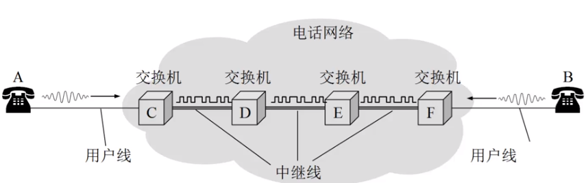

# 计算机网络

# 1.计算机网络概述

## 1.1 计算机网络基本概念

什么事计算机网络？

计算机网络=通信技术+计算机技术

计算机网络是 ==通信技术== 与==计算机技术==紧密结合的产物

通信系统模型：

计算机网络就是一种通信网络，特殊点在于信源和信宿通常都是计算机

计算机网络定义：计算机网络就是==互联==的，==自治==的计算机集合

+ 自治 无主从关系

+ 互联 互联互通

  + 通信链路
  + 

+ 距离远、数量大如何保证互联？

  + 通过==交换网络==互联主机
  + 

  什么是Internet？组成细节角度：

  + 全球最大的==互联网络==
    + ISP（Internet Service Provider）网络互联的“网络之网络”
    + 
    + 数以百万计的互联的==计算设备==集合：
      + 主机（host）=端系统（end system）
      + 运行各种网络应用
    + 通信链路
      + 光纤，铜缆，无线电，卫星……
    + 分组交换：转发分组
      + 路由器（router）和交换机（switches）

  服务角度：

  + ==为网络应用提供通信服务的通信基础设施==
    + Web，VoIP，email，游戏，电子商务，网络社交……
  + 为网络应用提供应用编程接口
    + 支持应用程序“连接”Internet，发送/接受数据
    + 提供类似于邮递系统的数据传输功能

  什么是网络协议？

  协议是计算机网络有序运行的重要保证

  + 硬件（主机，路由器，通信链路等）是计算机网络的基础
  + 计算机网络中的数据交换必须遵守事先约定好的==规则==
  + 如同交通系统

  网络通信：

  + 通信主体是机器而不是恶人
  + 交换电子化或数字化消息
  + 计算机网络的所有通信过程都必须遵守某种/些规则——==协议==

  什么是网络协议？

  + 网络协议（network protocol）简称为协议，是为进行网络中的数据交换而建立的规则，标准或约定
  + ==协议==规定了通信实体之间所交换的消息的==格式 意义 顺序==以及针对收到信息或发生的时间所采取的“==动作==”

协议的三要素：

+ 语法（Syntax）
  + 数据与控制信息的结构或格式
  + 信号电平
+ 语义（Semantics）
  + 需要发出何种控制信息
  + 完成何种动作以及做出何种相应
  + 差错控制
+ 时序（Timing）
  + 事件顺序
  + 速度匹配

协议是计算机网络的重要内容：

+ 协议规范了网络中所有信息发送和接收过程

+ 学习网络的重要内容之一
+ 网络创新的表现形式之一
+ Internet协议标准
  + RFC：Request for Comments
  + IETF：互联网工程任务组 Internet Engineering Task Force

## 1.2 计算机网络结构

1. 网络边缘

   + 主机

   + 网络应用

2. 接入网络，物理介质

   + 有线或无线通信链路

3. 网络核心（核心网络）

   + 互联的路由器或分组转发设备
   + 网络之网络

### 网络边缘

+ 主机（端系统）
  + 位于“网络边缘”
  + 运行网络应用程序
    + 如web email
+ 客户、服务器（client/server）应用模型
  + 客户发送请求，接收服务器响应
  + 如web应用，文件传输FTP应用
+ 对等（peer-peer P2P）应用模型
  + 无或者不依赖专用服务器
  + 通信在对等实体之间直接进行
  + 如Gnutella BT Skype QQ

接入网络的主要问题：如何将网络边缘接入核心网（边缘路由器）？接入网络

+ 住宅接入网络
+ 机构接入网络
+ 移动接入网络

用户关心的是？

带宽   独占/共享

### 接入网络

接入网络：数据用户线路（DSL）

+ 利用==已有的==电话线连接中心局的DSLAM
  + 数据通信通过DSL电话线接入Internet
  + 语音（电话）通过DSL电话线接入电话网
+ ADSL 非对称数据用户线路

接入网络：电缆网络

HFC：混合光纤同轴电缆（hybrid fiber coax）

+ 非对称
+ 共享

机构（企业）接入网络（Ethernet）

+ 主要用于公司、高校、企业等组织机构
+ 端系统通常直接连接以太网交换机（switch）

无线接入网络：

+ 通过==共享==的无线接入网络连接端系统与路由器
  + 通过基站（base station）或称为接入点（access point）
+ 无线局域网（LANs）
  + 同一建筑内（30m）
+ 广域无线接入
  + 通过电信运营商，接入范围在几十公里
  + 3G 4G

### 网络核心

+ 互联的路由器网络
+ 网络核心的关键功能：==路由==+==转发==

路由（routing）：

确定分组从源到目的传输路径

+ 路由算法

转发（forwarding）：

将分组从路由器的输入端口交换至正确的输出端口

网络核心解决的基本问题：如何实现数据从源主机通过网络核心送达目的主机？

A：数据交换

Internet结构：网络之网络

+ 端系统通过==接入ISP(access ISPs)连接到Internet
  + 家庭公司和大学ISPs
+ 接入ISP必须进一步互联
  + 这样任意两个主机才可以互相发送分组
+ 构成复杂的网络互联的网络
  + 经济和国家政策是网络演进的主要驱动力
+ 当前的Internet结构？
  + 无人能给出精确描述

数以百万计的计入ISP是如何彼此互联？

+ 在网络中心：少数互联的大型网络
  + 以及（tier-1）商业ISPs（如网通、电信、Sprint、AT&T）提供国家或国际范围的覆盖
  + 内容提供商网络（content provider network，如Google）：私有网络，连接其数据中心与Internet，通常绕过一级ISP和区域ISPs

## 1.3 网络核心

数据交换的类型：

+ 电路交换
+ 报文交换
+ 分组交换

## 电路交换的特点：

+ 最典型的电路交换网络：电话网络

+ 电路交换的三个阶段：
  + 建立连接（呼叫/电路建立）
  + 通信
  + 释放连接
+ ==独占资源==

电路交换网络如何共享中继线？多路复用（multiplexing）

多路复用，简称复用，是通信技术中的基本概念

多路复用：链路/网络资源（如带宽）划分为“资源片”

+ 将资源片分配给各路呼叫（calls）
+ 每路呼叫独占分配到的资源片进行通信
+ 资源片可能闲置（idle）（无共享）

典型多路复用方法

+ 频分多路复用 FDM 电视网络
+ 时分多路复用 TDM 
+ 波分多路复用 WDM 光的频分复用
+ 码分多路复用 CDM 无线网络 

## 报文交换（message switching）

报文：源（应用）发送信息整体

+ 比如：一个文件

## 分组交换（package switching）

分组：报文分拆出来的一系列相对较小的数据包

分组= 头+数据

分组交换需要报文的拆分和重组，会产生额外的开销

分组交换：统计多路复用

报文交换与分组交换均采用存储-转发交换方式

区别：

+ 报文交换以完整报文进行存储转发
+ 分组交换以较小的分组进行存储转发

分组交换优于报文交换

## 1.4 计算机网络性能

### 速率

速率即数据率（data rate）或称数据传输速率或比特率

+ 单位时间（秒）传输信息（比特）量
+ 计算机网络最重要的一个性能指标
+ 单位：b/s（bps） kb/s Mb/s Gb/s
+ 速率往往是指额定速率或标称速率

### 带宽

+ 带宽（bandwidth）原本指信号具有的频带宽度，即最高频率与最低频率之差，单位是赫兹（Hz）
+ 网络的带宽通常是数字信道所能传送的最高数据率 单位b/s

### 延迟/时延

四种分组延迟：

+ 节点处理延迟（nodal processing delay）
  + 差错检测
  + 确定输出链路
  + 通常小于msec，不考虑
+ 排队延迟（queueing delay）
  + 等待输出链路可用
  + 取决于路由器拥塞程度
+ 传输延迟（transmission delay）（收费站放行一个车队的总时间）
  + L：分组长度
  + R：链路宽度
  + d = L/R
+ 传播延迟（propagation delay）（从一个收费站到下一个收费站的时间）
  + 物理链路延迟
  + 信号传播速度

### 时延带宽积

时延带宽积 = 传播时延 × 带宽

### 分组丢失（丢包）

+ 队列缓存容量有限
+ 分组达到已满队列将被丢弃（丢包）
+ 丢弃分组可能由前序节点或源重发（也可能不重发）
+ 丢包率 = 丢包数/已发送总包数

### 吞吐量

吞吐量表示在发送端与接收端之间传送数据速率

+ 即时吞吐量：给定时刻的速率
+ 平均吞吐量：一段时间的平均速率

## 1.5 计算机网络体系结构

+ 网络体系结构是从功能上描述计算机网络结构
+ 计算机网络体系结构简称网络体系结构是分层结构
+ 每层遵循某个/些网络协议完成本层功能
+ 计算机网络体系结构是计算机网络的各层及其协议的集合
+ 体系结构是一个计算机网络的功能层次及其关系的定义
+ 体系结构是抽象的

### 分层网络体系结构的基本概念

+ 实体（entity）表示任何可发送或接受信息的硬件或软件进程
+ 协议是控制两个对等实体进行通信的规则的集合，协议是“水平的”
+ 任一层实体需要使用下层服务，遵循本层协议，实现本层功能，向上层提供服务，服务是垂直的
+ 下层协议的实现对上层的服务用户是透明的
+ 同系统的相邻层实体间通过接口进行交互，通过服务访问点，交换原语，指定请求的特定服务

###  OSI参考模型

|  7   |  应用层 application  |
| :--: | :------------------: |
|  6   | 表示层 presentation  |
|  5   |    会话层 session    |
|  4   |   传输层 transport   |
|  3   |    网络层 network    |
|  2   | 数据链路层 data link |
|  1   |   物理层 physical    |

为什么要数据封装？

+ 增加控制信息
  + 构造协议数据单元PDU
+ 控制信息主要包括
  + 地址 标识发送/接收端
  + 差错检测编码 用于差错检测
  + 协议控制 实现协议功能的附加信息，如优先级，服务质量安全控制等

## 1.6 计算机网络发展历史

# 2  网络应用

2.1 网络应用（层）内容概述

2.2 网络应用的基本原理

2.3 Web应用

2.4 Email应用

2.5 DNS应用

2.6 P2P应用

2.7 Socket编程

